<!--* caratula -->

    

### Universidad Peruana de Ciencias Aplicadas

Ingeniería de Software

**Periodo: 202520**

**1ACC0238 Aplicaciones para Dispositivos Móviles**

**NCR: 1827**

**Docente: David Gerardo Quevedo Velasco**

**StartUp: FuelTrack**

**Producto: FuelTrack Pro**

**Integrantes:**

_U202221436 - Acuña Tomas, Diego Rolin_

_U202223984 - Arias Segil, Marllely Anahi_

_U20201c320 - Meza Camayo, Lynn Jeeferzon_

_U202319239 - Miranda Ayasta, Rogger Faryd_

_U201817507 - Sanchez Arenas, Manuel Angel_

**Septiembre 2025**

# Registro de versiones del Informe

<table border>
  <tr>
    <th>Version</th>
    <th>Fecha</th>
    <th>Autor</th>
    <th>Descripción de modificación </th>
  </tr>
  <tr>
    <td>TB1</td>
    <td>16/09/2025</td>
    <td>
      <ul> 
        <li>Lynn Jeeferzon Meza Camayo</li> 
        <li>Manuel Angel Sanchez Arenas</li> 
        <li>Rogger Faryd Miranda Ayasta</li>
        <li>Marllely Anahi Arias Segil</li>
        <li>Diego Rolin Acuña Tomas</li>
      </ul>
    </td>
    <td> Se han incluído los siguientes capítulos:
    Carátula
    Registro de Versiones del Informe
    Project Report Collaboration Insights
    Contenido
    Student Outcome
    Capítulo I: Presentación
    Capítulo II: Requirements Development and Software Solution Design
    Conclusiones
    Bibliografía
    Anexos
    </td>
  </tr>
  <tr>
    <td>TP1</td>
    <td>4/10/2025</td>
    <td>
      <ul> 
        <li>Lynn Jeeferzon Meza Camayo</li> 
        <li>Manuel Angel Sanchez Arenas</li> 
        <li>Rogger Faryd Miranda Ayasta</li>
        <li>Marllely Anahi Arias Segil</li>
        <li>Diego Rolin Acuña Tomas</li>
      </ul>
    </td>
    <td> Se han incluído las mejoras indicadas por el docente de la entrega anterior. Además, en esta entrega se agregaron apartados como  Capítulo III: Solution UI/UX Design, Capítulo IV: Product Implementation & Validation y el Sprint 1, Conclusiones, Bibliografía y Anexos
    </td>
  </tr>
  <tr>
    <td>TB2</td>
    <td></td>
    <td>
      <ul> 
        <li>Lynn Jeeferzon Meza Camayo</li> 
        <li>Manuel Angel Sanchez Arenas</li> 
        <li>Rogger Faryd Miranda Ayasta</li>
        <li>Marllely Anahi Arias Segil</li>
        <li>Diego Rolin Acuña Tomas</li>
      </ul>
    </td>
    <td> Se han incluído los siguientes capítulos y secciones:
    Se han incorporado las mejoras sugeridas por el docente en la entrega anterior. Además, en esta entrega se incluyeron nuevos apartados clave como el Capítulo III: Solution UI/UX Design, Capítulo IV: Product Implementation & Validation, así como un resumen detallado del Sprint 2. También se añadieron las secciones de Conclusiones, Bibliografía y Anexos, proporcionando una visión más completa del progreso del proyecto, la implementación de las soluciones de diseño y las pruebas realizadas hasta el momento.
      <ul>
      </ul>
    </td>
  </tr>
  <tr>
    <td>TF1</td>
    <td></td>
    <td>
      <ul> 
        <li>Lynn Jeeferzon Meza Camayo</li> 
        <li>Manuel Angel Sanchez Arenas</li> 
        <li>Rogger Faryd Miranda Ayasta</li>
        <li>Marllely Anahi Arias Segil</li>
        <li>Diego Rolin Acuña Tomas</li>
      </ul>
    </td>
    <td> Se han incluído los siguientes capítulos y secciones: Se han incorporado la mayoría de mejoras sugeridas por el docente, la principal de ellas, el Sprint 2 completado, que documenta nuestro avance previo. Además, en esta entrega se incluyeron los avances y el apartado referente al Sprint 3. También se mejoraron las secciones de Conclusiones, Bibliografía y Anexos, proporcionando una visión más completa del progreso del proyecto, la implementación de las soluciones de diseño y las pruebas realizadas.
    </td>
  </tr>
</table>

# Project Report Collaboration Insights

**Link del repositorio del informe:**  
[https://github.com/1ACC0238-2520-1827-Group2-FuelTrack/report](https://github.com/1ACC0238-2520-1827-Group2-FuelTrack/report)

**Link de los repositorios de la organización:**  
[https://github.com/orgs/1ACC0238-2520-1827-Group2-FuelTrack/repositories](https://github.com/orgs/1ACC0238-2520-1827-Group2-FuelTrack/repositories)

**Link del Event Storming**
[https://miro.com/app/board/uXjVJG4nnMM=/?share_link_id=175103855021](https://miro.com/app/board/uXjVJG4nnMM=/?share_link_id=175103855021)

**TB1**

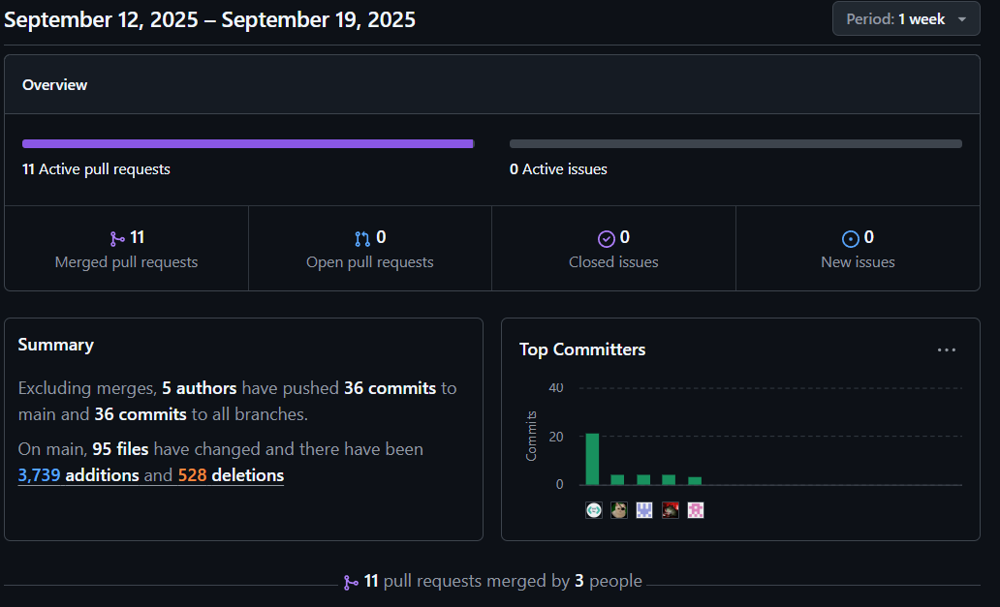

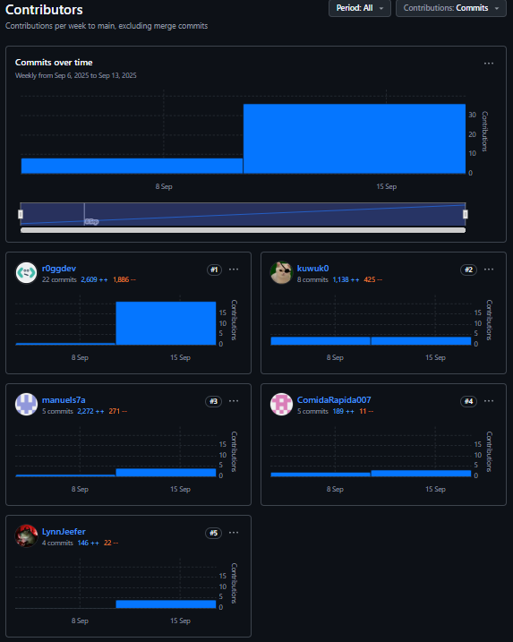

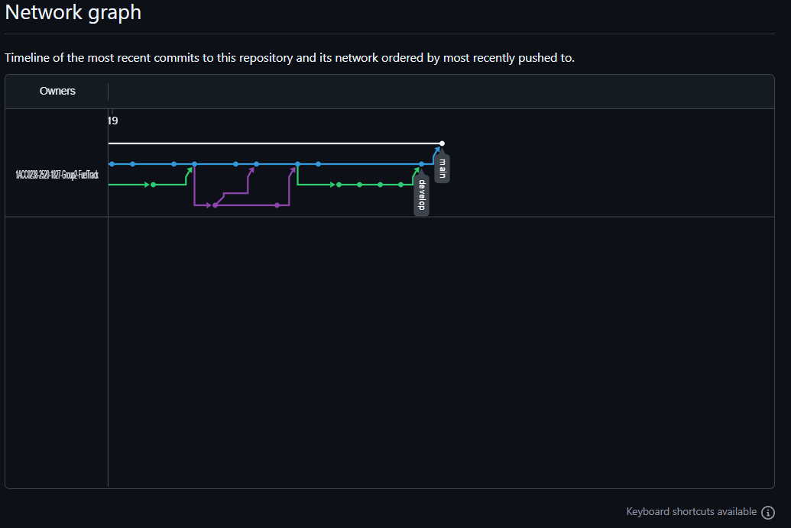

**TP1**

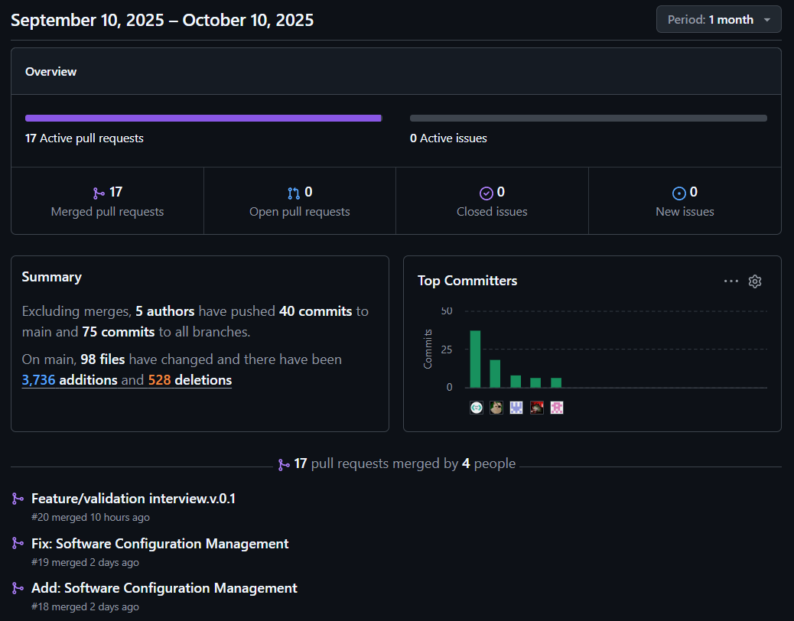

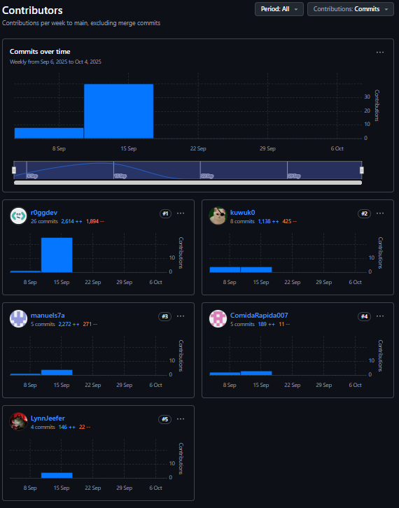

**TB2**

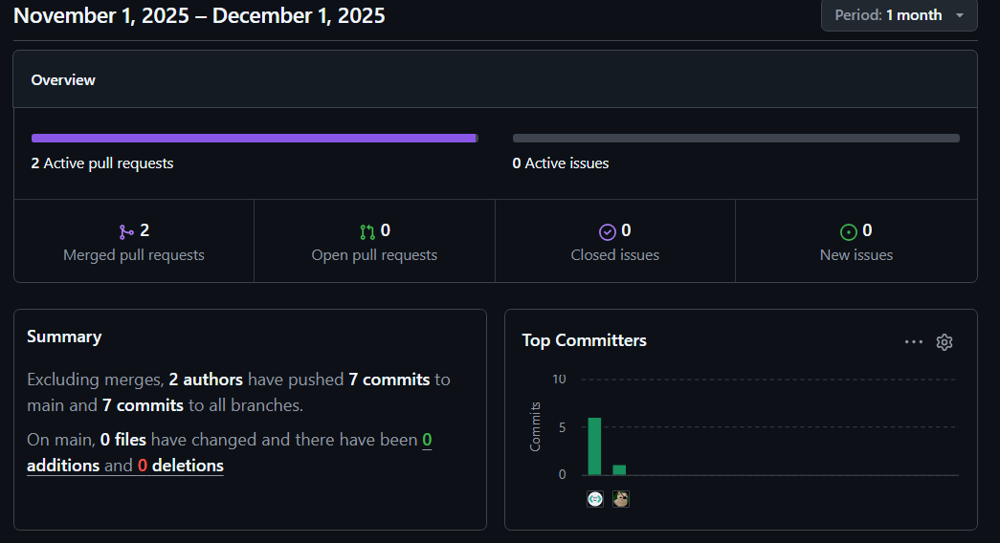

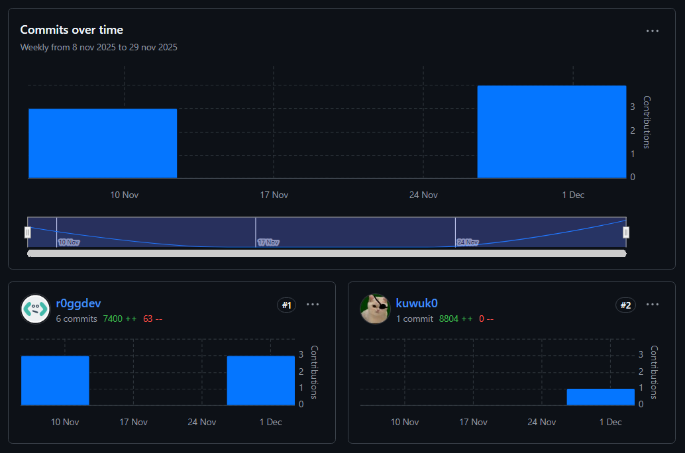

**TF**

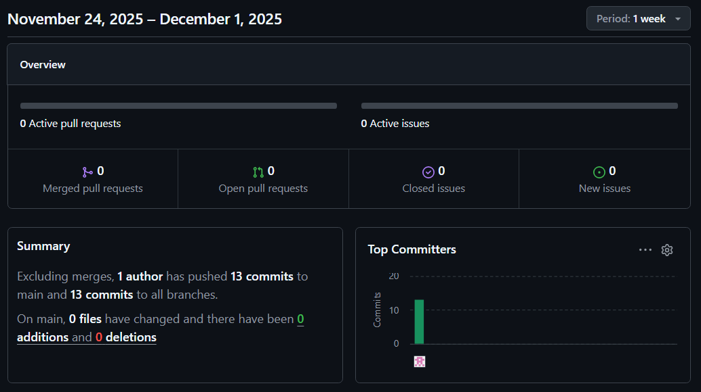

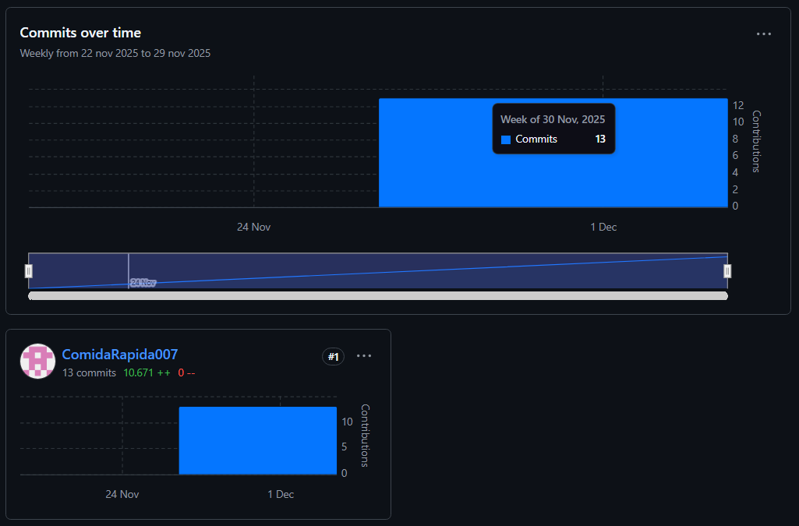

# Table of Contents

- [Registro de versiones del Informe](#registro-de-versiones-del-informe)
- [Project Report Collaboration Insights](#project-report-collaboration-insights)
- [Table of Contents](#table-of-contents)
- [Student Outcome](#student-outcome)
- [Objetivos SMART](#objetivos-smart)
- [Capitulo I: Presentación](#capitulo-i-presentación)
  - [1.1. Startup Profile](#11-startup-profile)
    - [1.1.1. Descripción de la Startup](#111-descripción-de-la-startup)
    - [1.1.2. Perfiles de integrantes del equipo](#112-perfiles-de-integrantes-del-equipo)
  - [1.2. Solution Profile](#12-solution-profile)
    - [1.2.1. Antecedentes y problemática](#121-antecedentes-y-problemática)
    - [1.2.2. Lean UX Process](#122-lean-ux-process)
      - [1.2.2.1. Lean UX Problem Statements](#1221-lean-ux-problem-statements)
      - [1.2.2.2. Lean UX Assumptions](#1222-lean-ux-assumptions)
      - [1.2.2.3. Lean UX Hypothesis Statements](#1223-lean-ux-hypothesis-statements)
      - [1.2.2.4. Lean UX Canvas](#1224-lean-ux-canvas)
  - [1.3. Segmentos Objetivo](#13-segmentos-objetivo)
- [Capítulo II: Requirements Development and Software Solution Design](#capítulo-ii-requirements-development-and-software-solution-design)
  - [2.1. Competidores.](#21-competidores)
    - [2.1.1. Análisis competitivo.](#211-análisis-competitivo)
    - [2.1.2. Estrategias y tácticas frente a competidores.](#212-estrategias-y-tácticas-frente-a-competidores)
      - [a. Diferenciación a través de especialización](#a-diferenciación-a-través-de-especialización)
      - [b. Innovación en la interfaz de usuario y experiencia](#b-innovación-en-la-interfaz-de-usuario-y-experiencia)
      - [c. Flexibilidad en precios y modelo SaaS escalable](#c-flexibilidad-en-precios-y-modelo-saas-escalable)
      - [d. Aprovechamiento de la digitalización en la logística](#d-aprovechamiento-de-la-digitalización-en-la-logística)
      - [e. Expansión hacia mercados internacionales](#e-expansión-hacia-mercados-internacionales)
  - [2.2. Entrevistas.](#22-entrevistas)
    - [2.2.1. Diseño de entrevistas.](#221-diseño-de-entrevistas)
      - [A. Proveedores de Combustible](#a-proveedores-de-combustible)
      - [B. Empresas Solicitantes](#b-empresas-solicitantes)
    - [2.2.2. Registro de entrevistas](#222-registro-de-entrevistas)
      - [**A. Proveedores de Combustible**](#a-proveedores-de-combustible-1)
      - [**B. Empresas Solicitantes**](#b-empresas-solicitantes-1)
    - [2.2.3. Análisis de entrevistas](#223-análisis-de-entrevistas)
      - [**A. Proveedores de Combustible**](#a-proveedores-de-combustible-2)
      - [Características Objetivas](#características-objetivas)
      - [Características Subjetivas](#características-subjetivas)
      - [Analisis Estadistico](#analisis-estadistico)
        - [Grafico 1:](#grafico-1)
        - [Grafico 2:](#grafico-2)
        - [Grafico 3:](#grafico-3)
      - [**B. Empresas Solicitantes**](#b-empresas-solicitantes-2)
      - [Características Objetivas](#características-objetivas-1)
      - [Características Subjetivas](#características-subjetivas-1)
      - [Analisis Estadistico](#analisis-estadistico-1)
        - [Grafico 1:](#grafico-1-1)
        - [Grafico 2:](#grafico-2-1)
        - [Grafico 3:](#grafico-3-1)
  - [2.3. Needfinding.](#23-needfinding)
    - [2.3.1. User Personas](#231-user-personas)
      - [A. Proveedores de Combustible](#a-proveedores-de-combustible-3)
      - [B. Empresas Solicitantes](#b-empresas-solicitantes-3)
    - [2.3.2. User Task Matrix.](#232-user-task-matrix)
    - [2.3.3. User Journey Mapping.](#233-user-journey-mapping)
      - [A. Proveedores de Combustible](#a-proveedores-de-combustible-4)
      - [B. Empresas Solicitantes](#b-empresas-solicitantes-4)
    - [2.3.4. Empathy Mapping.](#234-empathy-mapping)
      - [A. Proveedores de Combustible](#a-proveedores-de-combustible-5)
      - [B. Empresas Solicitantes](#b-empresas-solicitantes-5)
    - [2.3.5. Ubiquitous Language](#235-ubiquitous-language)
  - [2.4. Requirements specification](#24-requirements-specification)
    - [2.4.1. To Be Scenario Mapping](#241-to-be-scenario-mapping)
      - [A. Proveedores de Combustible](#a-proveedores-de-combustible-6)
      - [B. Empresas Solicitantes](#b-empresas-solicitantes-6)
    - [2.4.2. User Stories](#242-user-stories)
    - [2.4.3 Impact Mapping](#243-impact-mapping)
    - [2.4.4 Product Backlog](#244-product-backlog)
  - [2.5. Strategic-Level Domain-Driven Design](#25-strategic-level-domain-driven-design)
    - [2.5.1. EventStorming](#251-eventstorming)
      - [2.5.1.1. Candidate Context Discovery](#2511-candidate-context-discovery)
      - [2.5.1.2. Domain Message Flows Modeling](#2512-domain-message-flows-modeling)
    - [**Order**](#order)
    - [**Analytics**](#analytics)
    - [**Vehicles**](#vehicles)
    - [**Payments**](#payments)
    - [**Notifications**](#notifications)
      - [2.5.1.3. Bounded Context Canvases](#2513-bounded-context-canvases)
    - [**Order**](#order-1)
    - [**Analytics**](#analytics-1)
    - [**Vehicles**](#vehicles-1)
    - [**Payments**](#payments-1)
    - [**Notifications**](#notifications-1)
    - [2.5.2. Context Mapping](#252-context-mapping)
    - [2.5.3. Software Architecture](#253-software-architecture)
      - [2.5.3.1. Software Architecture Context Level Diagrams](#2531-software-architecture-context-level-diagrams)
      - [2.5.3.2. Software Architecture Container Level Diagrams](#2532-software-architecture-container-level-diagrams)
      - [2.5.3.3. Software Architecture Deployment Diagrams](#2533-software-architecture-deployment-diagrams)
  - [2.6. Tactical-Level Domain-Driven Design](#26-tactical-level-domain-driven-design)
    - [2.6.1. Bounded Context: Analytics](#261-bounded-context-analytics)
      - [2.6.1.1. Domain Layer](#2611-domain-layer)
      - [2.6.1.2. Interface Layer](#2612-interface-layer)
      - [2.6.1.3. Application Layer](#2613-application-layer)
      - [2.6.1.4 Infrastructure Layer](#2614-infrastructure-layer)
      - [2.6.1.5. Bounded Context Software Architecture Component Level Diagrams](#2615-bounded-context-software-architecture-component-level-diagrams)
      - [2.6.1.6. Bounded Context Software Architecture Code Level Diagrams](#2616-bounded-context-software-architecture-code-level-diagrams)
        - [2.6.1.6.1. Bounded Context Domain Layer Class Diagrams](#26161-bounded-context-domain-layer-class-diagrams)
        - [2.6.1.6.2. Bounded Context Database Design Diagram](#26162-bounded-context-database-design-diagram)
    - [2.6.2. Bounded Context: Operators](#262-bounded-context-operators)
      - [2.6.2.1. Domain Layer](#2621-domain-layer)
      - [2.6.2.2. Interface Layer](#2622-interface-layer)
      - [2.6.2.3. Application Layer](#2623-application-layer)
      - [2.6.2.4 Infrastructure Layer](#2624-infrastructure-layer)
      - [2.6.2.5. Bounded Context Software Architecture Component Level Diagrams](#2625-bounded-context-software-architecture-component-level-diagrams)
      - [2.6.2.6. Bounded Context Software Architecture Code Level Diagrams](#2626-bounded-context-software-architecture-code-level-diagrams)
        - [2.6.2.6.1. Bounded Context Domain Layer Class Diagrams](#26261-bounded-context-domain-layer-class-diagrams)
        - [2.6.2.6.2. Bounded Context Database Design Diagram](#26262-bounded-context-database-design-diagram)
    - [2.6.3. Bounded Context: Vehicles](#263-bounded-context-vehicles)
      - [2.6.3.1. Domain Layer](#2631-domain-layer)
      - [2.6.3.2. Interface Layer](#2632-interface-layer)
      - [2.6.3.3. Application Layer](#2633-application-layer)
      - [2.6.3.4 Infrastructure Layer](#2634-infrastructure-layer)
      - [2.6.3.5. Bounded Context Software Architecture Component Level Diagrams](#2635-bounded-context-software-architecture-component-level-diagrams)
      - [2.6.3.6. Bounded Context Software Architecture Code Level Diagrams](#2636-bounded-context-software-architecture-code-level-diagrams)
        - [2.6.3.6.1. Bounded Context Domain Layer Class Diagrams](#26361-bounded-context-domain-layer-class-diagrams)
        - [2.6.3.6.2. Bounded Context Database Design Diagram](#26362-bounded-context-database-design-diagram)
    - [2.6.4. Bounded Context: Users](#264-bounded-context-users)
      - [2.6.4.1. Domain Layer](#2641-domain-layer)
      - [2.6.4.2. Interface Layer](#2642-interface-layer)
      - [2.6.4.3. Application Layer](#2643-application-layer)
      - [2.6.4.4 Infrastructure Layer](#2644-infrastructure-layer)
      - [2.6.4.5. Bounded Context Software Architecture Component Level Diagrams](#2645-bounded-context-software-architecture-component-level-diagrams)
      - [2.6.4.6. Bounded Context Software Architecture Code Level Diagrams](#2646-bounded-context-software-architecture-code-level-diagrams)
        - [2.6.4.6.1. Bounded Context Domain Layer Class Diagrams](#26461-bounded-context-domain-layer-class-diagrams)
        - [2.6.4.6.2. Bounded Context Database Design Diagram](#26462-bounded-context-database-design-diagram)
    - [2.6.5. Bounded Context: Notifications](#265-bounded-context-notifications)
      - [2.6.5.1. Domain Layer](#2651-domain-layer)
      - [2.6.5.2. Interface Layer](#2652-interface-layer)
      - [2.6.5.3. Application Layer](#2653-application-layer)
      - [2.6.5.4 Infrastructure Layer](#2654-infrastructure-layer)
      - [2.6.5.5. Bounded Context Software Architecture Component Level Diagrams](#2655-bounded-context-software-architecture-component-level-diagrams)
      - [2.6.5.6. Bounded Context Software Architecture Code Level Diagrams](#2656-bounded-context-software-architecture-code-level-diagrams)
        - [2.6.5.6.1. Bounded Context Domain Layer Class Diagrams](#26561-bounded-context-domain-layer-class-diagrams)
        - [2.6.5.6.2. Bounded Context Database Design Diagram](#26562-bounded-context-database-design-diagram)
    - [2.6.6. Bounded Context: Payments](#266-bounded-context-payments)
      - [2.6.6.1. Domain Layer](#2661-domain-layer)
      - [2.6.6.2. Interface Layer](#2662-interface-layer)
      - [2.6.6.3. Application Layer](#2663-application-layer)
      - [2.6.6.4 Infrastructure Layer](#2664-infrastructure-layer)
      - [2.6.6.5. Bounded Context Software Architecture Component Level Diagrams](#2665-bounded-context-software-architecture-component-level-diagrams)
      - [2.6.6.6. Bounded Context Software Architecture Code Level Diagrams](#2666-bounded-context-software-architecture-code-level-diagrams)
        - [2.6.6.6.1. Bounded Context Domain Layer Class Diagrams](#26661-bounded-context-domain-layer-class-diagrams)
        - [2.6.6.6.2. Bounded Context Database Design Diagram](#26662-bounded-context-database-design-diagram)
    - [2.6.7. Bounded Context: Orders](#267-bounded-context-orders)
      - [2.6.7.1. Domain Layer](#2671-domain-layer)
      - [2.6.7.2. Interface Layer](#2672-interface-layer)
      - [2.6.7.3. Application Layer](#2673-application-layer)
      - [2.6.7.4 Infrastructure Layer](#2674-infrastructure-layer)
      - [2.6.7.5. Bounded Context Software Architecture Component Level Diagrams](#2675-bounded-context-software-architecture-component-level-diagrams)
      - [2.6.7.6. Bounded Context Software Architecture Code Level Diagrams](#2676-bounded-context-software-architecture-code-level-diagrams)
        - [2.6.7.6.1. Bounded Context Domain Layer Class Diagrams](#26761-bounded-context-domain-layer-class-diagrams)
        - [2.6.7.6.2. Bounded Context Database Design Diagram](#26762-bounded-context-database-design-diagram)
- [Capítulo III: Solution UI/UX Design](#capítulo-iii-solution-uiux-design)
  - [3.1. Product design](#31-product-design)
    - [3.1.1. Style Guidelines](#311-style-guidelines)
      - [3.1.1.1.General Style Guidelines](#3111general-style-guidelines)
    - [3.1.2. Information Architecture](#312-information-architecture)
      - [3.1.2.1. Organization Systems](#3121-organization-systems)
      - [3.1.2.2. Labelling Systems](#3122-labelling-systems)
      - [3.1.2.3. SEO Tags and Meta Tags](#3123-seo-tags-and-meta-tags)
      - [3.1.2.4. Searching Systems](#3124-searching-systems)
      - [3.1.2.5. Navigation Systems](#3125-navigation-systems)
    - [3.1.3. Landing Page UI Design](#313-landing-page-ui-design)
      - [3.1.3.1. Landing Page Wireframe](#3131-landing-page-wireframe)
      - [3.1.3.2. Landing Page Mock-ups](#3132-landing-page-mock-ups)
    - [3.1.4. Mobile Applications UX/UI Design](#314-mobile-applications-uxui-design)
      - [3.1.4.1. Mobile Applications Wireframes](#3141-mobile-applications-wireframes)
      - [**Bienvenida al aplicativo**](#bienvenida-al-aplicativo)
      - [**Sección Cliente**](#sección-cliente)
      - [**Inicio de Sesión (Cliente)**](#inicio-de-sesión-cliente)
      - [**Crear Cuenta (Cliente)**](#crear-cuenta-cliente)
      - [**Apartado Principal (Cliente)**](#apartado-principal-cliente)
      - [**Menú Principal (Cliente)**](#menú-principal-cliente)
      - [**Listado de Órdenes (Cliente)**](#listado-de-órdenes-cliente)
      - [**Visualización de una Orden**](#visualización-de-una-orden)
      - [**Creación de una Orden**](#creación-de-una-orden)
      - [**Sección Proveedor**](#sección-proveedor)
      - [**Inicio de Sesión (Proveedor)**](#inicio-de-sesión-proveedor)
      - [**Crear Cuenta (Proveedor)**](#crear-cuenta-proveedor)
      - [**Apartado Principal (Proveedor)**](#apartado-principal-proveedor)
      - [**Menú Principal (Proveedor)**](#menú-principal-proveedor)
      - [**Gestión de Órdenes (Order Management)**](#gestión-de-órdenes-order-management)
      - [**Conciliaciones (Subir comprobantes)**](#conciliaciones-subir-comprobantes)
      - [3.1.4.2. Mobile Applications Wireflow Diagrams](#3142-mobile-applications-wireflow-diagrams)
      - [**User Goal 01: Crear una nueva orden de combustible**](#user-goal-01-crear-una-nueva-orden-de-combustible)
      - [**User Goal 02: Visualizar historial de órdenes**](#user-goal-02-visualizar-historial-de-órdenes)
      - [**User Goal 03: Registrar proveedor**](#user-goal-03-registrar-proveedor)
      - [**User Goal 04: Cargar comprobantes o documentos de pago**](#user-goal-04-cargar-comprobantes-o-documentos-de-pago)
      - [3.1.4.3. Mobile Applications Mock-ups](#3143-mobile-applications-mock-ups)
      - [**Bienvenida al aplicativo**](#bienvenida-al-aplicativo-1)
      - [**Sección Cliente**](#sección-cliente-1)
      - [**Inicio de Sesión (Cliente)**](#inicio-de-sesión-cliente-1)
      - [**Crear Cuenta (Cliente)**](#crear-cuenta-cliente-1)
      - [**Apartado Principal (Cliente)**](#apartado-principal-cliente-1)
      - [**Menú Principal (Cliente)**](#menú-principal-cliente-1)
      - [**Listado de Órdenes (Cliente)**](#listado-de-órdenes-cliente-1)
      - [**Visualización de una Orden**](#visualización-de-una-orden-1)
      - [**Creación de una Orden**](#creación-de-una-orden-1)
      - [**Sección Proveedor**](#sección-proveedor-1)
      - [**Inicio de Sesión (Proveedor)**](#inicio-de-sesión-proveedor-1)
      - [**Crear Cuenta (Proveedor)**](#crear-cuenta-proveedor-1)
      - [**Apartado Principal (Proveedor)**](#apartado-principal-proveedor-1)
      - [**Menú Principal (Proveedor)**](#menú-principal-proveedor-1)
      - [**Gestión de Órdenes (Order Management)**](#gestión-de-órdenes-order-management-1)
      - [**Conciliaciones (Subir Comprobantes)**](#conciliaciones-subir-comprobantes-1)
      - [3.1.4.4. Mobile Applications User Flow Diagrams](#3144-mobile-applications-user-flow-diagrams)
      - [3.1.4.5. Mobile Applications Prototyping](#3145-mobile-applications-prototyping)
- [Capítulo IV: Product Implementation \& Validation](#capítulo-iv-product-implementation--validation)
  - [4.1 Software Configuration Management](#41-software-configuration-management)
    - [4.1.1. Software Development Environment Configuration](#411-software-development-environment-configuration)
    - [**Software Deployment**](#software-deployment)
    - [4.1.2. Source Code Management](#412-source-code-management)
    - [4.1.3. Source Code Style Guide \& Conventions](#413-source-code-style-guide--conventions)
      - [Backend: .NET (C#)](#backend-net-c)
      - [Landing Page: HTML, CSS y JavaScript](#landing-page-html-css-y-javascript)
      - [Mobile: Android (Kotlin) \& Jetpack Compose](#mobile-android-kotlin--jetpack-compose)
      - [Convenciones Generales (Todo el Proyecto)](#convenciones-generales-todo-el-proyecto)
    - [4.1.4. Software Deployment Configuration](#414-software-deployment-configuration)
      - [Landing Page (HTML/CSS/JS)](#landing-page-htmlcssjs)
      - [Backend (.NET API)](#backend-net-api)
      - [Aplicación Móvil (Android)](#aplicación-móvil-android)
  - [4.2. Landing Page \& Mobile Application Implementation](#42-landing-page--mobile-application-implementation)
    - [4.2.1. Sprint 1](#421-sprint-1)
      - [4.2.1.1. Sprint Planning 1](#4211-sprint-planning-1)
      - [4.2.1.2. Sprint Backlog 1](#4212-sprint-backlog-1)
      - [4.2.1.3. Development Evidence for Sprint Review](#4213-development-evidence-for-sprint-review)
      - [4.2.1.4. Testing Suite Evidence for Sprint Review](#4214-testing-suite-evidence-for-sprint-review)
      - [4.2.1.5. Execution Evidence for Sprint Review](#4215-execution-evidence-for-sprint-review)
      - [4.2.1.6. Services Documentation Evidence for Sprint Review](#4216-services-documentation-evidence-for-sprint-review)
      - [4.2.1.7. Software Deployment Evidence for Sprint Review](#4217-software-deployment-evidence-for-sprint-review)
      - [4.2.1.8. Team Collaboration Insigths during Sprint](#4218-team-collaboration-insigths-during-sprint)
    - [4.2.2. Sprint 2](#422-sprint-2)
      - [4.2.2.1. Sprint Planning 2](#4221-sprint-planning-2)
      - [4.2.3.2. Sprint Backlog 3](#4232-sprint-backlog-3)
      - [4.2.2.3. Development Evidence for Sprint Review](#4223-development-evidence-for-sprint-review)
      - [4.2.2.4. Testing Suite Evidence for Sprint Review](#4224-testing-suite-evidence-for-sprint-review)
      - [4.2.3.5. Execution Evidence for Sprint Review](#4235-execution-evidence-for-sprint-review)
      - [4.2.3.6. Services Documentation Evidence for Sprint Review](#4236-services-documentation-evidence-for-sprint-review)
      - [4.2.3.7. Software Deployment Evidence for Sprint Review](#4237-software-deployment-evidence-for-sprint-review)
      - [4.2.3.8. Team Collaboration Insights during Sprint](#4238-team-collaboration-insights-during-sprint)
    - [4.2.2. Sprint 3](#422-sprint-3)
      - [4.2.2.1. Sprint Planning 3](#4221-sprint-planning-3)
      - [4.2.3.2. Sprint Backlog 3](#4232-sprint-backlog-3-1)
      - [4.2.2.3. Development Evidence for Sprint Review](#4223-development-evidence-for-sprint-review-1)
      - [4.2.2.4. Testing Suite Evidence for Sprint Review](#4224-testing-suite-evidence-for-sprint-review-1)
      - [4.2.2.5. Execution Evidence for Sprint Review](#4225-execution-evidence-for-sprint-review)
      - [4.2.2.6. Services Documentation Evidence for Sprint Review](#4226-services-documentation-evidence-for-sprint-review)
      - [4.2.2.7. Software Deployment Evidence for Sprint Review](#4227-software-deployment-evidence-for-sprint-review)
      - [4.2.2.8. Team Collaboration Insights during Sprint](#4228-team-collaboration-insights-during-sprint)
  - [4.3. Entrevistas de Validación](#43-entrevistas-de-validación)
    - [4.3.1. Diseño de Entrevistas](#431-diseño-de-entrevistas)
    - [4.3.2. Registro de Entrevistas](#432-registro-de-entrevistas)
    - [4.3.3. Evaluaciones según Heurísticas](#433-evaluaciones-según-heurísticas)
- [Conclusiones](#conclusiones)
  - [Conclusiones y Recomendaciones](#conclusiones-y-recomendaciones)
  - [Video App Validation](#video-app-validation)
  - [Video About the product](#video-about-the-product)
  - [Video About the team](#video-about-the-team)
- [Glosario](#glosario)
- [Bibliografía](#bibliografía)
- [Anexos](#anexos)

# Student Outcome

<table border>
  <thead>
    <tr>
      <th><b>Criterio Específico</b></th>
      <th><b>Acciones Realizadas</b></th>
      <th><b>Conclusiones</b></th>
    </tr>
  </thead>
  <tbody>
    <tr>
      <td width="35%"><b>Actualiza conceptos y conocimientos necesarios para su desarrollo profesional y en especial para su proyecto en soluciones de ingeniería de software.</b></td>
      <td>
        <b>Diego Acuña</b> 
        TB1: Durante el desarrollo del startup y el producto, tuve que repasar conceptos básicos como Lean UX. En particular, necesité investigar nuevas tecnologías para crear diagramas ER y UML directamente desde Visual Studio Code. Esta experiencia me enseñó que, aunque hayas realizado algo muchas veces, siempre es necesario repasar conceptos, incluso los más básicos. Además, debo estar preparado para adquirir nuevos conocimientos que me permitan completar satisfactoriamente cualquier proyecto de software. 
        TP1: Para esta entrega, tuve que indagar aún más y actualizarme sobre las últimas tendencias en diseño UX/UI para poder aplicar enfoques innovadores en nuestra aplicación móvil. Esto se ve puede ver reflejado en mi desarrollo de vistas core. 
        TF: En esta entrega me encargué de gran parte del desarrollo de nuestra aplicación Fueltrack en Flutter, por lo que tuve que ir más allá de lo aprendido en clase. Esta experiencia me permitió mejorar mis habilidades de desarrollo móvil y comprender mejor cómo crear aplicaciones escalables y mantenibles.
        <b>Manuel Sanchez</b> 
        TB1: Los componentes que conforman la infraestructura de nuestro sistema me llevaron a actualizarme sobre las buenas practicas para un correcto despliegue. 
        TP1: Para este sprint fue necesario investigar la documentación de las librerías UI para el desarrollo de las vistas core de la aplicación. 
        TF: En este Sprint me encargué de insertar y modificar datos en nuestra instancia de base de datos desplegada, por lo que tuve que volver a investigar sobre MySQL y PgAdmin 4.
        <b>Marllely Arias</b> 
        TB1: A través del desarrollo del capítulo dos, trabajé en el análisis competitivo, el needfinding y las entrevistas, lo que me permitió adquirir nuevas perspectivas y herramientas que aportan directamente a mi formación profesional y al avance de mi proyecto en soluciones de ingeniería de software. 
        TP1: Durante esta entrega reforcé mis conocimientos en diseño UX/UI, aplicando principios de diseño, arquitectura de información y diseño inclusivo. Desarrollé wireframes, mockups y prototipos interactivos, lo cual fortaleció mis habilidades para proponer soluciones digitales efectivas. 
        TF: Completé parte del desarrollo de nuestra vista de órdenes de nuestra aplicación en Kotlin, por lo que revisé nuevamente el material de clase para implementar las funcionalidades faltantes. 
        <b>Rogger Miranda</b> 
        TB1: Durante el desarrollo del startup y el producto, me di cuenta de la importancia de repasar conceptos fundamentales y de estar siempre dispuesto a adoptar nuevas herramientas y metodologías. En este caso, implementé diagramas C4 (de contexto y componentes), lo que permitió mejorar la claridad y organización de la arquitectura del sistema. Esta experiencia me recordó que, aunque algunos aspectos del trabajo puedan parecer rutinarios, siempre es útil revisarlos y estar preparado para aprender lo necesario para mejorar la calidad y el alcance de los proyectos. 
        TP1: Durante el desarrollo del producto y el informe, me di cuenta la importancia de poder estar actualizado en conceptos, tecnicas y teconologias para el correcto desarrollo de la solución de manera agil y eficaz. En esta oportunidad fue muy importante entender conceptos de SEO, entender el funcionamiento de las tecnologias respectivas para el avance tanto de la landing como del backend, conceptos de UX/UI, etc. 
        TB2: Para esta entrega, profundicé en la integración entre la capa de presentación y la lógica del dominio, ademas reforce mis conocimientos en Kotlin, Flutter. Contribui en varios aspectos para el desarrollo del aplicativo lo que me permitio mejorar mis habilidades. 
        TF: Para esta entrega mejore aprendizaje para el desarrollo de la aplicación en Kotlin segmento objetivo proveedores. Además, contribuí en varios aspectos como el desarrollo del ppt para la exposición, corrección del documento, organizar el trabajo, etc. 
        <b>Lynn Meza</b> 
        TB1: Durante este hito actualicé y apliqué conceptos clave de Domain-Driven Design para mi desarrollo profesional y el proyecto: facilité un Event Storming para depurar el Lenguaje Ubicuo y extraer eventos, comandos y políticas; descubrí y definí Bounded Contexts mediante sus Canvases; y modelé Domain Message Flows que explicitan contratos de integración y decisiones de orquestación/coreografía. 
        TP1: Para esta entrega, profundicé en la integración entre la capa de presentación y la lógica del dominio, reforzando mis conocimientos en Kotlin y Java. Además, actualicé mis conocimientos sobre buenas prácticas en consumo de APIs REST, aunque en esta fase trabajamos con una API fake. Este avance técnico me permitió contribuir en la implementación de vistas core funcionales y escalables, alineadas al diseño UX definido. 
      </td>
      <td>
        En el transcurso del proyecto, el equipo demostró la capacidad de actualizar conceptos y conocimientos necesarios para fortalecer su desarrollo profesional y garantizar la calidad del trabajo realizado en soluciones de ingeniería de software. Para ello, se profundizó en tecnologías y prácticas contemporáneas, como el desarrollo móvil con Flutter, la creación y despliegue de servicios backend, y la gestión de bases de datos MySQL en entornos remotos.Adicionalmente, se consolidaron habilidades relacionadas con la planificación, comunicación efectiva y trabajo colaborativo, lo cual permitió integrar nuevas herramientas, resolver problemas técnicos y optimizar procesos del proyecto. En conjunto, estas acciones reflejan la actualización constante de conocimientos como parte fundamental del ejercicio profesional y del desarrollo de soluciones tecnológicas robustas.
      </td>
    </tr>
    <tr>
      <td><b>Reconoce la necesidad del aprendizaje permanente para el desempeño profesional y el desarrollo de proyectos en soluciones de tecnologías de ingeniería de software</b></td>
      <td>
        <b>Diego Acuña</b> 
        TB1: Al desarrollar el trabajo, tuve que aprender a usar herramientas para la creación de diagramas ER y UML que nunca había utilizado anteriormente. También repasé conocimientos ya adquiridos pero de gran importancia. Sobre todo, tuve que aprender todo lo que conlleva el mercado de combustibles, tanto su gestión como su logística. Estar abierto a aprender nuevas tecnologías y aspectos más allá de la informática, pero relacionados con el proyecto, ayuda a determinar si tu solución será útil o no para tus posibles clientes. 
        TP1: Para esta entrega, investigué las opciones de configuración de una aplicación móvil desarrollada en Kotlin y Java, con el objetivo de integrar y consumir datos desde una API simulada (fake API) durante el proceso de desarrollo. 
        TF: Al concluir con el desarrollo del proyecto me di cuenta de algo importante: Para mantener la calidad de mi código, debo actualizar constantemente mis conocimientos sobre Flutter. 
        <b>Marllely Arias Segil</b> 
        TB1: Al trabajar en el capítulo dos, donde realicé el análisis competitivo, el needfinding y las entrevistas, comprendí que cada etapa del proyecto en soluciones de ingeniería de software exige actualizarme y seguir aprendiendo, ya que los retos y necesidades del entorno cambian constantemente.
        TP: Este proyecto me permitió ver la importancia de seguir aprendiendo nuevas herramientas y enfoques en diseño y tecnología. Investigar y aplicar buenas prácticas en UX/UI fue clave para mejorar mi desempeño y adaptarme a los retos del desarrollo de software. 
        TF: Para completar la vista de órdenes me dediqué a revisar la documentación de Kotlin, la cual se actualizó recientemente. Es por ello que para mantener mis aportes en alta calidad, debo hacer constantes revisiones sobre estas tecnologías. 
        <b>Manuel Sanchez</b> 
        TB1: Al actualizar nuestro backend, me di cuenta que no solo la práctica, sino también el aprendizaje debe ser constante para complementar mis habilidades adquiridas y desempeñarme mejor en el desarrollo de soluciones.  
        TP1: Para esta entrega desarrollé parte de las vistas core de la aplicación móvil en Android Studio (Kotlin + Java) y verifiqué el comportamiento de los componentes de UI investigados previamente. Fue necesario investigar nuevamente sobre los componentes UI para asegurar su correcto funcionamiento. 
        TF: Debido a un error de configuración en la herramienta de despliegue de nuestra base de datos y backend, asumí la responsabilidad de investigar la causa del problema y solucionarlo. Tras revisar la configuración y realizar los ajustes necesarios, logré corregir el error y contribuir de manera significativa al avance del proyecto. Esta experiencia me permitió reconocer la importancia del aprendizaje continuo para aprovechar adecuadamente las herramientas utilizadas y resolver incidencias con mayor eficiencia. 
        <b>Lynn Meza</b> 
        TB1: Asumí el aprendizaje permanente mientras desarrollé el modelado del dominio: facilité el Event Storming, delimité Bounded Contexts y redacté sus Canvas, y diseñé los Domain Message Flows. Para lograrlo me actualicé con documentación. El resultado fue una arquitectura más modular, integraciones claras y criterios de prueba trazables, elevando la calidad técnica del proyecto. 
        TP1: En este sprint reforcé la importancia de la mejora continua, investigando sobre las mejores prácticas en Kotlin para asegurar un código mantenible. 
        <b>Rogger Faryd Miranda Ayasta</b> 
        TB1: A lo largo del desarrollo del proyecto, me di cuenta de que el aprendizaje constante es fundamental para mejorar el desempeño profesional y desarrollar soluciones efectivas en ingeniería de software. Al enfrentarme a tareas como el diseño de la arquitectura del sistema y la implementación de diagramas C4, comprendí que la adopción de nuevas herramientas y metodologías es crucial para optimizar el proceso. Esta experiencia me reafirmó que, para tener éxito en el campo, es necesario seguir aprendiendo y adaptándose continuamente a nuevas tecnologías y enfoques. 
        TP1: En esta oportunidad para el desarrollo  del producto y el informe, me di cuenta la importancia de conocer y aprender conceptos, tecnicas y teconologias para el correcto desarrollo de la solución de manera agil y eficaz. Fue de mucha importancia aprender sobre de Tags y MetaTags, conocerconceptos de UX/UI, etc. 
        TB2: En esta oportunidad, profundicé nuevos conomientos en Kotlin y Flutter lo que me permite contribuir en varios aspectos para el desarrollo del aplicativo lo que representa la mejora continua esperada. 
        TF: Para esta entrega mejore aprendizaje para el desarrollo de la aplicación en Kotlin segmento objetivo proveedores. Además, contribuí en varios aspectos como el desarrollo del ppt para la exposición, corrección del documento, organizar el trabajo, etc. 
      </td>
      <td>
      Durante el desarrollo del proyecto, nuestro equipo demostró una comprensión sólida de la importancia del aprendizaje continuo para abordar los desafíos técnicos y organizativos propios de las soluciones de ingeniería de software. A lo largo del proceso, adquirimos y aplicamos nuevos conocimientos relacionados con el desarrollo móvil en Flutter, la implementación de un backend funcional y su despliegue en un entorno productivo, así como la administración de una base de datos MySQL en un servidor remoto.Asimismo, integramos buenas prácticas de trabajo colaborativo mediante la coordinación de reuniones periódicas, la planificación de actividades y la asignación estratégica de tareas, lo que nos permitió adaptarnos a nuevas herramientas, metodologías y requerimientos. Esta experiencia reforzó nuestra capacidad de actualizar y ampliar continuamente nuestras competencias técnicas y profesionales, evidenciando el valor del aprendizaje permanente para el desarrollo exitoso de proyectos de software.
      </td>
    </tr>

  </tbody>
</table>

# Objetivos SMART

**SMART Goal 1**

- **S (Específico):** Desarrollar un sistema web que permita a los usuarios registrar, gestionar y monitorear pedidos de combustible en tiempo real.
- **M (Medible):** El sistema deberá permitir registrar al menos 100 pedidos en simultáneo sin pérdida de información.
- **A (Alcanzable):** Utilizando .NET Core y EF Core, con despliegue en infraestructura cloud disponible para el equipo.
- **R (Relevante):** Satisface la necesidad de optimizar la logística en la distribución de combustibles.
- **T (Tiempo):** Implementación de la primera versión funcional en un plazo de 8 semanas (2 Sprints).

---

**SMART Goal 2**

- **S (Específico):** Integrar un módulo de gestión de vehículos y operadores para gestionar y monitorear entregas de manera eficiente.
- **M (Medible):** Lograr que el 90% de los pedidos se asignen automáticamente a un vehículo y un operador disponible.
- **A (Alcanzable):** Mediante reglas de negocio establecidas en los servicios de dominio respectivo.
- **R (Relevante):** Reduce errores manuales en la logística y aumenta la eficiencia operativa.
- **T (Tiempo):** Finalizado para la fase 2 del proyecto (Semana 16).

---

**SMART Goal 3**

- **S (Específico):** Implementar un sistema de notificaciones que alerte a los usuarios sobre cambios en el estado de sus pedidos.
- **M (Medible):** Enviar notificaciones en menos de 5 segundos tras el cambio de estado de un pedido.
- **A (Alcanzable):** Usando un servicio de mensajería interna basado en EF Core y SignalR.
- **R (Relevante):** Mejora la experiencia del cliente y la transparencia del proceso de entrega.
- **T (Tiempo):** Disponible al final de la fase de pruebas (Semana 20).

---

# Capitulo I: Presentación

## 1.1. Startup Profile

### 1.1.1. Descripción de la Startup

**FuelTrack** es una startup innovadora dedicada a la optimización de la gestión de pedidos de combustible entre empresas solicitantes y proveedores. Fundada por estudiantes de la Universidad Peruana de Ciencias Aplicadas (UPC), nuestra propuesta se centra en la digitalización de un sector tradicionalmente dependiente de procesos manuales, brindando una solución tecnológica que garantiza eficiencia, transparencia y un control más riguroso de las operaciones.

**Misión**: Nuestra misión es desarrollar soluciones tecnológicas avanzadas que transformen la gestión de pedidos de combustible, eliminando los métodos informales y reduciendo el margen de error, mediante una plataforma web intuitiva y accesible.

**Visión**: Nuestra visión es posicionarnos como líderes en la digitalización del sector energético, ofreciendo a las empresas una herramienta que facilite una gestión más eficiente, segura y sostenible, contribuyendo al progreso tecnológico y a la mejora de la competitividad del sector.

### 1.1.2. Perfiles de integrantes del equipo

<table>
  <thead>
    <tr>
      <th>Foto del Participante</th>
      <th>Nombres y Apellidos</th>
      <th>Código de Estudiante</th>
      <th>Descripción de Carrera</th>
      <th>Resumen de Conocimientos y Habilidades</th>
    </tr>
  </thead>
  <tbody>
    <tr>
      <td></td>
      <td>Acuña Tomas, Diego Rolin</td>
      <td>U202221436</td>
      <td>Ingenieria de Software</td>
      <td>Soy Diego Acuña, tengo 23 años y estudió la carrera de ingeniería de software. Actualmente me encuentro en el 7mo ciclo de la carrera. Considero que soy responsable, y una persona abierta a las ideas y comentarios de mis compañeros. También me considero curioso pues aprendo lenguajes por mi cuenta como Matlab y Python, sin embargo también estudio por mi cuenta para mis cursos por ello me considero diestro en frameworks como Angular, al mismo tiempo que aprendí lenguajes como SQL, C++, Java, HTML, CSS y C#.</td>
    </tr>
    <tr>
      <td></td>
      <td>Miranda Ayasta, Rogger Faryd</td>
      <td>U202319239</td>
      <td>Ingenieria de Software</td>
      <td>🎓 Soy estudiante de Ingeniería de Software, 
   actualmente curso el 5.º ciclo de la carrera.

💻 A lo largo de mi formación he aprendido diversos lenguajes de programación, como:
➡️ C++  
 ➡️ Python  
 ➡️ JavaScript
➡️ HTML & CSS

🤝 Me destaco por mi responsabilidad, mis habilidades
para el trabajo en equipo y mi motivación constante por
seguir aprendiendo 📚.</td>

</tr>
<tr>
<td></td>
<td>Marllely Anahi Arias Segil</td>
<td>u202223984</td>
<td>Ingenieria de Software</td>
<td>Hola, mi nombre es Marllely Arias Segil. Soy estudiante de Ingeniería de Software en la Universidad Peruana de Ciencias Aplicadas (UPC), una persona empática, responsable y comprometida con mi crecimiento profesional. Mi objetivo es desarrollarme continuamente y aportar valor en cada proyecto.</td>
</tr>
<tr>
<td></td>
<td>Manuel Angel Sanchez Arenas </td>
<td>u201817507</td>
<td>Ingenieria de Software</td>
<td>Soy estudiante de la carrera de Ingeniería de Software en la Universidad Peruana de Ciencias Aplicadas. Trato de mantenerme actualizado con las últimas tecnologías siempre que puedo y poder desempeñarme correctamente en todos los ámbitos que mi carrera demanda.</td>
</tr>
<tr>
<td></td>
<td>Lynn Jeeferzon Meza Camayo</td>
<td>u20201c320</td>
<td>Ingenieria de Software</td>
<td>Hola, mi nombre es Lynn Jeeferzon Meza Camayo. Soy estudiante de Ingenería de Software. Me considero una persona perseverante, resiliente e interesado por el mundo tecnológico y cuento con habilidades para formar parte de ello con lo cual tambien coopero de manera responsable.</td>
</tr>

  </tbody>
</table>

## 1.2. Solution Profile

### 1.2.1. Antecedentes y problemática

**Descripción del problema**

El sector de distribución de combustibles enfrenta serias ineficiencias debido a la dependencia de métodos informales como llamadas telefónicas, correos electrónicos y aplicaciones de mensajería para gestionar los pedidos de combustible. Estos métodos generan desorganización, errores y falta de visibilidad en tiempo real, lo que afecta la eficiencia operativa y la relación con los clientes.

**Técnica 5W+2H**

**What? (¿Qué?)**
La problemática principal es la falta de un sistema centralizado y digital para gestionar los pedidos de combustible, lo que genera errores humanos, duplicación de esfuerzos y retrasos en las entregas.

- **When? (¿Cuándo?)**
  El problema se presenta constantemente en el proceso de gestión de pedidos, especialmente cuando hay un alto volumen de solicitudes o múltiples pedidos a coordinar.

- **Where? (¿Dónde?)**
  El problema ocurre en empresas solicitantes de combustible y proveedores, tanto en áreas urbanas como rurales, donde la infraestructura digital aún no está optimizada.

- **Who? (¿Quién?)**
  Los principales afectados son las empresas solicitantes (medianas y grandes), los proveedores de combustible y los encargados de la logística y gestión de pedidos.

- **Why? (¿Por qué?)**
  El problema radica en la falta de integración entre los métodos actuales de gestión (como correos y aplicaciones de mensajería), que dificultan un control centralizado y preciso de los pedidos.

- **How? (¿Cómo?)**
  Los procesos actuales son desorganizados, utilizando diversas plataformas desconectadas, lo que impide tener un flujo de trabajo eficiente y controlado.

- **How Much? (¿Cuánto?)**
  La magnitud del problema es considerable, pues cada día se pierden horas valiosas debido a la ineficiencia y los errores, lo que incrementa los costos operativos y puede generar pérdidas económicas significativas. Según IBM (2023), “la gestión de pedidos afecta prácticamente a todos los sistemas y procesos de la cadena de suministro. La mayoría de las empresas ya no integran la gestión de pedidos dentro de su organización, sino que involucran a múltiples socios, como proveedores de piezas y componentes, servicios de ensamblaje y embalaje o centros de distribución — lo que facilita la pérdida de visibilidad y control del pedido. Esto da lugar a costosos procesos manuales para completar y entregar el pedido sin errores.”

### 1.2.2. Lean UX Process

#### 1.2.2.1. Lean UX Problem Statements

Las empresas solicitantes de combustible y los proveedores de combustible buscan mantener una operación fluida y segura, garantizando la disponibilidad del recurso sin interrupciones, una gestión ordenada de pedidos y un control adecuado sobre los despachos y entregas. Su objetivo actual es coordinar eficazmente la demanda y el suministro de combustible para no afectar sus actividades productivas.

Sin embargo, los procesos actuales se realizan mediante canales informales como llamadas, correos o mensajería, lo que genera desorganización, duplicidad de información, errores logísticos y ausencia de trazabilidad. Esto provoca incertidumbre sobre los despachos, sobrecarga administrativa en los proveedores y una reducción en la eficiencia operativa y la satisfacción del cliente.

Tanto las empresas solicitantes como los proveedores buscan optimizar la gestión de pedidos y despachos, reducir errores y aumentar la eficiencia, mediante un sistema que se adapte a sus procesos actuales, facilite la trazabilidad y mejore la coordinación entre ambas partes sin requerir grandes cambios en su forma de trabajo.

#### 1.2.2.2. Lean UX Assumptions

**Business Assumptions (Suposiciones de Negocio)**

- Las empresas proveedoras tienen en la adopción de nuevas tecnologías para automatizar multiples procesos de gestión con el fin de tener un servicio más eficiente y reducir el número de operadores comerciales que necesitan.
- Las empresas están buscando formas de reducir errores y retrasos logísticos para optimizar sus costos operativos.
- Los proveedores estan dispuestos a invertir para mejorar su nivel de servicio y aumentar su competitividad en el mercado.
- Las empresas usuarias apreciarán tener un mayor control de sus órdenes y ser capaces de seguirlas en una plataforma centralizada.

- La dificil trazabilidad de los pedidos y la posibilidad de fallas en la comunicación hace que dejar los métodos informales sea una necesidad crítica para el sector en general.

**User Assumptions (Suposiciones de Usuario)**

- _¿Quién es el usuario?_
  Los usuarios principales serían los encargados logísticos de los proovedores y las empresas compradoras de combustible.

- _¿Dónde encaja nuestro producto en su trabajo o vida?_
  FuelTrack encajaría en el día a día de los usuarios como una plataforma de gestión centralizada, que ayudaría a coordinar, rastrear y organizar pedidos de combustible de forma confiable. Reemplazando así los sistemas dispersos que se utilizan hoy en día.

- _¿Qué problemas tiene nuestro producto que resolver?_
  FuelTrack debe resolver la desorganización causada por métodos informales de venta, reducir errores humanos y mejorar la experiencia del cliente.

- _¿Cuándo y cómo es nuestro producto usado?_
  Será utilizado diariamente por solicitantes y los proveedores por igual. Por el lado de los usuarios solicitantes, usarán la plataforma para registrar y monitorear pedidos de combustible, y por el lado de proveedores para gestionar la recepción, programación y entrega de dichos pedidos.

- _¿Qué características son importantes?_
  El seguimiento de pedidos en tiempo real, actualizaciones de estado mediante notificiaciones, historial de entregas, paneles de control y una interfaz clara y rápida.

- _¿Cómo debe verse nuestro producto y cómo debe comportarse?_
  El producto debe presentar una interfaz limpia y profesional. Adaptada al perfil corporativo de los clientes objetivos. Debe ser eficiente, permitiendo la creación, modificación y seguimiento de pedidos en pocos clics. También debe ser altamente confiable, debido al alto valor y magnitud de las órdenes que se realizarán en la plataforma

**Feature Assumptions**

- Creemos que al proporcionar una plataforma centralizada con trazabilidad en tiempo real, ayudaremos a las empresas a reducir errores y mejorar la eficiencia logística.
- Creemos que al ofrecer una interfaz clara y rápida con funciones de seguimiento, aumentaremos la adopción entre proveedores y solicitantes.
- Creemos que al automatizar la gestión de pedidos, los usuarios reducirán su dependencia de métodos informales y ganarán en control y visibilidad.
- Creemos que al integrar notificaciones en tiempo real sobre estados de pedido, mejoraremos la coordinación entre actores y reduciremos los retrasos.
- Creemos que al incluir visualización de métricas, facilitaremos la toma de decisiones y la optimización operativa de los proveedores.

#### 1.2.2.3. Lean UX Hypothesis Statements

**Hypothesis Statement 01: Reducción de Errores**

- _Creemos que_ al implementar una plataforma centralizada para la gestión de pedidos, los encargados logísticos podrán reducir significativamente los errores causados por la mala comunicación.
- _Sabremos que_ hemos tenido éxito
- _Cuando veamos_ que la tasa de pedidos que requieren modificaciones después de ser creados disminuya en un 70% durante los primeros tres meses.

**Hypothesis Statement 02: Satisfacción del Cliente**

- _Creemos que_ al ofrecer una función de seguimiento de pedidos en tiempo real, mejoraremos la confianza y satisfacción de las empresas solicitantes.
- _Sabremos que_ hemos tenido éxito
- _Cuando veamos_ que el número de llamadas y correos de clientes preguntando por el estado de su pedido se reduzca en un 30%.

**Hypothesis Statement 03: Eficiencia del Proveedor**

- _Creemos que_ al automatizar la recepción y organización de pedidos en la plataforma, los proveedores optimizarán su proceso logístico.
- _Sabremos que_ hemos tenido éxito
- _Cuando veamos_ que el tiempo promedio desde que un pedido es confirmado hasta que es entregado se reduzca en un 20%.

**Hypothesis Statement 04: Optimización de Recursos**

- _Creemos que_ al integrar notificaciones automáticas sobre el estado de los pedidos, reduciremos la carga de trabajo del personal de atención al cliente.
- _Sabremos que_ hemos tenido éxito
- _Cuando veamos_ que las solicitudes de información gestionadas manualmente por los operadores comerciales disminuyan en un 40% tras el primer trimestre de uso.

* _Creemos_ que las notificaciones automáticas sobre el estado de los pedidos reducirán la necesidad de una gran cantidad de operadores comerciales de alta disponibilidad.
* _Sabremos_ que hemos tenido éxito
* _Cuando_ las solicitudes de información por parte de clientes disminuyan en un 40% y el tiempo promedio de atención se reduzca en un 60% tras el primer trimestre de uso.

#### 1.2.2.4. Lean UX Canvas

  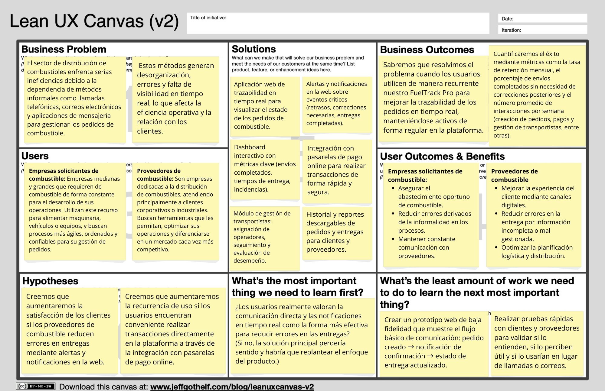

## 1.3. Segmentos Objetivo

**A. Empresas solicitantes de combustible**

Empresas medianas y grandes que requieren de combustible de forma constante para el desarrollo de sus operaciones. Utilizan este recurso para alimentar maquinaria, vehículos o equipos, y buscan procesos más ágiles, ordenados y confiables para su gestión de pedidos. Además, mantienen un contrato de exclusividad con un proveedor de combustible, lo que les permite tener un flujo constante de pedidos y una relación comercial estable.

_Necesidades:_

- Asegurar el abastecimiento oportuno de combustible.
- Reducir errores derivados de la informalidad en los procesos.
- Mantener constante comunicación con proveedores.

**B. Proveedores de combustible**

Son empresas dedicadas a la distribución de combustibles, atendiendo principalmente a clientes corporativos o industriales. Buscan herramientas que les permitan, optimizar sus operaciones y diferenciarse en un mercado cada vez más competitivo.

_Necesidades:_

- Mejorar la experiencia del cliente mediante canales digitales.
- Reducir errores en la entrega por información incompleta o mal gestionada.
- Optimizar la planificación logística y distribución.

----
# Capítulo II: Requirements Development and Software Solution Design

## 2.1. Competidores.

En el mercado existen diversas soluciones digitales enfocadas en la gestión de combustible y flotas que compiten de manera directa o indirecta con **FuelTrack**. Entre ellas destaca **Zavgar**, una plataforma SaaS que ayuda a las empresas con flotas vehiculares a optimizar costos y controlar el consumo de combustible. Otro competidor importante es **FuelCloud**, que ofrece una solución integrada de hardware y software para garantizar seguridad y precisión en el despacho de combustible, principalmente en empresas con tanques propios. Finalmente, **Wialon** se presenta como una plataforma internacional de gestión de flotas que combina monitoreo GPS, análisis operativos y control de combustible, dirigida a compañías logísticas y de transporte.

### 2.1.1. Análisis competitivo.

<table border="2">
  <tr>
    <th colspan="6" style="text-align:left">Competitive Analysis Landscape</th>
  </tr>
  <tr>
    <td colspan="1"><strong>¿Por qué llevar a cabo este análisis?</strong></td>
    <td colspan="5">Este análisis se está llevando a cabo porque queremos conocer las ventajas y desventajas de nuestra aplicación frente a la competencia, y cómo nos diferenciamos de ellas.</td>
  </tr>
  <tr>
  <td colspan="2"><strong></strong></td>
  <td><strong>FuelTrack</strong> </td>
  <td><strong>Zavgar</strong> </td>
  <td><strong>FuelCloud</strong> </td>
  <td><strong>Wialon</strong> </td>
</tr>

  <tr>
    <th rowspan="3">Perfil</th>
    <td><strong>Visión general</strong></td>
    <td>Plataforma web que digitaliza y estructura el proceso completo de pedido de combustible entre empresas y proveedores.</td>
    <td>SaaS para la gestión de consumo de combustible de flotas, con enfoque en eficiencia, monitoreo y costos.</td>
    <td>Solución con hardware/software para el control físico del despacho de combustible.</td>
    <td>Plataforma de gestión de flotas con control de combustible, GPS y reportes operativos.</td>
  </tr>
  <tr>
    <td><strong>Ventaja competitiva</strong></td>
    <td>Especialización en el flujo completo de pedido, despacho y análisis; integración de pagos y logística; UI intuitiva.</td>
    <td>No requiere hardware; ofrece métricas, control de gastos y reportes sobre consumo.</td>
    <td>Control físico preciso del combustible, monitoreo en tiempo real.</td>
    <td>Seguimiento en tiempo real, visualización de rutas, integración con sensores de combustible.</td>
  </tr>
  <tr>
    <td><strong>¿Qué valor ofrece al cliente?</strong></td>
    <td>Trazabilidad total, eficiencia operativa, reportes de consumo y validación segura de pedidos.</td>
    <td>Optimización de costos y control sobre el uso de combustible en flotas.</td>
    <td>Seguridad y precisión operativa en el control de combustible.</td>
    <td>Trazabilidad de flotas, alertas automáticas, análisis de rutas y consumo de combustible.</td>
  </tr>
  <tr>
    <th rowspan="2">Perfil de Marketing</th>
    <td><strong>Mercado objetivo</strong></td>
    <td>Empresas que solicitan combustible a proveedores.</td>
    <td>Empresas con flotas vehiculares que desean monitorear y reducir el consumo de combustible.</td>
    <td>Empresas con tanques de combustible propios.</td>
    <td>Empresas logísticas, distribuidoras y de transporte de combustible.</td>
  </tr>
  <tr>
    <td><strong>Estrategias de marketing</strong></td>
    <td>Alianzas con proveedores, demostraciones de ahorro, marketing de contenido enfocado en eficiencia.</td>
    <td>Enfoque digital, contenido técnico, integración con proveedores de tarjetas de combustible.</td>
    <td>Ferias industriales, distribuidores, venta consultiva entre empresas.</td>
    <td>Alianzas con distribuidores de GPS, marketing técnico, ferias de transporte.</td>
  </tr>
  <tr>
    <th rowspan="3">Perfil de Producto</th>
    <td><strong>Productos & Servicios</strong></td>
    <td>Plataforma para gestión completa de pedidos, seguimiento, reportes, validación y alertas.</td>
    <td>Plataforma web con módulo de abastecimiento, reportes de consumo, integración GPS y tarjetas.</td>
    <td>Hardware IoT y software para gestión, y control de combustible.</td>
    <td>Plataforma SaaS + app móvil con monitoreo, alertas, mapas y módulos personalizables.</td>
  </tr>
  <tr>
    <td><strong>Precios & Costos</strong></td>
    <td>Modelo SaaS con suscripción escalable según volumen y servicios.</td>
    <td>SaaS con modelos por flota activa o vehículos monitoreados.</td>
    <td>Venta e instalación de hardware + licencias de software.</td>
    <td>Modelo SaaS modular, basado en vehículos activos y funcionalidades activadas.</td>
  </tr>
  <tr>
    <td><strong>Canales de distribución</strong></td>
    <td>Web app responsive, potencial app móvil futura.</td>
    <td>Web app, marketing digital y comunidad de flotas.</td>
    <td>Plataforma web + hardware instalado en sitio.</td>
    <td>Red de partners global, distribuidores locales e integradores de sistemas GPS.</td>
  </tr>
  <tr>
    <th rowspan="4">Análisis SWOT</th>
    <td><strong>Fortalezas</strong></td>
    <td>Enfoque especializado, experiencia de usuario optimizada, integraciones clave, análisis avanzado de consumo.</td>
    <td>Implementación ágil, sin hardware, fácil adopción en empresas medianas.</td>
    <td>Control físico riguroso, solución probada en industrias exigentes.</td>
    <td>Plataforma robusta, cobertura internacional, integración con más de 2,400 dispositivos GPS.</td>
  </tr>
  <tr>
    <td><strong>Debilidades</strong></td>
    <td>Nueva en el mercado, menor reconocimiento de marca, necesita consolidar confianza.</td>
    <td>No gestiona el flujo completo del pedido, enfoque parcial en flotas.</td>
    <td>Alto costo, dependencia de hardware, menor adaptabilidad en mercados emergentes.</td>
    <td>No gestiona pedidos entre proveedor y solicitante, requiere configuración técnica inicial.</td>
  </tr>
  <tr>
    <td><strong>Oportunidades</strong></td>
    <td>Alta informalidad en el sector, digitalización creciente en logística, necesidad de trazabilidad y control.</td>
    <td>Mayor conciencia en eficiencia de flotas y digitalización de costos operativos.</td>
    <td>Nuevos mercados industriales con enfoque en seguridad y control.</td>
    <td>Creciente necesidad de control logístico y monitoreo de distribución en países en desarrollo.</td>
  </tr>
  <tr>
    <td><strong>Amenazas</strong></td>
    <td>Aparición de soluciones similares, resistencia al cambio en empresas tradicionales, competencia ERP.</td>
    <td>SaaS especializados con mayor cobertura funcional (ERP, proveedores, logística).</td>
    <td>SaaS ágiles y sin hardware físico, que ofrecen soluciones más accesibles.</td>
    <td>SaaS más específicos y ligeros, enfocados exclusivamente en la trazabilidad de entregas.</td>
  </tr>
</table>

### 2.1.2. Estrategias y tácticas frente a competidores.

**FuelTrack** aplicará diversas estrategias para afrontar la competencia y aprovechar las oportunidades que ofrece el sector.

#### a. Diferenciación a través de especialización

Una de las principales estrategias de **FuelTrack** es la **especialización en el flujo completo de pedido de combustible**. A diferencia de soluciones como **Zavgar**, que están orientadas principalmente al control y análisis del consumo de combustible en flotas, nuestra plataforma se enfoca en las **interacciones B2B** entre empresas solicitantes y proveedores. Esto nos permite ofrecer un **control dedicado del pedido**, **gestión de la logística**, y **reportes detallados de consumo y entregas**, lo cual no está presente en la mayoría de las plataformas competidoras.

- **Táctica**: Desarrollar funcionalidades para la **validación automática de pagos**, **gestión de stock en tiempo real** y la **optimización del transporte** logrando la automatización de procesos que solo eran logrados de forma manual. Esto crea una ventaja frente a competidores como **FuelCloud**, que se centran más en el control físico del combustible y menos en la administración a nivel operativo.

#### b. Innovación en la interfaz de usuario y experiencia

El sistema de **FuelTrack** está diseñado para ofrecer una **experiencia de usuario optimizada**, algo que **Wialon**, **FuelCloud** y la propia **OSINERGMIN** no abordan en sus plataformas. Al ser una solución especializada y dirigida a una tarea específica, podemos dedicar más recursos en crear una interfaz intuitiva y procesos bien definidos brindando comodidad y seguridad a nuestros usuarios.

- **Táctica**: Diseñar una **interfaz intuitiva y consistente** que permita a los usuarios acceder a reportes de consumo, validar pedidos y coordinar logística con facilidad. Además, ofrecer **soporte y formación continua** para asegurar que los usuarios aprovechen al máximo todas las funcionalidades del sistema.

#### c. Flexibilidad en precios y modelo SaaS escalable

El modelo de precios de **FuelTrack** ofrece **planes escalables basados en suscripción**, lo que hace que sea más accesible para medianas y grandes empresas. Esto es más competitivo frente a **Wialon**, que puede no ser una opción viable para empresas que solo requieren una solución de pedidos de combustible. También es más asequible que **FuelCloud**, que requiere una inversión considerable en hardware, instalación y mantenimiento.

- **Táctica**: Ofrecer un modelo de suscripción flexible y **precios competitivos**, con **múltiples niveles de suscripción** adaptados a las necesidades de diferentes empresas. Esto permitirá que empresas de menor tamaño puedan acceder a la plataforma sin comprometer su presupuesto, a la vez que se asegura el crecimiento a largo plazo a medida que la empresa crece.

#### d. Aprovechamiento de la digitalización en la logística

El sector de la logística está experimentando una transformación digital acelerada. **FuelTrack** se aprovechará de esta tendencia buscando la integración de la plataforma con otras soluciones logísticas (como los sistemas de gestión de vehículos o flotas). De esta forma podemos ofrecer una solución más completa y eficiente.

- **Táctica**: Colaborar con empresas de **gestión de flotas** para optimizar el proceso de asignación de vehículos, cisternas y choferes. También se considerará la posibilidad de integrar **sensores IoT** en los camiones de reparto para un control más preciso sobre el combustible transportado y la entrega.

#### e. Expansión hacia mercados internacionales

Si bien **FuelTrack** está inicialmente orientada a empresas locales, el modelo de negocio y la flexibilidad de la plataforma la hacen ideal para expandirse a **mercados internacionales**. Competidores como **Wialon** ya tienen presencia en mercados globales, pero su enfoque en empresas grandes y sus altos costos de implementación pueden ser una barrera para empresas de menor tamaño, limitando su alcance.

- **Táctica**: Iniciar la expansión en mercados emergentes donde la digitalización en la logística es una necesidad creciente. Esto incluirá la **localización de la plataforma** (idioma, moneda, regulaciones locales) para facilitar la adaptabilidad de los nuevos mercados.

## 2.2. Entrevistas.

### 2.2.1. Diseño de entrevistas.

Para comprender mejor a nuestros segmentos objetivo, se han definido dos entrevistas diferenciadas según el segmento objetivo:

- Proveedores de combustible
- Empresas con contratos de suministro (clientes corporativos)

---

#### A. Proveedores de Combustible

**Preguntas:**

1. ¿Cómo gestionan actualmente los pedidos de empresas clientes?
2. ¿Usan algún sistema digital para registrar pedidos o es manual?
3. ¿Qué pasos se siguen desde que un cliente hace un pedido hasta que se entregue?
4. ¿Cómo controlan que lo despachado coincida con lo solicitado?
5. ¿Qué tipo de reportes requieren generar (volúmenes, facturación, entregas, etc.)?
6. ¿Tienen un sistema para validar el stock antes de preparar el despacho de un pedido?
7. ¿Cómo hacen el seguimiento de los pedidos? ¿Informan al cliente en tiempo real?
8. ¿Qué problemas suelen ocurrir en el proceso de atención de pedidos empresariales?
9. ¿Cómo se realiza la conciliación de pagos con los clientes?
10. ¿Estarían dispuestos a integrar su sistema actual con una plataforma SaaS que unifique y centralice estos procesos?

**Preguntas complementarias:**

- ¿Qué edad tiene?
- ¿Cuál es su nivel de experiencia en logística o ventas?
- ¿Qué tipo de dispositivo usa en el trabajo? (PC, tablet, celular)
- ¿Qué aplicaciones o herramientas digitales usa en su día a día?
- ¿Cómo describiría su nivel de habilidad con la tecnología?

---

#### B. Empresas Solicitantes

**Preguntas:**

1. ¿Cómo solicitan actualmente combustible a su proveedor?
2. ¿Utilizan un sistema propio o envían pedidos por correo, WhatsApp, etc.?
3. ¿Cómo verifican que lo entregado coincida con lo solicitado?
4. ¿Tienen problemas con entregas incompletas o fuera de tiempo?
5. ¿Con qué frecuencia necesitan reportes de consumo, entregas o pagos?
6. ¿Qué tan importante es para ustedes tener trazabilidad de cada entrega?
7. ¿Quiénes son los responsables de validar pedidos y autorizar pagos?
8. ¿Cómo gestionan las reprogramaciones o cancelaciones de pedidos?
9. ¿Qué herramientas utilizan para monitorear el consumo mensual?
10. ¿Qué mejoras desearían ver en el proceso actual?

**Preguntas complementarias:**

- ¿Qué edad tiene?
- ¿En qué distrito vive y trabaja?
- ¿Qué nivel de estudios tiene?
- ¿Qué dispositivos utiliza más frecuentemente en el trabajo?
- ¿Qué aplicaciones o plataformas usa para su gestión operativa?
- ¿Cuáles son sus principales frustraciones en el proceso actual?

---

### 2.2.2. Registro de entrevistas

#### **A. Proveedores de Combustible**

**Entrevista 1**

- **Nombres:** Kevin
- **Apellidos:** Chacon
- **Edad:** 30
- **Distrito:** Lima
- **Captura de la entrevista**

  

- **Duración:** 4:44
- **URL de Entrevista:** [Ver video](https://upcedupe-my.sharepoint.com/:v:/g/personal/u202223984_upc_edu_pe/EZ-EvmI7ysxAgXLj16UBIEQBy1ZI2B8OWWevJ3a4DKPAaA?nav=eyJyZWZlcnJhbEluZm8iOnsicmVmZXJyYWxBcHAiOiJPbmVEcml2ZUZvckJ1c2luZXNzIiwicmVmZXJyYWxBcHBQbGF0Zm9ybSI6IldlYiIsInJlZmVycmFsTW9kZSI6InZpZXciLCJyZWZlcnJhbFZpZXciOiJNeUZpbGVzTGlua0NvcHkifX0&e=glKx5d)

**Entrevista 2**

- **Nombres:** Zahir
- **Apellidos:** Sanchez
- **Edad:** 25
- **Distrito:** Lima
- **Captura de la entrevista**

  

- **Duración:** 5:35
- **URL de Entrevista:** [Ver video](https://upcedupe-my.sharepoint.com/:v:/g/personal/u202223984_upc_edu_pe/EZ-EvmI7ysxAgXLj16UBIEQBy1ZI2B8OWWevJ3a4DKPAaA?nav=eyJyZWZlcnJhbEluZm8iOnsicmVmZXJyYWxBcHAiOiJPbmVEcml2ZUZvckJ1c2luZXNzIiwicmVmZXJyYWxBcHBQbGF0Zm9ybSI6IldlYiIsInJlZmVycmFsTW9kZSI6InZpZXciLCJyZWZlcnJhbFZpZXciOiJNeUZpbGVzTGlua0NvcHkifX0&e=glKx5d)

**Entrevista 3**

- **Nombres:** Jocelyn
- **Apellidos:** Almerco
- **Edad:** 22
- **Distrito:** Lima
- **Captura de la entrevista**

  

- **Duración:** 4:37
- **URL de Entrevista:** [Ver video](https://upcedupe-my.sharepoint.com/:v:/g/personal/u202223984_upc_edu_pe/EaNDMuXNpqFOkXswx7NnYUwBI5OI05-SYfsXkSLIujTLhw?nav=eyJyZWZlcnJhbEluZm8iOnsicmVmZXJyYWxBcHAiOiJPbmVEcml2ZUZvckJ1c2luZXNzIiwicmVmZXJyYWxBcHBQbGF0Zm9ybSI6IldlYiIsInJlZmVycmFsTW9kZSI6InZpZXciLCJyZWZlcnJhbFZpZXciOiJNeUZpbGVzTGlua0NvcHkifX0&e=mt182n)

---

#### **B. Empresas Solicitantes**

**Entrevista 1**

- **Nombres:** Carla
- **Apellidos:** Espejo
- **Edad:** 28
- **Distrito:** Lima
- **Captura de la entrevista**

  

- **Duración:** 3:10
- **URL de Entrevista:** [Ver video](https://upcedupe-my.sharepoint.com/:v:/g/personal/u202223984_upc_edu_pe/ERB62lcIgA5Dq2k4x8PeXaYBOcfO21rjD5dTdhCHjItp9g?nav=eyJyZWZlcnJhbEluZm8iOnsicmVmZXJyYWxBcHAiOiJPbmVEcml2ZUZvckJ1c2luZXNzIiwicmVmZXJyYWxBcHBQbGF0Zm9ybSI6IldlYiIsInJlZmVycmFsTW9kZSI6InZpZXciLCJyZWZlcnJhbFZpZXciOiJNeUZpbGVzTGlua0NvcHkifX0&e=aDK43j)

**Entrevista 2**

- **Nombres:** Luciana
- **Apellidos:** Sanchez
- **Edad:** 23
- **Distrito:** Lima
- **Captura de la entrevista**

  

- **Duración:** 5:24
- **URL de Entrevista:** [Ver video](https://upcedupe-my.sharepoint.com/:v:/g/personal/u202223984_upc_edu_pe/EaS3RVo9lc9Ams7yPEZVSkoBA7bKq1R98Rw21vWZty6jQQ?nav=eyJyZWZlcnJhbEluZm8iOnsicmVmZXJyYWxBcHAiOiJPbmVEcml2ZUZvckJ1c2luZXNzIiwicmVmZXJyYWxBcHBQbGF0Zm9ybSI6IldlYiIsInJlZmVycmFsTW9kZSI6InZpZXciLCJyZWZlcnJhbFZpZXciOiJNeUZpbGVzTGlua0NvcHkifX0&e=IpUNrI)

**Entrevista 3**

- **Nombres:** Miguel
- **Apellidos:** Gomez
- **Edad:** 24
- **Distrito:** Villa el Salvador
- **Captura de la entrevista**

  

- **Duración:** 4:55
- **URL de Entrevista:** [Ver video](https://upcedupe-my.sharepoint.com/:v:/g/personal/u202223984_upc_edu_pe/EZNQzHmiDDVLqrDDfFRus18BEy1m2wSLCwNUNPL6s_SjaQ?nav=eyJyZWZlcnJhbEluZm8iOnsicmVmZXJyYWxBcHAiOiJPbmVEcml2ZUZvckJ1c2luZXNzIiwicmVmZXJyYWxBcHBQbGF0Zm9ybSI6IldlYiIsInJlZmVycmFsTW9kZSI6InZpZXciLCJyZWZlcnJhbFZpZXciOiJNeUZpbGVzTGlua0NvcHkifX0&e=uXbPv6)

---

### 2.2.3. Análisis de entrevistas

#### **A. Proveedores de Combustible**

#### Características Objetivas

<table border="1" cellspacing="0" cellpadding="5">
  <thead>
    <tr>
      <th>Característica</th>
      <th>Entrevista 1</th>
      <th>Entrevista 2</th>
      <th>Entrevista 3</th>
    </tr>
  </thead>
  <tbody>
    <tr>
      <td>Gestión de pedidos</td>
      <td>Correo y WhatsApp, registrados en Excel</td>
      <td>Correo → registro manual en sistema interno</td>
      <td>Sistema comercial en línea</td>
    </tr>
    <tr>
      <td>Uso de sistemas digitales</td>
      <td>No (Excel y Google Drive)</td>
      <td>Parcial, requiere digitación manual</td>
      <td>Sí, plataforma digital completa</td>
    </tr>
    <tr>
      <td>Pasos del proceso</td>
      <td>Validación, verificación de stock, orden, despacho, entrega</td>
      <td>Registro, validación, agendamiento, despacho, entrega</td>
      <td>Registro, validación de stock, programación, despacho, facturación</td>
    </tr>
    <tr>
      <td>Validación de stock</td>
      <td>Manual con almacén</td>
      <td>Comunicación con planta</td>
      <td>Sistema de inventarios en tiempo real</td>
    </tr>
    <tr>
      <td>Reportes generados</td>
      <td>Volúmenes, facturación mensual, tiempos de entrega (manual)</td>
      <td>Reportes diarios y mensuales de volúmenes, libros de venta</td>
      <td>Volúmenes, facturación, consumo por cliente, estadísticas</td>
    </tr>
    <tr>
      <td>Seguimiento de pedidos</td>
      <td>Manual, clientes llaman o escriben</td>
      <td>WhatsApp o teléfono</td>
      <td>Trazabilidad en tiempo real</td>
    </tr>
    <tr>
      <td>Conciliación de pagos</td>
      <td>Excel (cruce de comprobantes bancarios y facturación)</td>
      <td>Área de cobranzas (manual)</td>
      <td>Sistemas financieros internos</td>
    </tr>
  </tbody>
</table>

#### Características Subjetivas

<table border="1" cellspacing="0" cellpadding="5">
  <thead>
    <tr>
      <th>Aspecto</th>
      <th>Entrevista 1</th>
      <th>Entrevista 2</th>
      <th>Entrevista 3</th>
    </tr>
  </thead>
  <tbody>
    <tr>
      <td>Frustraciones principales</td>
      <td>Despachos incompletos, falta de stock, demoras por transporte</td>
      <td>Errores de digitación, discrepancias en pedidos</td>
      <td>Retrasos en transporte, disponibilidad de cisternas</td>
    </tr>
    <tr>
      <td>Percepción del proceso actual</td>
      <td>Manual, poco controlado y propenso a errores</td>
      <td>Manual en gran parte, riesgo de errores humanos</td>
      <td>Estructurado, pero afectado por factores externos</td>
    </tr>
    <tr>
      <td>Deseo de mejoras</td>
      <td>Sí, más control, reducción de errores, centralización</td>
      <td>Sí, automatización y reducción de errores</td>
      <td>Sí, integración con condiciones de seguridad</td>
    </tr>
    <tr>
      <td>Disposición a integrar plataforma</td>
      <td>Muy alta</td>
      <td>Muy alta</td>
      <td>Alta (condicionada a seguridad e integración)</td>
    </tr>
  </tbody>
</table>

El perfil de los proveedores de combustible combina procesos manuales y parcialmente digitalizados, con la excepción de empresas que ya cuentan con sistemas internos avanzados. En cuanto a características objetivas, la mayoría aún depende de registros en Excel, validaciones manuales de stock y seguimiento mediante llamadas o WhatsApp.

Tambien existe consenso en las principales frustraciones: errores por digitación manual, retrasos en la entrega y falta de integración de procesos. Todos los entrevistados expresaron disposición a adoptar una plataforma centralizada; sin embargo, las empresas con mayor madurez digital condicionan la integración a requisitos de seguridad e interoperabilidad con sus sistemas actuales.

#### Analisis Estadistico

##### Grafico 1:

  

El gráfico muestra que el 66.7% de los proveedores mantiene procesos manuales o parcialmente digitalizados, mientras que solo el 33.3% ha implementado sistemas integrales.
Esto evidencia una brecha tecnológica significativa en la mayoría del segmento.

##### Grafico 2:

  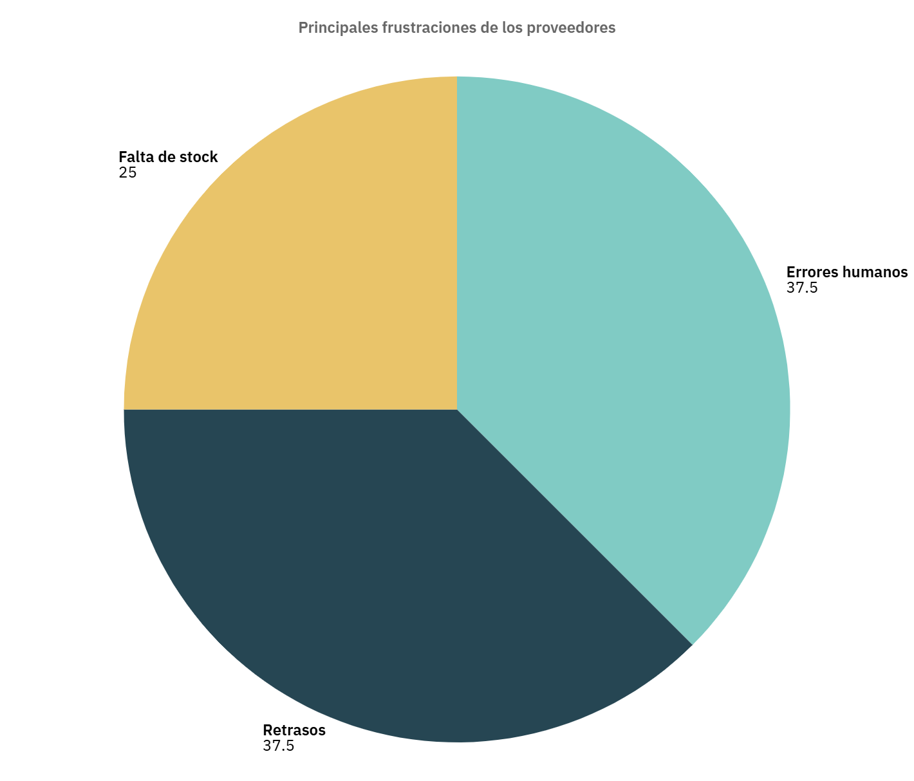

Las frustraciones más frecuentes son los errores humanos y los retrasos en la entrega (100% de los casos), seguidas por la falta de stock (66.7%).
Esto confirma la necesidad de automatización e integración para reducir estos problemas.

##### Grafico 3:

  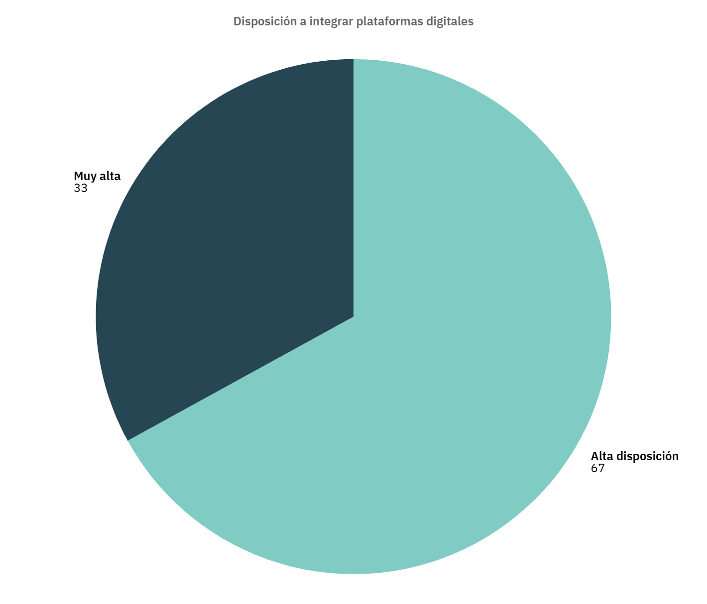

El gráfico refleja una predisposición total (100%) de los proveedores a implementar soluciones tecnológicas, aunque con distintos grados de entusiasmo.
Esto demuestra una alta aceptación del cambio digital dentro del sector.

#### **B. Empresas Solicitantes**

#### Características Objetivas

<table border="1" cellspacing="0" cellpadding="5">
  <thead>
    <tr>
      <th>Característica</th>
      <th>Entrevista 1</th>
      <th>Entrevista 2</th>
      <th>Entrevista 3</th>
    </tr>
  </thead>
  <tbody>
    <tr>
      <td>Edad promedio</td>
      <td>28 años</td>
      <td>23 años</td>
      <td>24 años</td>
    </tr>
    <tr>
      <td>Cargo/rol</td>
      <td>Compras</td>
      <td>Logística</td>
      <td>Operaciones</td>
    </tr>
    <tr>
      <td>Nivel educativo</td>
      <td>Licenciada en Administración</td>
      <td>Universitaria completa</td>
      <td>Universitario completo</td>
    </tr>
    <tr>
      <td>Herramientas principales</td>
      <td>Laptop, smartphone</td>
      <td>Email, WhatsApp, Excel</td>
      <td>WhatsApp, llamadas, software básico</td>
    </tr>
    <tr>
      <td>Medio actual de solicitud</td>
      <td>Correo, WhatsApp</td>
      <td>Teléfono, correo, WhatsApp</td>
      <td>Correo, WhatsApp, llamadas</td>
    </tr>
    <tr>
      <td>Validación de pedidos</td>
      <td>Jefe de operaciones</td>
      <td>Jefe de operaciones</td>
      <td>Jefe de área</td>
    </tr>
    <tr>
      <td>Autorización de pagos</td>
      <td>Contabilidad</td>
      <td>Finanzas/tesorería</td>
      <td>Tesorería</td>
    </tr>
    <tr>
      <td>Reportes de consumo</td>
      <td>Semanal</td>
      <td>Semanal</td>
      <td>Mensual</td>
    </tr>
  </tbody>
</table>

#### Características Subjetivas

<table border="1" cellspacing="0" cellpadding="5">
  <thead>
    <tr>
      <th>Aspecto</th>
      <th>Entrevista 1</th>
      <th>Entrevista 2</th>
      <th>Entrevista 3</th>
    </tr>
  </thead>
  <tbody>
    <tr>
      <td>Frustración con métodos manuales</td>
      <td>Sí</td>
      <td>Sí</td>
      <td>Sí</td>
    </tr>
    <tr>
      <td>Problemas con retrasos/entregas incompletas</td>
      <td>Sí</td>
      <td>Sí</td>
      <td>Sí</td>
    </tr>
    <tr>
      <td>Importancia de trazabilidad</td>
      <td>Muy importante</td>
      <td>Muy importante</td>
      <td>Muy importante</td>
    </tr>
    <tr>
      <td>Deseo de mejoras (automatización/plataforma centralizada)</td>
      <td>Sí</td>
      <td>Sí</td>
      <td>Sí</td>
    </tr>
    <tr>
      <td>Percepción de informalidad en proceso actual</td>
      <td>Sí</td>
      <td>Sí</td>
      <td>Sí</td>
    </tr>
  </tbody>
</table>

El perfil de las empresas solicitantes entrevistadas corresponde a profesionales jóvenes (23-28 años), con formación universitaria, en roles de logística, compras u operaciones, que gestionan pedidos de combustible de manera manual mediante correo, llamadas o WhatsApp.

En cuanto a <strong>características objetivas</strong>, todas dependen de hojas de cálculo (Excel) y comunicaciones informales, con reportes semanales o mensuales. La validación de pedidos recae siempre en el área operativa y los pagos en contabilidad/tesorería.

En cuanto a <strong>características subjetivas</strong>, hay consenso en las principales frustraciones: falta de automatización, informalidad en la gestión, retrasos frecuentes y pérdida de información. Existe un 100% de coincidencia en la necesidad de una plataforma centralizada y trazabilidad en tiempo real, lo que refuerza la propuesta de valor de implementar un sistema digital de gestión de pedidos.

#### Analisis Estadistico

##### Grafico 1:

  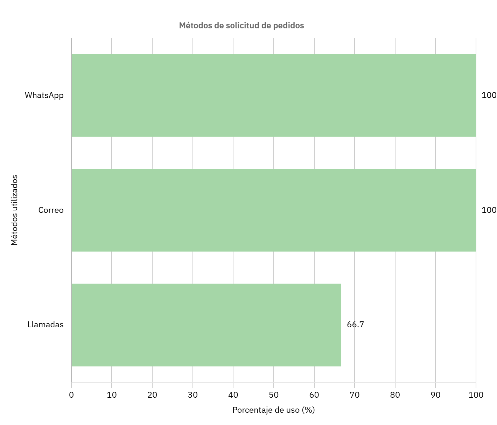

El 100% de las empresas solicitantes utiliza canales informales (WhatsApp y correo), evidenciando la ausencia de sistemas estructurados de pedidos y la alta dependencia de la comunicación directa con los proveedores.

##### Grafico 2:

  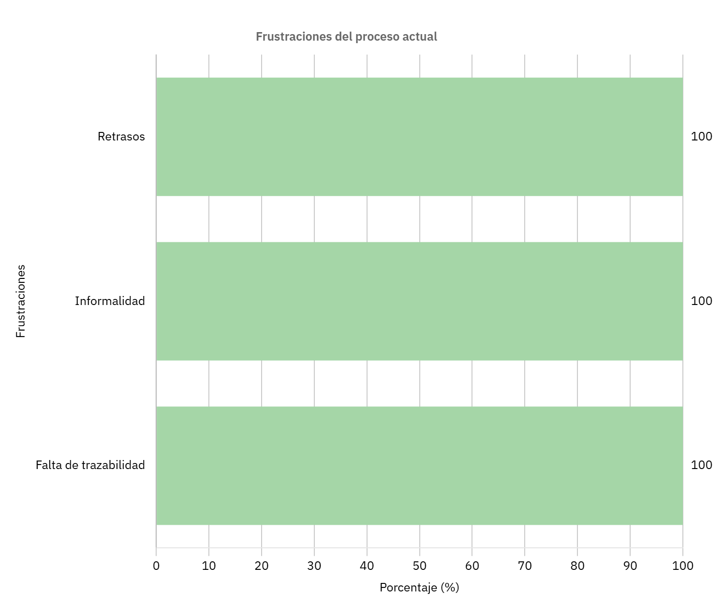

Las tres frustraciones se repiten en todos los entrevistados (100%), confirmando que la falta de control y trazabilidad es un problema transversal que afecta directamente la eficiencia del proceso.

##### Grafico 3:

  

El 100% de las empresas solicitantes mostró una actitud positiva hacia la automatización y digitalización del proceso de pedidos, lo que respalda la viabilidad de implementar una plataforma centralizada.

## 2.3. Needfinding.

### 2.3.1. User Personas

#### A. Proveedores de Combustible

  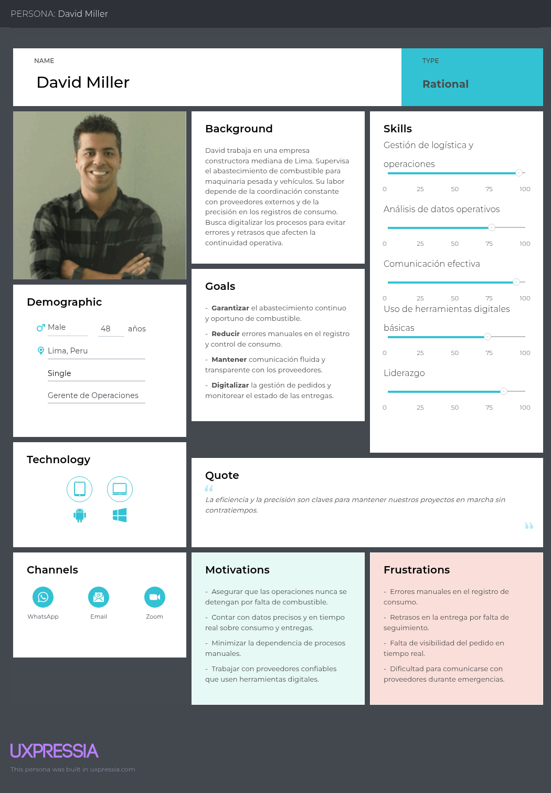

#### B. Empresas Solicitantes

  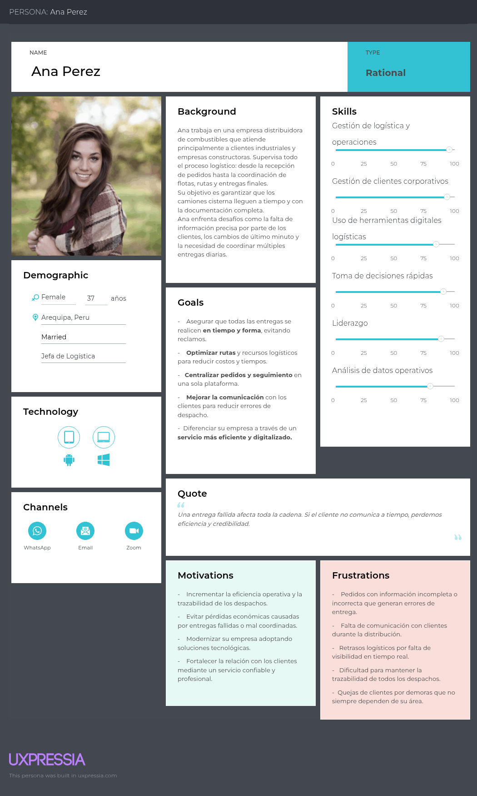

### 2.3.2. User Task Matrix.

<table border>
  <thead>
    <tr>
      <th>Tarea</th>
      <th>David Miller – Frecuencia</th>
      <th>David Miller – Importancia</th>
      <th>Ana Pérez – Frecuencia</th>
      <th>Ana Pérez – Importancia</th>
    </tr>
  </thead>
  <tbody>
    <tr>
      <td>Revisar nivel de stock de combustible</td>
      <td>Alta</td>
      <td>Alta</td>
      <td>Baja</td>
      <td>Baja</td>
    </tr>
    <tr>
      <td>Realizar pedido de combustible</td>
      <td>Media</td>
      <td>Alta</td>
      <td>Alta</td>
      <td>Alta</td>
    </tr>
    <tr>
      <td>Validar confirmación de pedido</td>
      <td>Alta</td>
      <td>Alta</td>
      <td>Alta</td>
      <td>Alta</td>
    </tr>
    <tr>
      <td>Hacer seguimiento a la entrega</td>
      <td>Alta</td>
      <td>Alta</td>
      <td>Alta</td>
      <td>Alta</td>
    </tr>
    <tr>
      <td>Supervisar descarga y recepción</td>
      <td>Media</td>
      <td>Alta</td>
      <td>Media</td>
      <td>Media</td>
    </tr>
    <tr>
      <td>Evaluar proceso post-servicio</td>
      <td>Baja</td>
      <td>Media</td>
      <td>Alta</td>
      <td>Alta</td>
    </tr>
    <tr>
      <td>Gestionar atención al cliente</td>
      <td>Media</td>
      <td>Alta</td>
      <td>Alta</td>
      <td>Alta</td>
    </tr>
    <tr>
      <td>Revisar encuestas o feedback</td>
      <td>Baja</td>
      <td>Media</td>
      <td>Media</td>
      <td>Alta</td>
    </tr>
  </tbody>
</table>

### 2.3.3. User Journey Mapping.

#### A. Proveedores de Combustible

En el caso del solicitante, el recorrido empieza con la generación de un pedido por correo o llamada, seguido por la validación manual del depósito, la espera de aprobación por parte del proveedor, la coordinación del despacho, y finalmente el registro manual de la entrega.

  

#### B. Empresas Solicitantes

En el caso del proveedor, el flujo parte desde la recepción del pedido, luego incluye la verificación del estado de cuenta, la aprobación manual, la asignación de planta y vehículo, y en muchos casos, la reprogramación por problemas de disponibilidad.

  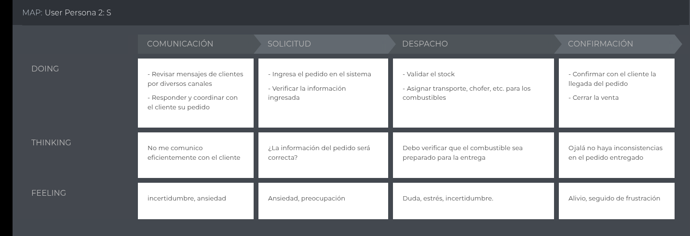

### 2.3.4. Empathy Mapping.

#### A. Proveedores de Combustible

  

#### B. Empresas Solicitantes

  

### 2.3.5. Ubiquitous Language

<table border="1" cellspacing="0" cellpadding="5">
  <tr>
    <th>Término</th>
    <th>Definición</th>
    <th>Segmentos relacionados</th>
  </tr>
  <tr>
    <td>Requester (Solicitante)</td>
    <td>Usuario representante de una empresa requiere abastecimiento de combustible</td>
    <td>Solicitante</td>
  </tr>
  <tr>
    <td>Supplier (Proveedor)</td>
    <td>Empresa que ofrece combustibles al por mayor y compite mediante precios, descuentos y promociones.</td>
    <td>Proveedor</td>
  </tr>
  <tr>
    <td>Fuel (Combustible)</td>
    <td>Recurso energético que es ofertado por los proveedores. Ejemplos: gasohol, diésel, GNV.</td>
    <td>Solicitante, Proveedor</td>
  </tr>
  <tr>
    <td>Plant (Planta)</td>
    <td>Punto de distribución del combustible perteneciente al proveedor.</td>
    <td>Solicitante, Proveedor</td>
  </tr>
  <tr>
    <td>Price per gallon (Precio por galón)</td>
    <td>Valor económico que el proveedor establece por cada galón de combustible. Puede variar según planta, tipo de combustible, etc.</td>
    <td>Solicitante, Proveedor</td>
  </tr>
  <tr>
    <td>Discount (Descuento)</td>
    <td>Reducción aplicada sobre el precio ofrecido, ya sea por volumen, fidelización u otras condiciones.</td>
    <td>Solicitante, Proveedor</td>
  </tr>
  <tr>
    <td>Quotation (Cotización)</td>
    <td>Propuesta formal que un proveedor genera detallando precios, productos, entre otras condiciones</td>
    <td>Solicitante, Proveedor</td>
  </tr>
  <tr>
    <td>Price Table (Tabla de precios)</td>
    <td>Grilla o tabla que muestra los precios ofrecidos por planta, proveedor y tipo de combustible.</td>
    <td>Solicitante</td>
  </tr>
  <tr>
    <td>Negotiation (Negociación)</td>
    <td>Intercambio de condiciones entre solicitante y proveedor para alcanzar un acuerdo favorable para ambas partes.</td>
    <td>Solicitante, Proveedor</td>
  </tr>
  <tr>
    <td>Consumption Volume (Volumen de consumo)</td>
    <td>Cantidad de combustible estimada que una empresa solicita regularmente en un periodo determinado.</td>
    <td>Solicitante</td>
  </tr>
  <tr>
    <td>Purchase History (Historial de compras)</td>
    <td>Registro de cotizaciones y compras o pedidos previos hechos por el solicitante dentro del sistema.</td>
    <td>Solicitante</td>
  </tr>
</table>

## 2.4. Requirements specification

### 2.4.1. To Be Scenario Mapping

#### A. Proveedores de Combustible

<table border>
  <thead>
    <tr>
      <th>FASES</th>
      <th>Comunicación</th>
      <th>Solicitar pedido</th>
      <th>Seguimiento</th>
      <th>Entrega</th>
    </tr>
  </thead>
  <tbody>
    <tr>
      <td><strong>DOING</strong></td>
      <td>Utiliza la plataforma centralizada FuelTrack, con historial de comunicación y notificaciones automáticas.</td>
      <td>Completa un formulario estructurado directamente desde la web o app.</td>
      <td>Revisa el panel de seguimiento con estado del pedido en tiempo real.</td>
      <td>Recibe una confirmación automática con hora estimada y firma digital.</td>
    </tr>
    <tr>
      <td><strong>THINKING</strong></td>
      <td>"Puedo revisar todos mis pedidos desde un solo lugar."</td>
      <td>"Todo quedó registrado sin ningún error."</td>
      <td>"Puedo ver exactamente en qué etapa está mi pedido y cuánto falta para que pueda recibirlo."</td>
      <td>"Recibí el pedido tal como estaba programado."</td>
    </tr>
    <tr>
      <td><strong>FEELING</strong></td>
      <td>Tranquilidad, control.</td>
      <td>Confianza, seguridad.</td>
      <td>Calma, claridad.</td>
      <td>Satisfacción, alivio.</td>
    </tr>
  </tbody>
</table>

#### B. Empresas Solicitantes

<table border>
  <thead>
    <tr>
      <th>FASES</th>
      <th>Comunicación</th>
      <th>Recepción de pedido</th>
      <th>Gestión y seguimiento</th>
      <th>Entrega final</th>
    </tr>
  </thead>
  <tbody>
    <tr>
      <td><strong>DOING</strong></td>
      <td>Recibe notificaciones automáticas de nuevos pedidos desde FuelTrack.</td>
      <td>Visualiza un pedido estructurado en la plataforma, con toda la información validada.</td>
      <td>Utiliza el panel de control para organizar la flota y asignar recursos.</td>
      <td>Registra la entrega con confirmación digital y genera comprobante automático.</td>
    </tr>
    <tr>
      <td><strong>THINKING</strong></td>
      <td>"Los pedidos me llegan claros y sin errores de comunicación."</td>
      <td>"Tengo toda la información necesaria en un solo lugar."</td>
      <td>"Puedo controlar y optimizar mis recursos sin perder tiempo."</td>
      <td>"La entrega quedó confirmada y registrada automáticamente."</td>
    </tr>
    <tr>
      <td><strong>FEELING</strong></td>
      <td>Seguridad, orden.</td>
      <td>Confianza, claridad.</td>
      <td>Control, eficiencia.</td>
      <td>Tranquilidad, satisfacción.</td>
    </tr>
  </tbody>
</table>

### 2.4.2. User Stories

<table border>
  <thead>
    <tr>
      <th>Epic ID</th>
      <th>Título</th>
      <th>Descripción</th>
      <th>Criterios de aceptación</th>
    </tr>
  </thead>
  <tbody>
    <tr>
      <td>EP01</td>
      <td>Gestión de pedidos de combustible de solicitante</td>
      <td>Como usuario solicitante de combustible, quiero poder registrar mis pedidos fácilmente y con la capacidad de establecer parámetros específicos para evitar errores en la comunicación y recibir lo que necesito.</td>
      <td><strong>Escenario 1</strong>: Registro de pedido exitoso. 
       Dado que el solicitante está autenticado y tiene permisos vigentes para registrar pedidos   
       Y cuenta con la información necesaria del requerimiento 
       Cuando registra un nuevo pedido proporcionando todos los datos obligatorios válidos  
       Y confirma el envío del pedido
       Entonces el sistema valida la información
       Y crea el pedido 
       <strong>Escenario 2</strong>: Visualización de historial de pedidos. Dado que el solicitante está autenticado y existen pedidos asociados a su cuenta 
       Cuando solicita el historial de sus pedidos  
       Entonces el sistema retorna la lista completa de pedidos del solicitante 
       Y si no existen pedidos, el sistema retorna una lista vacía sin error 
       </td>
    </tr>
    <tr>
      <td>EP02</td>
      <td>Gestión de pedidos recibidos por el proovedoor</td>
      <td>Como usuario proovedor de combustible, quiero poder revisar los pedidos realizados por mis clientes, actualizar el estado de cada uno y dar actualizaciones en tiempo real a mis clientes.</td>
      <td><strong>Escenario 1</strong>: Visualización de pedidos entrantes. Dado que haya pedidos activos 
      Cuando solicita el listado de pedidos entrantes 
      Entonces el sistema retorna la colección de pedidos activos visibles para ese proveedor 
        <strong>Escenario 2</strong>: Actualización de estado del pedido.Dado que un pedido esté en curso
      Cuando solicita actualizar el estado del pedido 
      Entonces el sistema valida la transición si este esta en estado pendiente 
      Y aplica el nuevo estado
         <strong>Escenario 3</strong>: Notificación a los clientes.  Dado que el cliente está autenticado y es titular del pedido 
       Y el sistema ha confirmado un cambio realizado por el proveedor sobre ese pedido 
       Cuando el sistema procesa dicho cambio 
       Entonces emite y entrega al cliente una notificación en tiempo real 
       </td>
    </tr>
    <tr>
      <td>EP03</td>
      <td>Gestión de seguridad y acceso</td>
      <td>Como usuario de ambos segmentos de la plataforma, quiero que mis datos estén protegidos y acceder solo mediante autenticación segura, para garantizar la privacidad y evitar accesos no autorizados.</td>
      <td><strong>Escenario 1</strong>: Inicio de sesión seguro. Dado que el usuario tenga una cuenta, Cuando intente iniciar sesión con correo y contraseña, Entonces el sistema debe validar las credenciales y otorgar acceso solo si son correctas, evitando revelar información en caso de error.   <strong>Escenario 2</strong>: Control de accesos según rol. Dado que un usuario (cliente o proveedor) haya iniciado sesión,Cuando intente acceder a secciones específicas de la plataforma, Entonces solo deberá poder ver y operar dentro de las funcionalidades permitidas por su tipo de cuenta.   <strong>Escenario 3</strong>: Autenticación multifactor para operaciones. Dado que un cliente esté realizando un pedido,Cuando intente enviarlo o confirmarlo,Entonces el sistema deberá activar un segundo paso de verificación (código temporal o notificación) antes de procesar la acción..</td>
    </tr>
    <tr>
      <td>EP04</td>
      <td>Landing Page informativa y funcional</td>
      <td>Como parte de la solución, quiero ofrecer una landing page que muestre los beneficios y funcionalidades de FuelTrack, para captar el interés de potenciales usuarios.</td>
      <td><strong>Escenario 1</strong>: Visualización pública. Cuando alguien acceda al dominio principal sin estar autenticado, el sistema debe mostrar la landing page con secciones informativas, beneficios del sistema, segmentos objetivo y llamadas a la acción hacia login/registro.   <strong>Escenario 2</strong>: Redirección según interés. Al hacer clic en 'Quiero registrarme', debe llevar al formulario correspondiente según el segmento.</td>
    </tr>
  </tbody>
</table>

<table border="1">
  <thead>
    <tr>
      <th>User Story ID</th>
      <th>Título</th>
      <th>Descripción</th>
      <th>Criterios de aceptación</th>
      <th>Relacionado con (Epic ID)</th>
    </tr>
  </thead>
  <tbody>
    <tr>
      <td>US01</td>
      <td>Crear nuevo pedido</td>
      <td>Como usuario de una empresa solicitante, quiero poder registrar un pedido directamente desde la plataforma agilizar el proceso y evitar llamadas.</td>
      <td>
      <strong>Escenario 1</strong>:Crear un nuevo pedido exitosamente  
      Dado que el usuario solicitante autenticado y cuenta con permisos para registrar pedidos 
      Cuando registra un nuevo pedido proporcionando todos los datos obligatorios válidos 
      Y confirma el envío 
      Entonces el sistema valida la información  
      Y crea el pedido  
      Y asigna un identificador único 
      <strong>Escenario 2</strong>:Error por información obligatoria faltante o inválida 
      Dado que el solicitante esta registrando un nuevo pedido 
      Cuando intenta registrar un pedido omitiendo uno o más campos obligatorios o ingresando valores inválidos 
      Entonces el sistema rechaza la creación del pedido  
      <strong>Escenario 3</strong>:Visualización en lista de pedidos 
      Dado que el pedido fue registrado correctamente 
      Cuando el solicitante consulta su listado de pedidos 
      Entonces el sistema incluye el pedido en los resultados 
      Y muestra su estado actual “Pendiente” 
          </td>
      <td>EP01</td>
    </tr>
    <tr>
      <td>US02</td>
      <td>Consultar historial de pedidos</td>
      <td>Como solicitante, quiero poder consultar mi historial de pedidos anteriores, y poder ver cada u no con información detallada. Además, debo ser capaz de filtrar y ordenar el historial según características específicas de los pedidos.</td>
      <td>
      <strong>Escenario 1</strong>:Visualización del historial de pedidos 
      Dado que el solicitante tiene pedidos asociados  
      Cuando solicita el historial 
      Entonces retorna los pedidos asociados del solicitante. 
      <td>EP01</td>
    </tr>
    <tr>
      <td>US03</td>
      <td>Editar pedidos</td>
      <td>Como solicitante, quiero tener la posibilidad de editar parámetros, como el monto o dirección de entrega, de mis pedidos siempre y cuando estos todavía no hayan sido confirmados por el proveedor</td>
      <td>
      <strong>Escenario 1</strong>:Edición habilitado solo antes de confirmación 
      Dado que el solicitante es titular del pedido  
      Y el pedido esta en estado "Pendiente" 
      Cuando solicita editar uno o más campos permitidos con datos válidos  
      Entonces el sistema valida y aplica los cambios 
      <strong>Escenario 2</strong>:Bloquea edición cuando el pedido está confirmado 
      Dado que pedido está en estado Confirmado por proveedor 
      Cuando intenta editar el pedido 
      Entonces el sistema rechaza la operación por estado no editable 
      Y no persiste cambios 
      </td>
      <td>EP01</td>
    </tr>
    <tr>
      <td>US04</td>
      <td>Actualizar estado e información de pedido</td>
      <td>Como proveedor de combustible, quiero poder actualizar el estado e información de los pedidos en tiempo real, para mantener a mis clientes informados y organizar mejor mis entregas.</td>
      <td>
      <strong>Escenario 1</strong>:Cambio de estado   
      Dado que existan pedidos activos para el proveedor   
      Cuando solicita actualizar el estado del pedido a Confirmado, En ruta o Entregado 
      Entonces el sistema aplica la actualización.
      </td>
      <td>-</td>
    </tr>
    <tr>
      <td>US05</td>
      <td>Notificar a clientes sobre cambios de pedido</td>
      <td>Como proovedor, quiero que mis clientes reciban notificaciones automáticas cuando actualizo un pedido, para que estén al tanto del progreso sin tener que llamarlos.</td>
      <td>
      <strong>Escenario 1</strong>:Notifica al actualizar estado   
      Dado que el sistema registra un cambio válido sobre un pedido del cliente titular 
      Cuando modifica datos operativos relevantes del pedido  
      Entonces el sistema envía una notificación al cliente con el detalle del cambio en tiempo real.</td>
      <td>EP02</td>
    </tr>
    <tr>
      <td>US06</td>
      <td>Rechazar o cancelar pedidos</td>
      <td>Como proveedor de combustible, quiero poder rechazar o cancelar un pedido y enviar un mensaje al cliente explicando los motivos, para mantener una comunicación clara y evitar confusiones.</td>
      <td>
      <strong>Escenario 1</strong>:Rechazo de pedido pendiente  
      Dado que el proveedor no pueda atender un pedido 
      Cuando el proveedor registra el rechazo indicando un motivo válido 
      Entonces el sistema cambia el estado a Rechazado por proveedor 
      Y notifica al cliente con el mensaje correspondiente. 
      <strong>Escenario 2</strong>:Estados no editables 
      Dado que el pedido está en estado "Entregado" o "Pendiente" 
      Cuando el proveedor intenta rechazarlo o cancelar el pedido  
      Entonces el sistema la operación 
      </td>
      <td>EP02</td>
    </tr>
    <tr>
      <td>US07</td>
      <td>Iniciar sesión en la Plataforma</td>
      <td>Como usuario registrado, quiero iniciar sesión con mi correo y contraseña, para acceder a mi cuenta de forma segura.</td>
      <td>
      <strong>Escenario 1</strong>:Inicio de sesión exitoso  
      Dado que el usuario tenga una cuenta valida 
      Cuando ingresa el correo y contraseña correctos  
      Entonces el sistema deberá validar sus credenciales 
      Y permitir el acceso a la plataforma.  
      <strong>Escenario 2</strong>:Error por credenciales incorrectas  
      Dado que el usuario ingresa un correo o contraseña Incorrecto 
      Cuando intenta iniciar sesión 
      Entonces el sistema rechaza la autenticación por credenciales inválidas 
      Y no permite el acceso 
      <td>EP03</td>
    </tr>
    <tr>
      <td>US08</td>
      <td>Registrar una nueva cuenta de usuario</td>
      <td>Como visitante, Quiero crear una cuenta con correo, contraseña y rol (cliente o proveedor), Para acceder y comenzar a utilizar la plataforma.</td>
      <td>
      <strong>Escenario 1</strong>:Registro exitoso 
      Dado que el visitante complete todos los campos requeridos  
      Cuando confirma la solicitud de registro 
      Entonces el sistema crea la cuenta,  
      Y redirigirlo al panel de inicio segun su rol de registro. 
      <strong>Escenario 2</strong>:Registro invalido 
      Dado que el visitante intenta registrarse  
      Cuando omite campos obligatorios o envía valores con formato inválido 
      Entonces el sistema rechaza la creación de la cuenta 
      Y no crea una nueva cuenta 
      </td>
      <td>EP03</td>
    </tr>
    <tr>
      <td>US09</td>
      <td>Recuperar contraseña</td>
      <td>Como usuario, Quiero tener la posibilidad de recuperar mi contraseña mediante correo electrónico, Para no perder el acceso a mi cuenta en caso la olvide.</td>
      <td>
      <strong>Escenario 1</strong>:Solicitud de recuperación exitosa 
      Dado que el usuario no recuerde su contraseña 
      Cuando solicita la recuperación de contraseña 
      Y proporciona el correo registrado en la cuenta  
      Entonces el sistema envía un correo con instrucciones de recuperación o enlace seguro.  
      <strong>Escenario 2</strong>:Correo no registrado 
      Dado que el usuario ingresa un correo que no está registrado en el sistema  
      Cuando intenta solicitar la recuperación  
      Entonces el sistema no realizara la solicitud de recuperación. 
      </td>
      <td>EP03</td>
    </tr>
    <tr>
      <td>US10</td>
      <td>Restringir acceso por roles</td>
      <td>Como administrador de la plataforma, Quiero que los usuarios solo accedan a las secciones según su rol, Para evitar errores en el sistema</td>
      <td>
      <strong>Escenario 1</strong>:Acceso permitido según rol 
      Dado que un usuario acceda a la plataforma 
      Cuando vea las secciones que tiene disponible 
      Entonces el sistema muestra únicamente las que son correspondientes a su rol.</td>
      <td>EP03</td>
    </tr>
    <tr>
      <td>US11</td>
      <td>Requerir MFA para emitir pedidos</td>
      <td>Como empresa solicitante, Quiero que se me solicite una autenticación multifactor al momento de realizar un pedido, Para asegurar que solo personal autorizado pueda emitir órdenes de compra</td>
      <td>
      <strong>Escenario 1</strong>:MFA obligatorio al emitir pedido 
      Dado que el solicitante quiera registrar un pedido  
      Cuando complete los datos del formulario de registro  
      Entonces el sistema requiere un segundo factor de autenticación (MFA) antes de confirmar la operación 
      <strong>Escenario 2</strong>:Emisión exitosa tras MFA válido 
      Dado que el solicitante recibe/posee un código MFA válido y vigente 
      Cuando ingresa el código y confirma la operación  
      Entonces el sistema valida el MFA y registra el pedido 
      <strong>Escenario 3</strong>:Bloqueo por MFA inválido o expirado 
      Dado que el solicitante ingresa un código incorrecto o vencido 
      Cuando intenta confirmar 
      Entonces el sistema rechaza la operación por MFA no válido, detalla la causa operativa y permite reintentar hasta el límite configurado sin registrar el pedido 
      </td>
      <td>EP03</td>
    </tr>
    <tr>
      <td>US12</td>
      <td>Visualizar landing page informativa</td>
      <td>Como usuario de la plataforma, quiero que el sistema muestre un landing page informativo para que los interesados conozcan los beneficios antes de registrarse.</td>
      <td>
      <strong>Escenario 1</strong>:Acceso público sin autenticación  
      Dado que el visitante acceda a la URL principal sin estar autenticado 
      Cuando solicita el recurso público de presentación 
      Entonces el sistema entrega la página informativa 
      </td>
      <td>EP04</td>
    </tr>
    <tr>
      <td>TS01</td>
      <td>Implementar endpoint REST para pedidos</td>
      <td>Como desarrollador, quiero implementar un endpoint RESTful para registrar pedidos, para que la aplicación frontend pueda enviar solicitudes válidas al backend.</td>
      <td>
      <strong>Escenario 1</strong>:Creación exitosa  
      Dado que se realice una solicitud POST con datos válidos  
      Cuando el backend procesa la creación 
      Entonces deberá guardarse el pedido en la base de datos y devolver un código 201 con ID.
      </td>
      <td>EP01</td>
    </tr>
    <tr>
      <td>TS02</td>
      <td>Servicio de autenticación y token</td>
      <td>Como desarrollador, quiero implementar un servicio de autenticación con generación de tokens, para proteger las rutas privadas de la plataforma.</td>
      <td>
      <strong>Escenario 1</strong>:Login exitoso y emisión de tokens  
      Dado que un usuario envía credenciales válidas 
      Cuando se procesa el POST 
      Entonces el sistema deberá generar un token JWT para acceso a recursos protegidos.
      <strong>Escenario 2</strong>:Credenciales inválidas  
      Dado que las credenciales no coinciden o la cuenta está bloqueada/inactiva 
      Cuando se procesa el POST 
      Entonces el sistema retorna 401 (o 403 si está bloqueada) sin emitir tokens
      </td>
      <td>EP03</td>
    </tr>
    <tr>
      <td>TS03</td>
      <td>Envío de notificaciones por cambios de estado</td>
      <td>Como desarrollador, quiero implementar un servicio que envíe notificaciones automáticas cuando un pedido cambie de estado, para mantener informados a los usuarios.</td>
      <td>
      <strong>Escenario 1</strong>:Notificación tras cambio válido  
      Dado un evento PedidoEstadoActualizado con transición válida  
      Cuando el servicio lo procesa 
      Entonces emite notificaciones a los canales permitidos del titular, en tiempo casi real, y registra la trazabilidad.
      </td>
      <td>EP02</td>
    </tr>
    <tr>
      <td>TS04</td>
      <td>Registro y validación de ubicación GPS</td>
      <td>Como desarrollador, quiero permitir que los pedidos en ruta envíen coordenadas GPS, para poder visualizar la trazabilidad del transporte en tiempo real.</td>
      <td>Dado que un conductor envíe su ubicación, Cuando el backend reciba las coordenadas, Entonces deberán almacenarse y estar disponibles para visualización en el frontend.</td>
      <td>EP02</td>
    </tr>
    <tr>
      <td>US13</td>
      <td>Ver sección Home</td>
      <td>Como visitante (proveedor), quiero ver una sección de inicio que resuma el valor de FuelTrack para comprender rápidamente el objetivo del sistema.</td>
      <td>
        Escenario 1: Visualización de resumen del sistema. 
        Dado que un visitante sin autenticación accede a la ruta pública de inicio 
        Cuando solicita el recurso Home 
        Entonces el sistema entrega contenido informativo que describe el objetivo de FuelTrack  
        y los beneficios clave para proveedores 
        Escenario 2: Acceso a acciones principales desde Home 
        Dado que el visitante se encuentra en Home sin autenticación 
        Cuando solicita una acción principal definida por el negocio 
        Entonces el sistema direcciona a la ruta correspondiente 
      </td>
      <td>EP04</td>
    </tr>
    <tr>
      <td>US14</td>
      <td>Ver sección About Us</td>
      <td>Como visitante de ambos segmentos, quiero conocer quiénes están detrás de FuelTrack para confiar en el sistema.</td>
      <td>
        Escenario 1: Información visible del equipo. 
        Dado que un visitante accede al recurso público About Us sin autenticación 
        Cuando solicita la información del equipo responsable 
        Entonces el sistema entrega los datos permitidos 
        Escenario 2: Ver valores o misión 
        Dado que un visitante accede al recurso público About Us 
        Cuando solicita el contenido institucional 
        Entonces el sistema retorna la misión, visión y valores vigentes de FuelTrack  
      </td>
      <td>EP04</td>
    </tr>
    <tr>
      <td>US15</td>
      <td>Ver sección How it works?</td>
      <td>Como visitante de ambos segmentos, quiero entender cómo funciona FuelTrack paso a paso para evaluar si se ajusta a mis necesidades.</td>
      <td>
        Escenario 1: Comprensión del flujo de pedidos. 
        Dado que un visitante sin autenticación accede al recurso público How it works 
        Cuando solicita el contenido del flujo de punta a punta 
        Entonces el sistema entrega un resumen paso a paso que cubre. 
      </td>
      <td>EP04</td>
    </tr>
    <tr>
      <td>US16</td>
      <td>Enviar mensaje de contacto</td>
      <td>Como visitante de ambos segmentos, quiero enviar un mensaje desde Contact Us para solicitar más información.</td>
      <td>
        Escenario 1: Envío exitoso de mensaje. 
        Dado que el visitante proporciona todos los campos obligatorios con valores válidos 
        Cuando envía la solicitud de contacto 
        Entonces el sistema crea el registro con un ID de seguimiento 
        Escenario 2: Validación de campos obligatorios. 
        Dado que el visitante omite campos obligatorios o envía formatos inválidos  
        Cuando envia la solicitud 
        Entonces el sistema rechaza el envío 
      </td>
      <td>EP04</td>
    </tr>
    <tr>
      <td>US17</td>
      <td>Aprobar pedido</td>
      <td>Como proveedor, quiero aceptar según el stock disponible para evitar conflictos de distribución.</td>
      <td>
          <strong>Escenario 1: Aprobación de pedido con stock disponible</strong> 
          Dado que el proveedor tiene stock suficiente 
          Cuando aprueba el pedido 
          Entonces el estado cambia a Aprobado 
          <strong>Escenario 2: Envío de motivo</strong> 
          Dado que el proveedor decide no aprobar un pedido 
          Cuando registra el motivo de no aprobación 
          Entonces el sistema cambia el estado a Rechazado 
      </td>
      <td>EP02</td>
    </tr>
    <tr>
      <td>US18</td>
      <td>Marcar el pedido como despachado.</td>
      <td>Como proveedor, quiero marcar cuándo un pedido sale a entrega para notificar al cliente.</td>
      <td>
        <strong>Escenario 1: Despacho exitoso de un pedido</strong>
        Dado que el proveedor tiene un pedido aprobado 
        Cuando marca el pedido como despachado 
        Entonces el sistema cambia el estado a Despachado 
        <strong>Escenario 2: Restricción de despacho sin aprobación previa</strong>
         Dado que el proveedor intenta despachar un pedido sin aprobación 
         Cuando ejecuta la acción 
         Entonces el sistema impide el cambio de estado 
      </td>
      <td>EP02</td>
    </tr>
    <tr>
      <td>US19</td>
      <td>Cerrar el pedido</td>
      <td>Como proveedor, quiero cerrar el pedido cuando el cliente confirme la entrega para finalizar el proceso.</td>
      <td>
        <ul>
          <strong>Escenario 1: Cierre correcto del pedido tras confirmación</strong>
              Dado que el solicitante ya confirmó la entrega 
              Cuando el proveedor solicita cerrar el pedido 
              Entonces el sistema cambia el estado a Cerrado 
              Y bloquea modificaciones posteriores 
          <strong>Escenario 2: Intento de cierre sin confirmación previa</strong> 
              Dado que el proveedor intenta cerrar el pedido 
              Cuando el solicitante aún no ha confirmado la entrega 
              Entonces el sistema impide esta acción 
            </ul>
          </li>
        </ul>
      </td>
      <td>EP02</td>
    </tr>
    <tr>
      <td>US20</td>
      <td>Generar reporte de ventas</td>
      <td>Como proveedor, quiero generar reportes de ventas para tener registro de operaciones realizadas.</td>
      <td>
          <strong>Escenario 1: Generación de reporte con datos disponibles</strong> 
            Dado que el proveedor envía un rango de fechas válido 
            Cuando solicita generar reporte 
            Entonces se genera un archivo con los datos de ventas 
          <strong>Escenario 2: Generación sin datos en el rango</strong> 
            Dado que el proveedor selecciona un rango sin ventas 
            Cuando solicita el reporte 
            Entonces el sistema informa que no hay resultados 
          <strong>Escenario 3: Descarga del archivo generado</strong> 
            Dado que el reporte se genera correctamente 
            Cuando finaliza el proceso 
            Entonces el proveedor puede descargar el archivo 
      </td>
      <td>EP02</td>
    </tr>
    <tr>
      <td>US21</td>
      <td>Ver resumen de pedidos</td>
      <td>Como solicitante, quiero ver un resumen de mis pedidos para identificar cuántos están en proceso o completados.</td>
      <td>
          <strong>Escenario 1: Visualización de resumen con datos disponibles</strong>
            Dado que el solicitante tiene pedidos registrados 
            Cuando solicita el resumen de pedidos 
            Entonces el sistema calcula y retorna los KPIs por estado (Pendientes, Confirmados, Despachados, Finalizados y Rechazados) junto con el total y la marca temporal del cálculo 
          <strong>Escenario 2: Sin pedidos registrados</strong>
            Dado que el solicitante no tiene pedidos 
            Cuando solicita el resumen 
            Entonces el sistema retorna contadores en cero para todos los estados y el total 
          <strong>Escenario 3: Error al cargar datos del resumen</strong>
            Dado que ocurre una falla al consultar/aggregar los datos 
            Cuando el solicitante solicita el resumen 
            Entonces el sistema rechaza la operación con un error operativo. 
      </td>
      <td>EP01</td>
    </tr>
    <tr>
      <td>TS05</td>
      <td>Endpoint: Login</td>
      <td>Como developer, quiero un endpoint para autenticar usuarios.</td>
      <td>
        <strong>Escenario 1: Autenticación exitosa</strong> 
            Dado que el developer incluye credenciales válidas en el requests 
            Cuando lo envía al endpoint de autenticación 
            Entonces recibe un token JWT y un status 200 como respuesta 
          <strong>Escenario 2: Credenciales inválidas</strong> 
            Dado que el developer incluye credenciales incorrectas en el request 
            Cuando se procesa la solicitud 
            Entonces se retorna status 401 con un mensaje de error 
          <strong>Escenario 3: Error interno del servidor</strong> 
            Dado que el developer realiza un request y ocurre un problema en el backend 
            Cuando se procesa la autenticación 
            Entonces se retorna status 500 con un mensaje genérico de error 
      </td>
      <td>EP03</td>
    </tr>
    <tr>
      <td>TS06</td>
      <td>Endpoint: Recuperar contraseña</td>
      <td>Como developer, quiero un endpoint para que permita enviar correo de recuperación.</td>
      <td>
        <ul>
          <li><strong>Escenario 1: Solicitud válida</strong>
            <ul>
              <li>Dado que el developer envía un request con un correo que existe en la base de datos,</li>
              <li>Cuando el request llega al endpoint de recuperación,</li>
              <li>Entonces el sistema genera un token y envía el correo de recuperación.</li>
            </ul>
          </li>
          <li><strong>Escenario 2: Correo inexistente</strong>
            <ul>
              <li>Dado que el developer envía un request con un correo no registrado,</li>
              <li>Cuando se procesa la solicitud,</li>
              <li>Entonces se retorna status 404 y no se envía ningún correo.</li>
            </ul>
          </li>
          <li><strong>Escenario 3: Error en el envío del correo</strong>
            <ul>
              <li>Dado que el developer ejecuta la acción y ocurre un fallo en el servicio de correo,</li>
              <li>Cuando se intenta enviar el mensaje,</li>
              <li>Entonces se retorna status 500 y se registra el error en los logs del servidor.</li>
            </ul>
          </li>
        </ul>
      </td>
      <td>EP03</td>
    </tr>
    <tr>
      <td>TS07</td>
      <td>Endpoint: Logout</td>
      <td>Como developer, quiero un endpoint para cerrar sesión.</td>
      <td>
        <ul>
          <li><strong>Escenario 1: Logout exitoso</strong>
            <ul>
              <li>Dado que el developer envía un token de sesión válido,</li>
              <li>Cuando llama al endpoint de logout,</li>
              <li>Entonces la sesión se invalida y se retorna status 200.</li>
            </ul>
          </li>
          <li><strong>Escenario 2: Token inválido o expirado</strong>
            <ul>
              <li>Dado que el developer incluye un token no válido o expirado,</li>
              <li>Cuando se llama al endpoint de logout,</li>
              <li>Entonces se retorna status 401 y no se realiza ninguna acción.</li>
            </ul>
          </li>
          <li><strong>Escenario 3: Falla del servidor</strong>
            <ul>
              <li>Dado que el developer realiza un request y ocurre un error interno en el servidor,</li>
              <li>Cuando se procesa el logout,</li>
              <li>Entonces se retorna status 500 con un mensaje genérico.</li>
            </ul>
          </li>
        </ul>
      </td>
      <td>EP03</td>
    </tr>
    <tr>
      <td>US23</td>
      <td>Asignar un vehículo al pedido.</td>
      <td>Como proveedor, quiero asignar un vehículo a un pedido aprobado para organizar la logística.</td>
      <td>
        <strong>Escenario 1: Asignación válida</strong>
            Dado que el proveedor tiene un pedido aprobado y un vehículo libre disponible 
            Cuando el proveedor registra la asignación del vehículo 
            Entonces el sistema vincula el vehículo al pedido 
         <strong>Escenario 2: Vehículo ocupado</strong>
            Dado que el vehículo seleccionado tiene conflicto de disponibilidad
            Cuando el proveedor intenta asignarlo
            Entonces l sistema rechaza la operación por no disponibilidad
      </td>
      <td>EP02</td>
    </tr>
    <tr>
      <td>US24</td>
      <td>Asignar un conductor al pedido.</td>
      <td>Como proveedor, quiero asignar un conductor para completar la información de despacho.</td>
      <td>
        <strong>Escenario 1: Conductor disponible</strong> 
            Dado que el proveedor tiene un pedido con vehículo asignado y el conductor está libre 
            Cuando el proveedor registra la asignación del conductor 
            Entonces el sistema vincula al conductor con el pedido. 
          <strong>Escenario 2: Conductor ya asignado en misma franja horaria</strong> 
            Dado que el conductor está asignado a otro pedido en el mismo horario 
            Cuando se intenta asignarlo al pedido 
            Entonces el sistema rechaza la operación por no disponibilidad e indica la causa.  
      </td>
      <td>EP02</td>
    </tr>
    <tr>
      <td>US25</td>
      <td>Validar la disponibilidad de transporte</td>
      <td>Como proveedor, quiero saber qué vehículos están disponibles antes de asignarlos para vincularlos correctamente.</td>
      <td>
        <strong>Escenario 1: Vehículo no disponible por superposición</strong> 
            Dado que el proveedor solicita el listado de vehículos disponibles  
            Cuando un vehículo está asignado a otro pedido para la misma fecha y hora estimada</li>
            Entonces el sistema lo marca como no disponible 
          <strong>Escenario 2: Vehículo disponible</strong> 
            Dado que el proveedor solicita el listado de disponibilidad
            Cuando un vehículo no presenta conflictos de agenda ni restricciones operativas 
            Entonces el sistema lo considera disponible 
         <strong>Escenario 3: Conflicto en tiempo real</strong> 
            Dado que un vehículo fue asignado recientemente 
            Cuando el proveedor intenta seleccionarlo para otro pedido 
            Entonces el sistema rechaza la selección por conflicto de disponibilidad 
      </td>
      <td>EP03</td>
    </tr>
    <tr>
      <td>US26</td>
      <td>Ver perfil de usuario</td>
      <td>Como usuario registrado, quiero ver mis datos de perfil para revisar mi información registrada.</td>
      <td>
          <strong>Escenario 1: Visualización exitosa del perfil</strong> 
            Dado que el usuario tiene sesión activa 
            Cuando accede a su perfil 
            Entonces el sistema retorna su nombre, correo y rol 
          <strong>Escenario 2: Error en la carga de datos</strong> 
            Dado que el usuario está autenticado 
            Cuando ocurre un error al recuperar la información del perfil 
            Entonces el sistema rechaza la operación con un error operativo 
          <strong>Escenario 3: Restricción de datos de otros usuarios</strong>
           
            Dado que el usuario tiene sesión activa 
            Cuando intenta ver otro perfil 
            Entonces el sistema deniega la operación por falta de autorización 
      </td>
      <td>EP03</td>
    </tr>
    <tr>
      <td>US27</td>
      <td>Editar datos de perfil</td>
      <td>Como usuario registrado, quiero editar mis datos para mantener mi información actualizada.</td>
      <td>
        <strong>Escenario 1: Edición y guardado exitoso</strong> 
            Dado que el usuario modifica uno o más campos del formulario 
            Cuando envía la solicitud de actualización 
            Entonces el sistema valida y aplica los cambios 
          <strong>Escenario 2: Campo obligatorio vacío</strong> 
            Dado que el usuario deja un campo obligatorio vacío 
            Cuando se procesa la solicitud 
            Entonces el sistema rechaza la actualización por validación fallida 
          <strong>Escenario 3: Error del servidor al guardar</strong> 
            Dado que ocurre un error interno durante la persistencia 
            Cuando se procesa la actualización 
            Entonces el sistema rechaza la operación con error operativo 
      </td>
      <td>EP03</td>
    </tr>
    <tr>
      <td>US28</td>
      <td>Buscar pedido por código</td>
      <td>Como usuario de ambos segmentos, quiero buscar un pedido específico por su código para encontrarlo rápidamente.</td>
      <td>
        <ul>
          <li><strong>Escenario 1: Ingresar a la búsqueda</strong>
            <ul>
              <li>Dado que el usuario presione el botón de filtrar,</li>
              <li>Cuando ingrese la opción del código en las grillas,</li>
              <li>Entonces podrá buscar su pedido según su código.</li>
            </ul>
          </li>
          <li><strong>Escenario 2: Pedido encontrado</strong>
            <ul>
              <li>Dado que el usuario escribe un código válido,</li>
              <li>Cuando existe un pedido con ese código,</li>
              <li>Entonces se muestra el resultado correspondiente.</li>
            </ul>
          </li>
          <li><strong>Escenario 3: Pedido no encontrado</strong>
            <ul>
              <li>Dado que el usuario digita un código no correspondiente a ningún pedido,</li>
              <li>Cuando finaliza la búsqueda,</li>
              <li>Entonces el sistema muestra un mensaje de que no hay coincidencias.</li>
            </ul>
          </li>
        </ul>
      </td>
      <td>EP03</td>
    </tr>
    <tr>
      <td>US29</td>
      <td>Filtrar pedidos por estado</td>
      <td>Como usuario de ambos segmentos, quiero filtrar mis pedidos por estado (pendiente, aprobado, entregado) para facilitar la revisión.</td>
      <td>
        <strong>Escenario 1: Aplicar filtro correctamente</strong> 
          Dado que el usuario está autenticado 
          Cuando se procesa la búsqueda 
          Entonces el sistema retorna el pedido correspondientes al filtro 
        <strong>Escenario 2: No hay pedidos en ese estado</strong> 
          Dado que el usuario selecciona un estado que no tiene coincidencias 
          Cuando se procesa la búsqueda 
          Entonces el sistema retorna resultado vacío sin error e informa que no hay coincidencias 
      </td>
      <td>EP03</td>
    </tr>
    <tr>
      <td>US30</td>
      <td>Recibir notificación de aprobación</td>
      <td>Como solicitante, quiero recibir una notificación cuando un pedido sea aprobado o rechazado para estar informado.</td>
      <td>
        <strong>Escenario 1: Visualización de notificación</strong> 
          Dado que el proveedor cambia el estado del pedido del solicitante a Aprobado o Rechazado 
          Cuando el solicitante inicia sesión 
          Entonces el sistema entrega las notificaciones pendientes del evento 
      </td>
      <td>EP01</td>
    </tr>
    <tr>
      <td>US31</td>
      <td>Notificar el pedido de despacho.</td>
      <td>Como solicitante, quiero recibir una notificación cuando un pedido haya sido despachado para estar informado.</td>
      <td>
        <strong>Escenario 1: Pedido marcado como despachado</strong> 
          Dado que el proveedor marca el pedido como despachado 
          Cuando el solicitante accede a su cuenta 
          Entonces el sistema entrega la notificación  
        <strong>Escenario 2: Visualización posterior del evento</strong> 
          Dado que el pedido fue despachado anteriormente 
          Cuando el solicitante accede en otro momento 
          Entonces la notificación permanece visible hasta que sea marcada como leída 
      </td>
      <td>EP01</td>
    </tr>
    <tr>
      <td>US32</td>
      <td>Ver listado de empresas</td>
      <td>Como proveedor, quiero ver una lista de empresas solicitantes para identificar a mis clientes frecuentes.</td>
      <td>
        <strong>Escenario 1: Visualización del listado</strong> 
          Dado que el proveedor accede al módulo de empresas 
          Cuando solicita el listado 
          Entonces se retorna nombre, pedidos activos y total histórico por empresa 
        <strong>Escenario 2: Lista vacía o sin datos</strong> 
          Dado que el proveedor accede al módulo y no hay empresas registradas 
          Cuando se solicita el listado 
          Entonces el sistema retorna una lista vacía sin error 
      </td>
      <td>EP02</td>
    </tr>
    <tr>
        <td>US33</td>
        <td>Ver detalles de empresa</td>
        <td>Como proveedor, quiero ver información detallada de una empresa solicitante para analizar su historial de pedidos.</td>
        <td>
        <strong>Escenario 1: Visualización de detalles con historial disponible</strong> 
          Dado que el proveedor selecciona una empresa 
          Cuando solicita el detalle de la empresa  
          Entonces el sistema retorna los datos básicos de la empresa autorizados 
          <strong>Escenario 2: Empresa sin historial de pedidos</strong> 
          Dado que el proveedor selecciona una empresa que aún no ha realizado pedidos 
          Cuando se accede a su perfil 
          Entonces l sistema retorna lista vacía de pedidos sin error 
        </td>
      <td>EP02</td>
    </tr>
    <tr>
      <td>US34</td>
      <td>Ver gráfico de consumo</td>
      <td>Como solicitante, quiero ver un gráfico de mi consumo mensual para tener control sobre el uso del combustible.</td>
      <td>
        <strong>Escenario 1:Consumo mensual con datos disponibles</strong> 
         Dado que el solicitante ha realizado pedidos 
         Cuando solicita el reporte de consumo mensual 
         Entonces el sistema muestra un gráfico con galones consumidos por mes 
        <strong>Escenario 2:Sin datos suficientes</strong> 
        Dado que el solicitante no tiene pedidos entregados en el período 
        Cuando accede al gráfico de consumo 
        Entonces el sistema retorna una serie vacía sin error e informa que no hay datos suficientes para el cálculo 
      </td>
      <td>EP01</td>
    </tr>
    <tr>
      <td>US35</td>
      <td>Ver gráfico de ventas </td>
      <td>Como proveedor, quiero ver un gráfico de ventas por mes para monitorear el rendimiento del negocio.</td>
      <td>
        <strong>Escenario 1:Consumo mensual con datos disponibles</strong> 
          Dado que el proveedor ha despachado pedidos 
          Cuando accede al módulo de reportes 
          Entonces realiza un gráfico con las ventas mensuales totales 
        <strong>Escenario 2:Consumo mensual sin datos disponibles</strong>  
        Dado que el proveedor no ha realizado ventas aún 
        Cuando accede al gráfico 
        Entonces el sistema retorna una serie vacía sin error e informa que no hay datos suficientes para mostrar el gráfico 
      </td>
      <td>EP02</td>
    </tr>
    <tr>
      <td>US36</td>
      <td>Descargar reporte</td>
      <td>Como usuario de ambos segmentos, quiero descargar un resumen de pedidos o ventas en formato PDF para archivarlo o compartirlo.</td>
      <td>
        <strong>Escenario 1:Generar reporte con datos disponibles</strong> 
         Dado que el proveedor está autenticado y existen ventas en el periodo solicitado 
         Cuando solicita descargar el reporte en PDF indicando fechas válidas 
         Entonces el sistema genera un archivo PDF 
        <strong>Escenario 2:Generar reporte Sin datos en el periodo</strong>  
          Dado que el periodo solicitado no contiene ventas elegibles 
          Cuando el proveedor solicita la descarga 
          Entonces el sistema no genera el PDF 
      </td>
      <td>EP02</td>
    </tr>
  </tbody>
</table>

### 2.4.3 Impact Mapping

### 2.4.4 Product Backlog

<table border>
  <thead>
    <tr>
      <th>#Orden</th>
      <th>ID</th>
      <th>User Story</th>
      <th>Story Points</th>
    </tr>
  </thead>
  <tbody>
    <tr>
      <td>01</td>
      <td>US-01</td>
      <td>Crear nuevo pedido</td>
      <td>5</td>
    </tr>
    <tr>
      <td>02</td>
      <td>US-02</td>
      <td>Consultar historial de pedidos</td>
      <td>3</td>
    </tr>
    <tr>
      <td>03</td>
      <td>US-03</td>
      <td>Editar pedidos</td>
      <td>5</td>
    </tr>
    <tr>
      <td>04</td>
      <td>US-04</td>
      <td>Confirmar pedido recibido</td>
      <td>3</td>
    </tr>
    <tr>
      <td>05</td>
      <td>US-05</td>
      <td>Actualización de un pedido</td>
      <td>5</td>
    </tr>
    <tr>
      <td>06</td>
      <td>US-06</td>
      <td>Notificaciones a clientes sobre cambios</td>
      <td>5</td>
    </tr>
    <tr>
      <td>07</td>
      <td>US-07</td>
      <td>Cancelación o rechazo de pedidos</td>
      <td>3</td>
    </tr>
    <tr>
      <td>08</td>
      <td>US-08</td>
      <td>Inicio de sesión</td>
      <td>3</td>
    </tr>
    <tr>
      <td>09</td>
      <td>US-09</td>
      <td>Registro de cuenta nueva</td>
      <td>3</td>
    </tr>
    <tr>
      <td>10</td>
      <td>US-10</td>
      <td>Recuperación de contraseña</td>
      <td>3</td>
    </tr>
    <tr>
      <td>11</td>
      <td>US-11</td>
      <td>Acceso restringido por roles</td>
      <td>2</td>
    </tr>
    <tr>
      <td>12</td>
      <td>US-12</td>
      <td>Autenticación MFA para realizar pedidos</td>
      <td>5</td>
    </tr>
    <tr>
      <td>13</td>
      <td>US-13</td>
      <td>Visualización del landing page</td>
      <td>2</td>
    </tr>
    <tr>
      <td>14</td>
      <td>TS-01</td>
      <td>Implementar endpoint REST para pedidos</td>
      <td>5</td>
    </tr>
    <tr>
      <td>15</td>
      <td>TS-02</td>
      <td>Servicio de autenticación y token</td>
      <td>5</td>
    </tr>
    <tr>
      <td>16</td>
      <td>TS-03</td>
      <td>Envío de notificaciones por cambios de estado</td>
      <td>3</td>
    </tr>
    <tr>
      <td>17</td>
      <td>TS-04</td>
      <td>Registro y validación de ubicación GPS</td>
      <td>5</td>
    </tr>
  </tbody>
</table>

## 2.5. Strategic-Level Domain-Driven Design

En esta sección se describe el enfoque utilizado para la toma de decisiones estratégicas en el desarrollo del sistema, aplicando los principios de Domain-Driven Design (DDD). El propósito central fue reconocer y delimitar los límites naturales del dominio, dividiendo la solución en Bounded Contexts.

Para esta descomposición, el equipo hizo uso de herramientas colaborativas como Event Storming, que permitió representar de manera visual y dinámica los flujos de eventos, comandos y actores del dominio; y el Bounded Context Canvas, mediante el cual se definieron los aspectos clave de cada contexto, tales como objetivos, modelos, responsabilidades y sus interacciones con otros.

Este enfoque estratégico no solo favoreció una organización más clara y coherente del sistema, sino que también facilitó la alineación de las decisiones técnicas con las metas del negocio, optimizando la comunicación entre los distintos participantes del proyecto.

### 2.5.1. EventStorming

En esta sección se expone el proceso de EventStorming aplicado como técnica de exploración del dominio, cuyo objetivo fue identificar los eventos más relevantes del sistema y comprender cómo estos se relacionan con los actores y las reglas de negocio. La dinámica permitió representar de manera visual y secuencial los hechos clave, así como los comandos que los originan, facilitando conversaciones entre los participantes y generando un entendimiento común sobre el comportamiento esperado. Este enfoque posibilitó construir una visión compartida del dominio, sentando las bases para etapas posteriores de modelado más detallado y delimitación de responsabilidades.

#### 2.5.1.1. Candidate Context Discovery

Como resultado del proceso de EventStorming, se identificaron áreas de responsabilidad bien definidas que evolucionaron en bounded contexts candidatos, los cuales agrupan los eventos, comandos y reglas de negocio relacionados. Cada uno de estos contextos representa una parte autónoma del dominio que captura un conjunto específico de funcionalidades y mantiene su propia coherencia interna.

**Order**

Este bounded context encapsula toda la lógica relacionada con los pedidos. Sin embargo, debido a la diferencia de actores involucrados (Empresar - proveedor), se divide en dos áreas de responsabilidad expuestas mediante distintos endpoints:

- Orders: Contexto orientado a las empresas, quienes pueden crear nuevas órdenes de pedido de gasolina, consultar su historial, aplicar filtros y realizar ediciones de pedidos. Aquí se encapsulan las reglas sobre quién puede generar pedidos y en qué condiciones pueden modificarse.

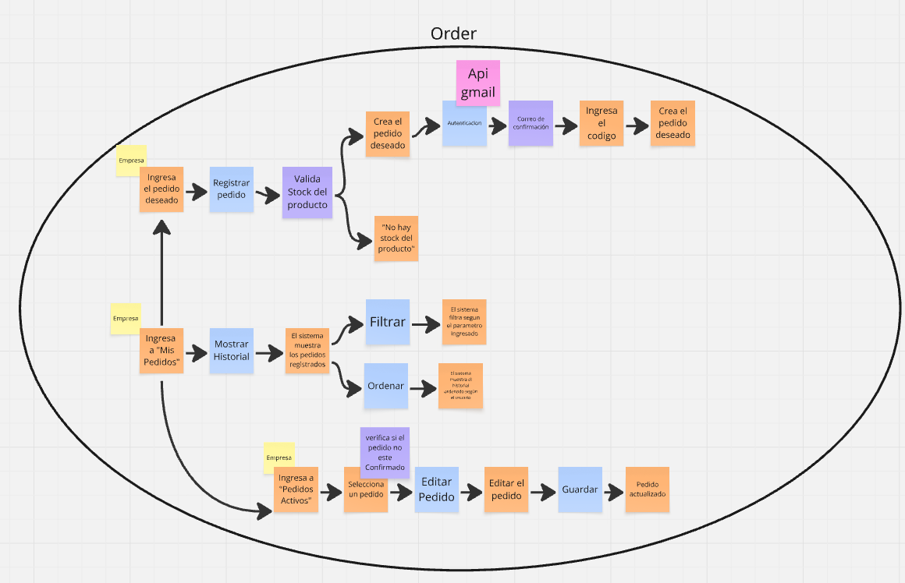

- **Order Management**: Contexto orientado a los proveedores, quienes tienen la capacidad de aceptar o rechazar órdenes, así como de actualizar sus estados (confirmado, en proceso, entregado, cancelado). Este subcomponente concentra las reglas sobre validación y control operativo de los pedidos en función de la disponibilidad y capacidad del proveedor.

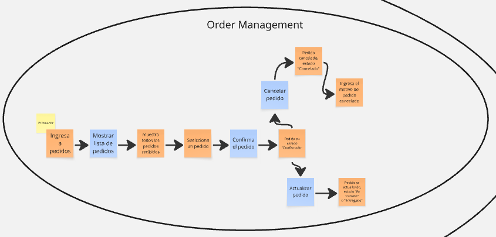

**Analytics**

Contexto orientado al análisis de la información relacionada con pedidos. Permite al proveedor visualizar reportes en forma de gráficos analíticos, aplicar filtros por criterios definidos (fecha, estado, usuario, etc.) y exportar dichos reportes en formatos estándar como PDF y Excel. Su foco está en la generación de valor analítico y en la integración con herramientas externas de gestión.

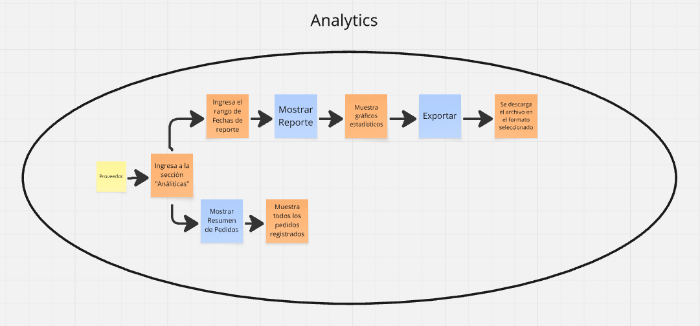

**Vehicles**

Contexto destinado a la gestión de la flota del proveedor. Permite registrar y mantener vehículos, administrar conductores, validar la disponibilidad de ambos recursos y realizar la asignación de vehículo y chofer a pedidos confirmados. Asimismo, asegura la trazabilidad de las asignaciones y la correcta coordinación logística.

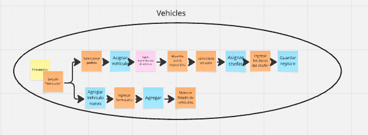

**Payments**

Contexto responsable de la gestión de pagos asociados a pedidos confirmados. Incluye el registro de la tarjeta al momento de la transacción, el procesamiento de pagos a través de pasarelas externas, la confirmación o rechazo de los mismos. Este contexto garantiza la seguridad y confiabilidad de las operaciones financieras.

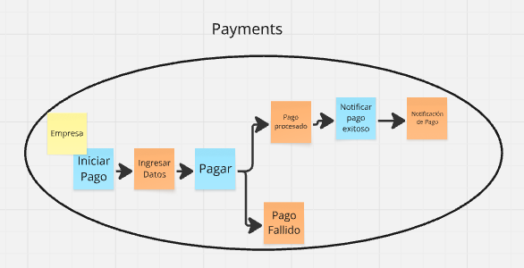

**Notifications**

Contexto encargado de comunicar de manera oportuna y confiable las actualizaciones de estado de los pedidos a los usuarios. Aquí se concentran las reglas para el envío de notificaciones y la gestión de reintentos automáticos en caso de fallas.

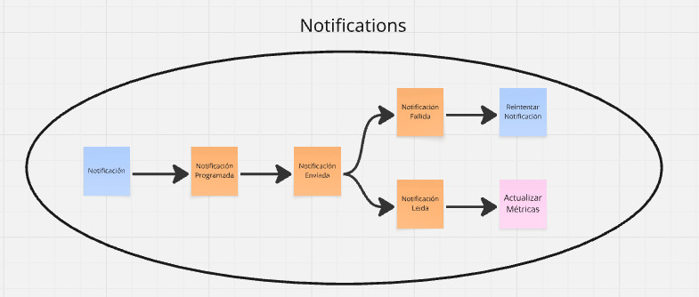

link de miro: <https://miro.com/app/board/uXjVJG4nnMM=/?share_link_id=333896184497>

#### 2.5.1.2. Domain Message Flows Modeling

En esta sección se representan los flujos de mensajes que circulan dentro de cada bounded context y hacia otros contextos relacionados. El Domain Message Flows Modeling permite visualizar cómo los comandos ejecutados por los actores generan eventos de dominio que a su vez son consumidos por sistemas internos o propagados hacia otros bounded contexts.

### **Order**

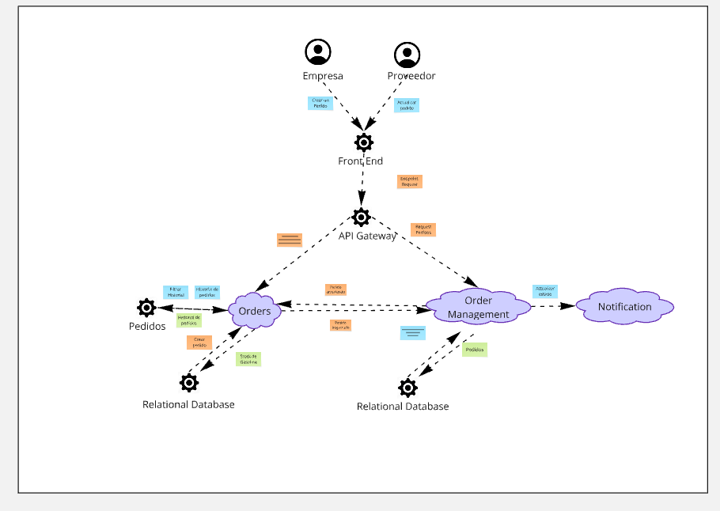

### **Analytics**

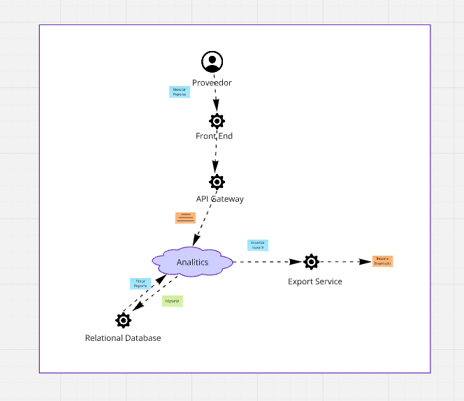

### **Vehicles**

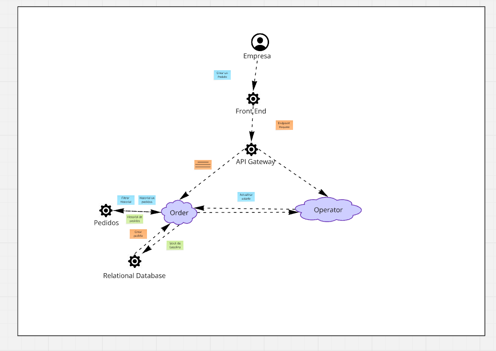

### **Payments**

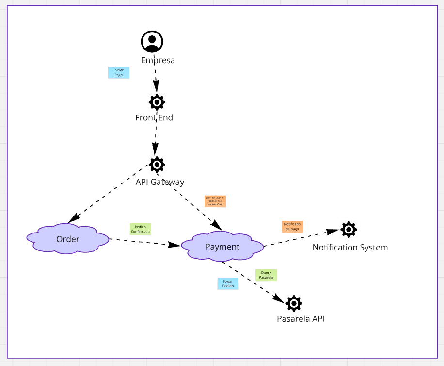

### **Notifications**

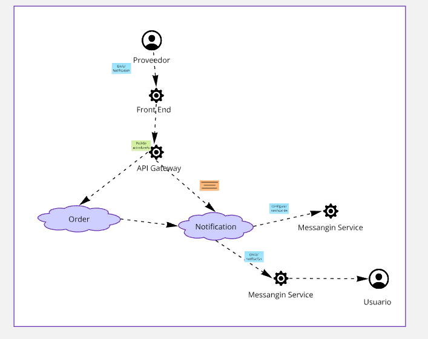

link de miro: <https://miro.com/app/board/uXjVJG4nnMM=/?share_link_id=333896184497>

#### 2.5.1.3. Bounded Context Canvases

A continuación, se presentan los canvases de los bounded contexts identificados, los cuales sintetizan el propósito, límites, capacidades principales, reglas de negocio, lenguaje ubicuo, dependencias y una crítica de diseño de cada contexto.

### **Order**

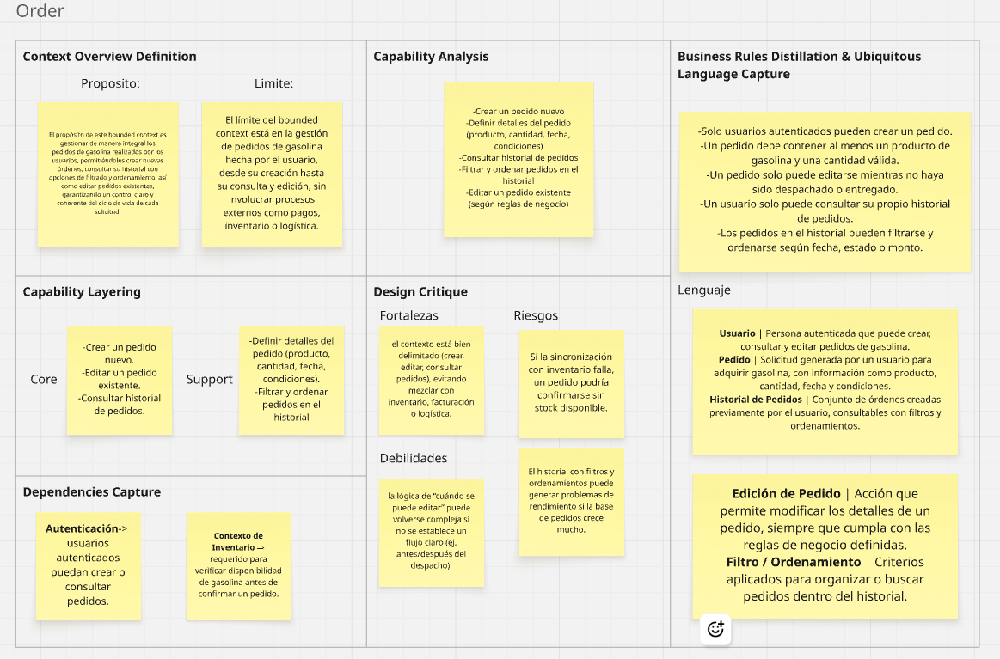

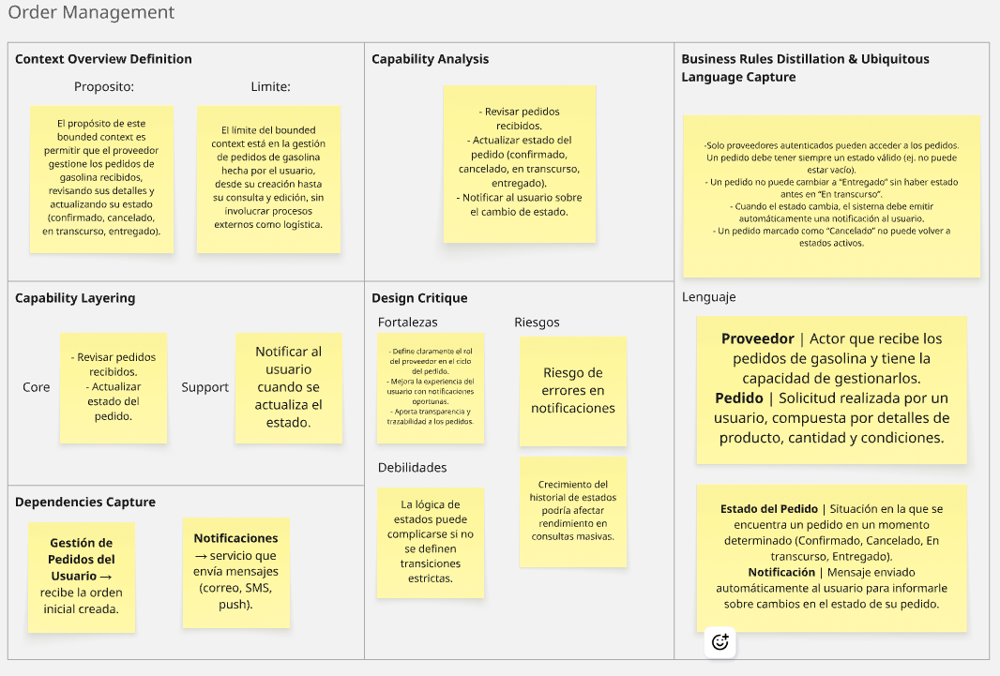

### **Analytics**

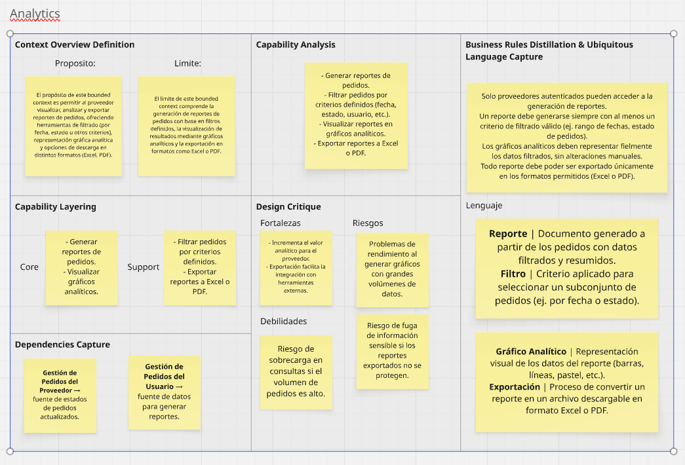

### **Vehicles**

### **Payments**

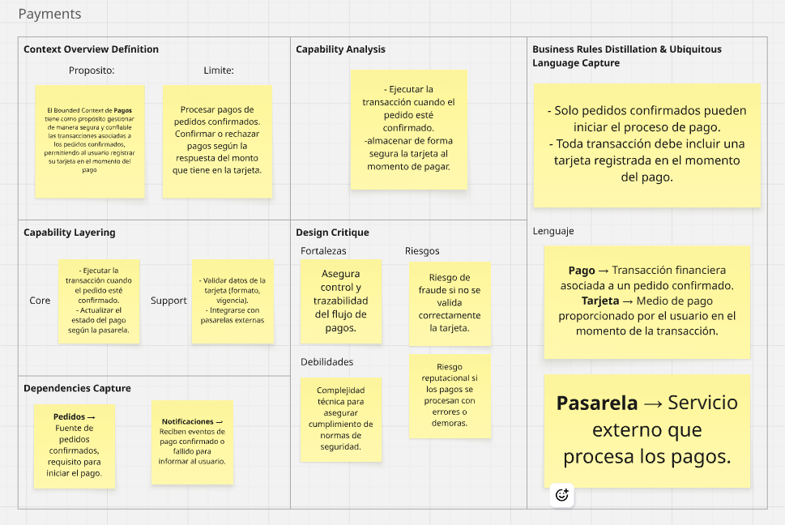

### **Notifications**

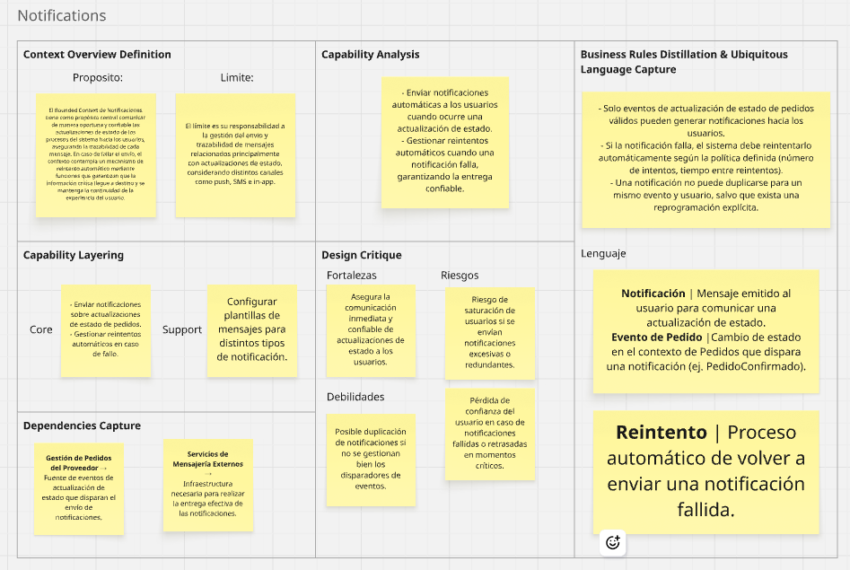

link de miro: <https://miro.com/app/board/uXjVJG4nnMM=/?share_link_id=333896184497>

### 2.5.2. Context Mapping

El Context Mapping permite representar las relaciones existentes entre los diferentes bounded contexts identificados en el dominio. Mientras que cada bounded context encapsula de forma autónoma sus reglas y responsabilidades, el mapa de contexto hace explícitas las dependencias y los flujos de mensajes que los conectan, estableciendo así una visión global de la interacción entre las distintas áreas del sistema.

Order → Order Management: el contexto Order emite el evento PedidoCreado, el cual es consumido por Operator para decidir si aceptar o rechazar el pedido.

Order → Payments: al confirmar un pedido, Order emite PedidoConfirmado, habilitando al contexto Payments para iniciar el flujo de pago.

Order Management → Vehicles: los pedidos aceptados en Operator son consumidos por Vehicles, que se encarga de asignar el vehículo y conductor correspondientes.

Order Management→ Notifications: emite mensajes como PedidoRechazado o EstadoDePedidoActualizado, que son enviados a Notifications para informar al usuario.

Order & Order Management → Analytics: tanto Order como Operator proveen información histórica y de estados que alimenta al contexto Analytics, el cual genera reportes y gráficos analíticos.

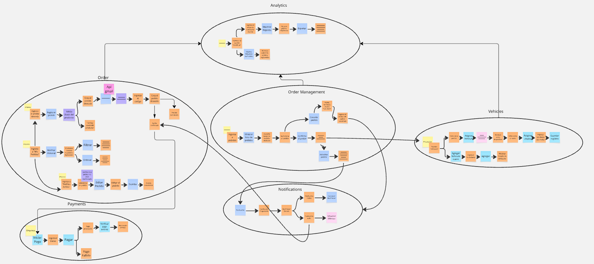

### 2.5.3. Software Architecture

#### 2.5.3.1. Software Architecture Context Level Diagrams

#### 2.5.3.2. Software Architecture Container Level Diagrams

#### 2.5.3.3. Software Architecture Deployment Diagrams

En esta sección presentaremos la disposición física de los principales componentes desplegados de la infraestructura del sistema en un diagrama para mostrar las conexiones entre estos.

En nuestro sistema Fueltrack, contamos con 3 componentes:

- Landing Page: Sitio estático desplegado en Vercel.
- Backend: Como servicio web en Render (.NETCore).
- Base de datos: servicio PostgreSQL administrado en Render.

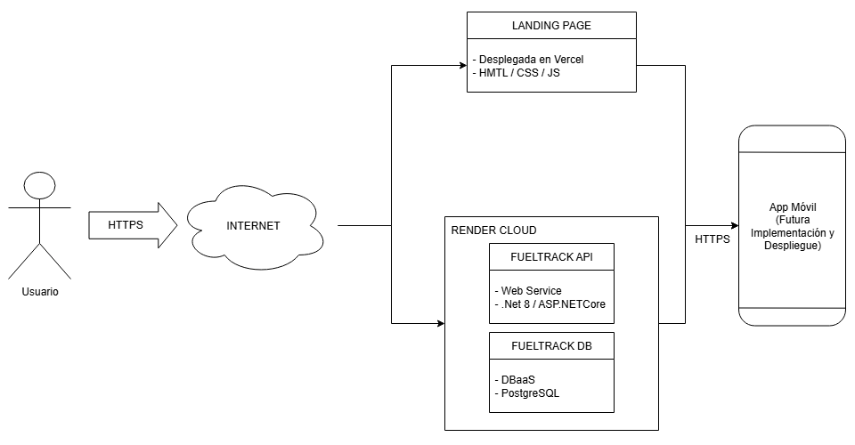

## 2.6. Tactical-Level Domain-Driven Design

### 2.6.1. Bounded Context: Analytics

#### 2.6.1.1. Domain Layer

Este **bounded context** no define sus propias entidades o agregados, sino que depende de entidades y enums del módulo **Shared**. Las consultas son **read-only**, orientadas a analítica y estadísticas.

<table border>
  <thead>
    <tr>
      <th>Clase</th>
      <th>Tipo</th>
      <th>Descripción</th>
    </tr>
  </thead>
  <tbody>
    <tr>
      <td>Order</td>
      <td>Entity (de Shared.Models)</td>
      <td>Entidad accedida por EF Core en las consultas de estadísticas. No se modifica en este contexto.</td>
    </tr>
    <tr>
      <td>User</td>
      <td>Entity (de Shared.Models)</td>
      <td>Entidad accedida por EF Core en las consultas de estadísticas. No se modifica en este contexto.</td>
    </tr>
    <tr>
      <td>Vehicle</td>
      <td>Entity (de Shared.Models)</td>
      <td>Entidad accedida por EF Core en las consultas de estadísticas. No se modifica en este contexto.</td>
    </tr>
    <tr>
      <td>Operator</td>
      <td>Entity (de Shared.Models)</td>
      <td>Entidad accedida por EF Core en las consultas de estadísticas. No se modifica en este contexto.</td>
    </tr>
    <tr>
      <td>OrderStatus</td>
      <td>Value Object (Enum)</td>
      <td>Se usa para filtrar datos y calcular métricas específicas: pedidos completados.</td>
    </tr>
    <tr>
      <td>UserRole</td>
      <td>Value Object (Enum)</td>
      <td>Se usa para filtrar datos y calcular métricas específicas: usuarios por rol.</td>
    </tr>
    <tr>
      <td>OperatorStatus</td>
      <td>Value Object (Enum)</td>
      <td>Se usa para filtrar datos y calcular métricas específicas: operadores disponibles.</td>
    </tr>
  </tbody>
</table>

#### 2.6.1.2. Interface Layer

Contiene el **controlador HTTP** que expone los **endpoints** para obtener las estadísticas por tipo de usuario (Admin, Proveedor, Cliente).

<table border>
  <thead>
    <tr>
      <th>Clase</th>
      <th>Tipo</th>
      <th>Métodos Públicos</th>
      <th>Descripción</th>
    </tr>
  </thead>
  <tbody>
    <tr>
      <td>AnalyticsController</td>
      <td>Controller</td>
      <td>
        - <code>GetDashboardStats()</code> 
        - <code>GetUserStats()</code> 
        - <code>GetProviderStats()</code> 
        - <code>GetClientStats()</code>
      </td>
      <td>
        Expone los endpoints <code>/dashboard</code>, <code>/users</code>, <code>/provider</code> y <code>/client</code>. 
        Autenticado y con autorización por roles. Orquesta al servicio <code>IAnalyticsService</code>.
      </td>
    </tr>
  </tbody>
</table>

#### 2.6.1.3. Application Layer

Contiene la lógica de **agregación y cálculos** para las estadísticas mostradas en el dashboard.

| Clase             | Tipo                | Métodos Públicos                                                                                                                                                                                     | Descripción                                                                                                                                                              |
| ----------------- | ------------------- | ---------------------------------------------------------------------------------------------------------------------------------------------------------------------------------------------------- | ------------------------------------------------------------------------------------------------------------------------------------------------------------------------ |
| IAnalyticsService | Interface           | - `GetDashboardStatsAsync()` - `GetUserStatsAsync()` - `GetProviderStatsAsync()` - `GetClientStatsAsync(int)`                                                                               | Define el contrato para cualquier implementación que calcule estadísticas analíticas.                                                                                    |
| AnalyticsService  | Application Service | - Todos los anteriores + métodos privados:  `GetMonthlyRevenueAsync`, `GetMonthlySpendingAsync`, `GetFuelTypeStatsAsync`,  `GetPersonalFuelTypeStatsAsync`, `GetMonthlyUserRegistrationsAsync` | Implementa cálculos agregados como ingresos, pedidos por tipo de combustible, usuarios activos, registros mensuales, etc. No modifica datos ni maneja lógica de negocio. |

#### 2.6.1.4 Infrastructure Layer

<table border>
  <thead>
    <tr>
      <th>Clase</th>
      <th>Tipo</th>
      <th>Descripción</th>
    </tr>
  </thead>
  <tbody>
    <tr>
      <td>FuelTrackDbContext</td>
      <td>EF Core DbContext</td>
      <td>
        Se usa como punto de acceso a los datos persistentes. 
        Permite realizar queries con LINQ sobre <code>Orders</code>, <code>Users</code>, <code>Vehicles</code>, <code>Operators</code>, etc.
      </td>
    </tr>
  </tbody>
</table>

**DTOs usados**

<table border>
  <thead>
    <tr>
      <th>Clase</th>
      <th>Tipo</th>
      <th>Descripción</th>
    </tr>
  </thead>
  <tbody>
    <tr>
      <td>DashboardStatsDto</td>
      <td>DTO de salida</td>
      <td>
        Contiene datos como total de pedidos, pedidos completados, ingresos, vehículos activos, operadores disponibles, etc.
      </td>
    </tr>
    <tr>
      <td>UserStatsDto</td>
      <td>DTO de salida</td>
      <td>
        Muestra estadísticas de usuarios por rol y actividad.
      </td>
    </tr>
    <tr>
      <td>MonthlyRevenueDto</td>
      <td>DTO auxiliar</td>
      <td>
        Incluye ingresos y conteo de pedidos por mes (en <code>DashboardStatsDto</code>).
      </td>
    </tr>
    <tr>
      <td>FuelTypeStatsDto</td>
      <td>DTO auxiliar</td>
      <td>
        Contiene estadísticas de uso de tipos de combustible (en <code>DashboardStatsDto</code>).
      </td>
    </tr>
    <tr>
      <td>UserRegistrationDto</td>
      <td>DTO auxiliar</td>
      <td>
        Muestra la cantidad de usuarios registrados por mes.
      </td>
    </tr>
  </tbody>
</table>

#### 2.6.1.5. Bounded Context Software Architecture Component Level Diagrams

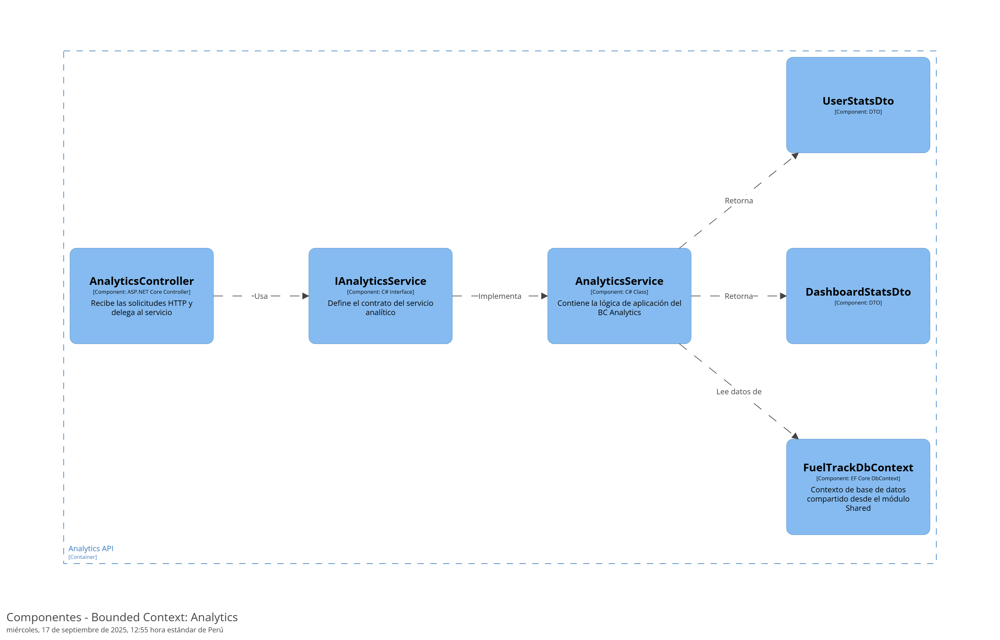

#### 2.6.1.6. Bounded Context Software Architecture Code Level Diagrams

##### 2.6.1.6.1. Bounded Context Domain Layer Class Diagrams

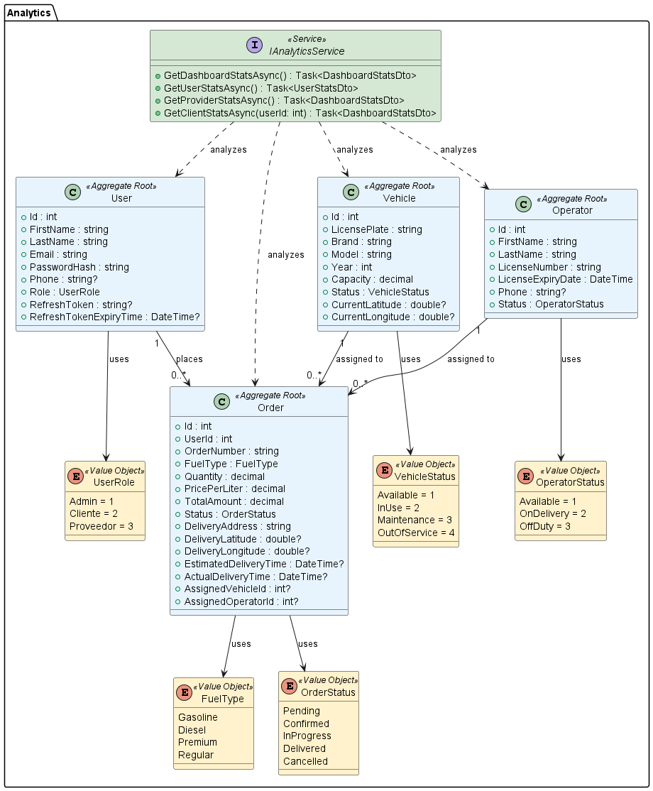

##### 2.6.1.6.2. Bounded Context Database Design Diagram

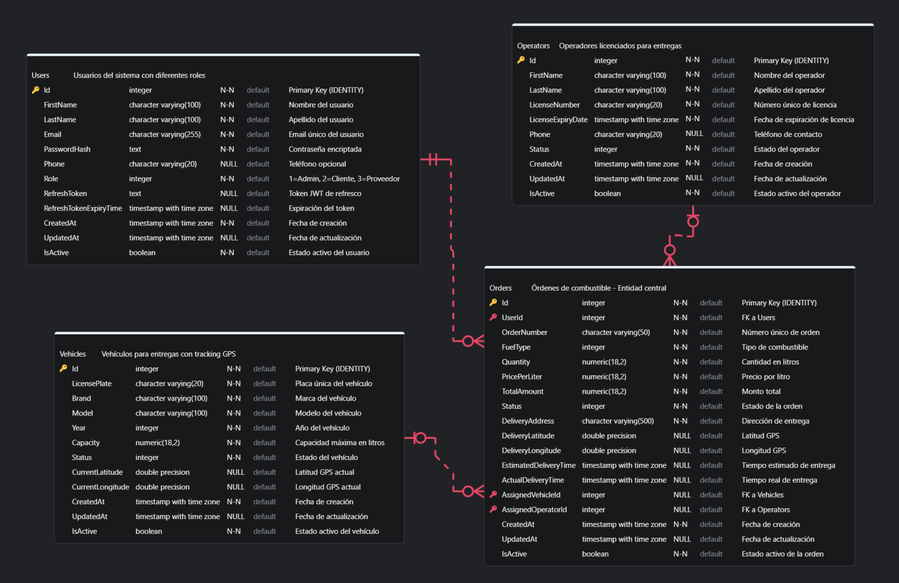

### 2.6.2. Bounded Context: Operators

#### 2.6.2.1. Domain Layer

En este **bounded context**, no se encuentran entidades o agregados definidos explícitamente dentro del mismo módulo. Sin embargo, se utilizan **entidades** del módulo compartido (**Shared**), en particular:

<table border>
  <thead>
    <tr>
      <th>Clase</th>
      <th>Tipo</th>
      <th>Descripción</th>
    </tr>
  </thead>
  <tbody>
    <tr>
      <td>Operator</td>
      <td>Entity</td>
      <td>
        Representa a un operador en el sistema. Incluye atributos como nombre, número de licencia, estado, fecha de creación, etc. 
        Es una entidad persistente, con reglas de validación como la unicidad del número de licencia.
      </td>
    </tr>
  </tbody>
</table>

#### 2.6.2.2. Interface Layer

Contiene el **controlador HTTP** que expone los **endpoints** relacionados con los operadores.

<table border>
  <thead>
    <tr>
      <th>Clase</th>
      <th>Tipo</th>
      <th>Métodos Públicos</th>
      <th>Descripción</th>
    </tr>
  </thead>
  <tbody>
    <tr>
      <td>OperatorsController</td>
      <td>Controller</td>
      <td>
        - <code>GetOperatorInfo()</code> 
        - <code>GetOperatorStatus()</code> 
        - <code>UpdateOperatorStatus()</code>
      </td>
      <td>
        Expone los endpoints <code>/operator/info</code>, <code>/operator/status</code>, y <code>/operator/update</code>. 
        Autenticado y con autorización por roles. Orquesta al servicio <code>IOperatorService</code>.
      </td>
    </tr>
  </tbody>
</table>

#### 2.6.2.3. Application Layer

Contiene la lógica de **gestión y actualización** de los operadores en el sistema.

<table border>
  <thead>
    <tr>
      <th>Clase</th>
      <th>Tipo</th>
      <th>Métodos Públicos</th>
      <th>Descripción</th>
    </tr>
  </thead>
  <tbody>
    <tr>
      <td>IOperatorService</td>
      <td>Interface</td>
      <td>
        - <code>GetOperatorInfoAsync()</code> 
        - <code>GetOperatorStatusAsync()</code> 
        - <code>UpdateOperatorStatusAsync()</code>
      </td>
      <td>
        Define el contrato para cualquier implementación que maneje la lógica de operadores, 
        como obtener datos o actualizar el estado del operador.
      </td>
    </tr>
    <tr>
      <td>OperatorService</td>
      <td>Application Service</td>
      <td>
        - Todos los anteriores + métodos privados: 
        <code>ValidateLicenseAsync</code>, <code>SetOperatorStatusAsync</code>
      </td>
      <td>
        Implementa la lógica para gestionar operadores, incluyendo validaciones y actualizaciones de estado. 
        No modifica datos fuera de su contexto.
      </td>
    </tr>
  </tbody>
</table>

#### 2.6.2.4 Infrastructure Layer

<table border>
  <thead>
    <tr>
      <th>Clase</th>
      <th>Tipo</th>
      <th>Descripción</th>
    </tr>
  </thead>
  <tbody>
    <tr>
      <td>OperatorsDbContext</td>
      <td>EF Core DbContext</td>
      <td>
        Se usa como punto de acceso a los datos persistentes relacionados con los operadores. 
        Permite realizar queries con LINQ sobre operadores, sus estados, y licencias.
      </td>
    </tr>
  </tbody>
</table>

**DTOs usados**

<table border>
  <thead>
    <tr>
      <th>Clase</th>
      <th>Tipo</th>
      <th>Descripción</th>
    </tr>
  </thead>
  <tbody>
    <tr>
      <td>OperatorInfoDto</td>
      <td>DTO de salida</td>
      <td>
        Contiene información detallada de un operador, como nombre, número de licencia, y estado.
      </td>
    </tr>
    <tr>
      <td>OperatorStatusDto</td>
      <td>DTO de salida</td>
      <td>
        Muestra el estado actual de un operador, si está activo o inactivo.
      </td>
    </tr>
    <tr>
      <td>LicenseValidationDto</td>
      <td>DTO auxiliar</td>
      <td>
        Contiene detalles sobre la validación de un número de licencia, si es válido o no.
      </td>
    </tr>
  </tbody>
</table>

#### 2.6.2.5. Bounded Context Software Architecture Component Level Diagrams

#### 2.6.2.6. Bounded Context Software Architecture Code Level Diagrams

##### 2.6.2.6.1. Bounded Context Domain Layer Class Diagrams

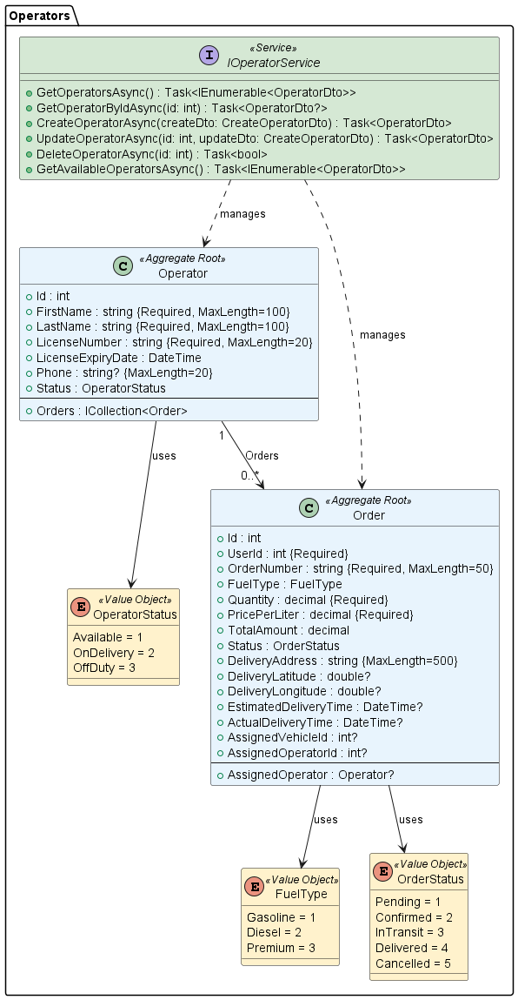

##### 2.6.2.6.2. Bounded Context Database Design Diagram

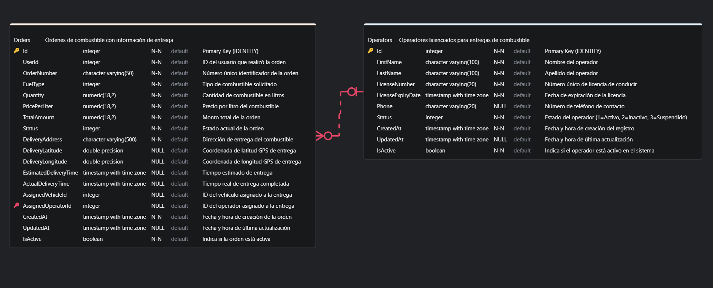

### 2.6.3. Bounded Context: Vehicles

Gestiona el ciclo de vida de los vehículos registrados en el sistema: creación, edición, eliminación lógica, y actualizaciones de ubicación en tiempo real. También permite filtrar vehículos disponibles.

#### 2.6.3.1. Domain Layer

<table border>
  <thead>
    <tr>
      <th>Clase</th>
      <th>Tipo</th>
      <th>Descripción</th>
    </tr>
  </thead>
  <tbody>
    <tr>
      <td>Vehicle</td>
      <td>Entity (Shared.Models)</td>
      <td>
        Entidad persistida que representa un vehículo con estado, ubicación, y atributos clave como capacidad, año, placa, etc.
      </td>
    </tr>
    <tr>
      <td>VehicleStatus</td>
      <td>Value Object (Enum)</td>
      <td>
        Representa el estado del vehículo (<code>Available</code>, <code>InUse</code>, etc.).
      </td>
    </tr>
    <tr>
      <td>Order</td>
      <td>Entity (Shared.Models)</td>
      <td>
        Se usa para verificar si un vehículo está asignado a un pedido activo antes de eliminarlo.
      </td>
    </tr>
    <tr>
      <td>OrderStatus</td>
      <td>Value Object (Enum)</td>
      <td>
        Filtra pedidos activos (<code>Confirmed</code>, <code>InTransit</code>) al validar eliminación de vehículos.
      </td>
    </tr>
  </tbody>
</table>

#### 2.6.3.2. Interface Layer

Contiene el **controlador HTTP** que expone los **endpoints** para la gestión de vehículos.

<table border>
  <thead>
    <tr>
      <th>Clase</th>
      <th>Tipo</th>
      <th>Métodos Públicos</th>
      <th>Descripción</th>
    </tr>
  </thead>
  <tbody>
    <tr>
      <td>VehiclesController</td>
      <td>Controller</td>
      <td>
        - <code>GetVehicles()</code> 
        - <code>GetAvailableVehicles()</code> 
        - <code>GetVehicle(int)</code> 
        - <code>CreateVehicle()</code> 
        - <code>UpdateVehicle()</code> 
        - <code>DeleteVehicle()</code> 
        - <code>UpdateVehicleLocation()</code>
      </td>
      <td>
        Orquesta todas las operaciones del dominio: lectura, escritura, actualización de ubicación. 
        Aplica validación de roles: <code>Admin</code>, <code>Proveedor</code>.
      </td>
    </tr>
  </tbody>
</table>

#### 2.6.3.3. Application Layer

Contiene la lógica de **gestión de vehículos** dentro del sistema.

<table border>
  <thead>
    <tr>
      <th>Clase</th>
      <th>Tipo</th>
      <th>Métodos Públicos</th>
      <th>Descripción</th>
    </tr>
  </thead>
  <tbody>
    <tr>
      <td>IVehicleService</td>
      <td>Interface</td>
      <td>
        - <code>GetVehiclesAsync()</code> 
        - <code>GetVehicleByIdAsync()</code> 
        - <code>CreateVehicleAsync()</code> 
        - <code>UpdateVehicleAsync()</code> 
        - <code>DeleteVehicleAsync()</code> 
        - <code>UpdateVehicleLocationAsync()</code> 
        - <code>GetAvailableVehiclesAsync()</code>
      </td>
      <td>
        Define las operaciones del vehículo como servicio de aplicación.
      </td>
    </tr>
    <tr>
      <td>VehicleService</td>
      <td>Application Service</td>
      <td>
        Implementa todos los métodos del contrato anterior. Contiene la lógica de negocio como: 
        - Validación de unicidad de placa 
        - Validación de pedidos activos antes de eliminar 
        - Actualización de ubicación GPS 
        - Soft delete
      </td>
      <td>
        Implementa la lógica de negocio para los vehículos, incluyendo validaciones y reglas específicas del dominio.
      </td>
    </tr>
  </tbody>
</table>

#### 2.6.3.4 Infrastructure Layer

<table border>
  <thead>
    <tr>
      <th>Clase</th>
      <th>Tipo</th>
      <th>Descripción</th>
    </tr>
  </thead>
  <tbody>
    <tr>
      <td>FuelTrackDbContext</td>
      <td>EF Core DbContext</td>
      <td>
        Provee acceso a la base de datos para las entidades <strong>Vehicles</strong> y <strong>Orders</strong>. 
        Todas las operaciones de lectura y escritura se hacen usando LINQ directamente sobre este contexto.
      </td>
    </tr>
  </tbody>
</table>

**DTOs usados**

<table border>
  <thead>
    <tr>
      <th>Clase</th>
      <th>Tipo</th>
      <th>Atributos Clave</th>
      <th>Descripción</th>
    </tr>
  </thead>
  <tbody>
    <tr>
      <td>VehicleDto</td>
      <td>DTO de salida</td>
      <td>
        <code>Id</code>, <code>LicensePlate</code>, <code>Brand</code>, <code>Model</code>, 
        <code>Year</code>, <code>Capacity</code>, <code>Status</code>, 
        <code>CurrentLatitude</code>, <code>CurrentLongitude</code>, 
        <code>IsActive</code>, <code>CreatedAt</code>
      </td>
      <td>
        Proporciona los datos del vehículo para visualización y uso externo.
      </td>
    </tr>
    <tr>
      <td>CreateVehicleDto</td>
      <td>DTO de entrada</td>
      <td>
        <code>LicensePlate</code>, <code>Brand</code>, <code>Model</code>, <code>Year</code>, <code>Capacity</code>
      </td>
      <td>
        Datos requeridos para crear o actualizar un vehículo.
      </td>
    </tr>
    <tr>
      <td>UpdateVehicleLocationDto</td>
      <td>DTO de entrada</td>
      <td>
        <code>Latitude</code>, <code>Longitude</code>
      </td>
      <td>
        Usado exclusivamente para actualizar la ubicación de un vehículo.
      </td>
    </tr>
  </tbody>
</table>

#### 2.6.3.5. Bounded Context Software Architecture Component Level Diagrams

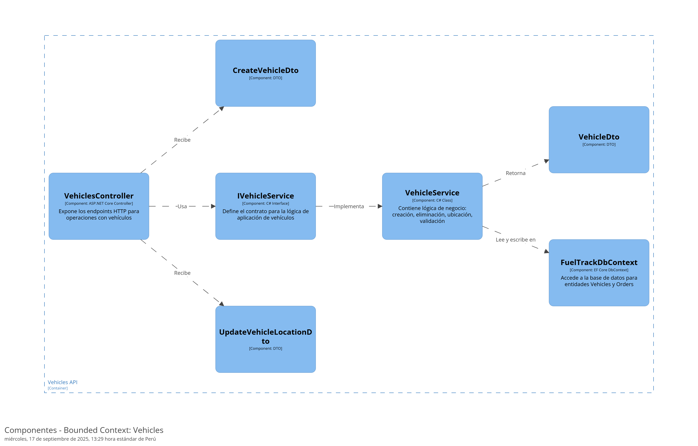

#### 2.6.3.6. Bounded Context Software Architecture Code Level Diagrams

##### 2.6.3.6.1. Bounded Context Domain Layer Class Diagrams

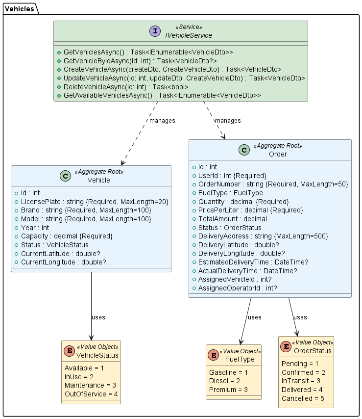

##### 2.6.3.6.2. Bounded Context Database Design Diagram

### 2.6.4. Bounded Context: Users

Este contexto se encarga de la gestión de usuarios de la plataforma: consulta de usuarios, actualización de perfil, y activación/desactivación. Incluye lógica específica para la obtención del usuario autenticado y el control de acceso según roles (Admin, Proveedor, etc.).

#### 2.6.4.1. Domain Layer

En este **bounded context**, se apoya en la entidad **User** definida en el modelo compartido y usa **UserRole** como **Value Object (VO)** para aplicar control de acceso y validación.

<table border>
  <thead>
    <tr>
      <th>Clase</th>
      <th>Tipo</th>
      <th>Descripción</th>
    </tr>
  </thead>
  <tbody>
    <tr>
      <td>User</td>
      <td>Entity (Shared.Models)</td>
      <td>
        Representa a un usuario del sistema: <em>nombre, email, rol, estado activo, etc.</em>
      </td>
    </tr>
    <tr>
      <td>UserRole</td>
      <td>Value Object (Enum)</td>
      <td>
        Enum que define los roles del sistema: <em>Admin, Proveedor, Cliente, etc.</em>
      </td>
    </tr>
  </tbody>
</table>

#### 2.6.4.2. Interface Layer

Contiene el **controlador HTTP** que expone los **endpoints** relacionados con los usuarios.

<table border>
  <thead>
    <tr>
      <th>Clase</th>
      <th>Tipo</th>
      <th>Métodos Públicos</th>
      <th>Descripción</th>
    </tr>
  </thead>
  <tbody>
    <tr>
      <td>UsersController</td>
      <td>Controller</td>
      <td>
        - <code>GetAllUsers()</code> 
        - <code>GetUser(int)</code> 
        - <code>GetCurrentUserProfile()</code> 
        - <code>UpdateCurrentUserProfile()</code> 
        - <code>ToggleUserStatus(int)</code>
      </td>
      <td>
        Controlador HTTP para operaciones sobre usuarios. Implementa protección por roles. 
        Gestiona el acceso de administradores y la edición del usuario autenticado.
      </td>
    </tr>
  </tbody>
</table>

#### 2.6.4.3. Application Layer

Contiene la lógica de **gestión de usuarios** dentro del sistema.

<table border>
  <thead>
    <tr>
      <th>Clase</th>
      <th>Tipo</th>
      <th>Métodos Públicos</th>
      <th>Descripción</th>
    </tr>
  </thead>
  <tbody>
    <tr>
      <td>IUserService</td>
      <td>Interface</td>
      <td>
        - <code>GetAllUsersAsync()</code> 
        - <code>GetUserByIdAsync()</code> 
        - <code>UpdateUserAsync()</code> 
        - <code>ToggleUserStatusAsync()</code> 
        - <code>GetCurrentUserAsync()</code>
      </td>
      <td>
        Define los servicios para la gestión de usuarios en el sistema.
      </td>
    </tr>
    <tr>
      <td>UserService</td>
      <td>Application Service</td>
      <td>
        Implementa todos los métodos del contrato anterior. Contiene lógica como: 
        - Obtención y actualización del perfil del usuario actual 
        - Activación y desactivación de usuarios 
        - Mapeo entre entidad y DTO
      </td>
      <td>
        Implementa la lógica de negocio relacionada con los usuarios, como la activación y desactivación de cuentas, 
        actualización de perfiles y mapeo entre la entidad y DTO.
      </td>
    </tr>
  </tbody>
</table>

#### 2.6.4.4 Infrastructure Layer

<table border>
  <thead>
    <tr>
      <th>Clase</th>
      <th>Tipo</th>
      <th>Descripción</th>
    </tr>
  </thead>
  <tbody>
    <tr>
      <td>FuelTrackDbContext</td>
      <td>EF Core DbContext</td>
      <td>
        Utilizado por <strong>UserService</strong> para acceder a los datos de la entidad <strong>User</strong>. 
        Todas las operaciones CRUD se ejecutan directamente a través de este contexto.
      </td>
    </tr>
  </tbody>
</table>

**DTOs usados**

<table border>
  <thead>
    <tr>
      <th>Clase</th>
      <th>Tipo</th>
      <th>Atributos Clave</th>
      <th>Descripción</th>
    </tr>
  </thead>
  <tbody>
    <tr>
      <td>UserDto</td>
      <td>DTO de salida</td>
      <td><code>Id</code>, <code>FirstName</code>, <code>LastName</code>, <code>Email</code>, <code>Phone</code>, <code>Role</code>, <code>IsActive</code>, <code>CreatedAt</code></td>
      <td>Representa un usuario con información legible para el frontend.</td>
    </tr>
    <tr>
      <td>CreateUserDto</td>
      <td>DTO de entrada</td>
      <td><code>FirstName</code>, <code>LastName</code>, <code>Email</code>, <code>Password</code>, <code>Phone</code>, <code>Role</code></td>
      <td>Usado para registrar nuevos usuarios (aunque no se usa directamente en el controlador mostrado).</td>
    </tr>
    <tr>
      <td>UpdateUserDto</td>
      <td>DTO de entrada</td>
      <td><code>FirstName</code>, <code>LastName</code>, <code>Phone</code></td>
      <td>Usado para actualizar el perfil del usuario actual.</td>
    </tr>
  </tbody>
</table>

#### 2.6.4.5. Bounded Context Software Architecture Component Level Diagrams

#### 2.6.4.6. Bounded Context Software Architecture Code Level Diagrams

##### 2.6.4.6.1. Bounded Context Domain Layer Class Diagrams

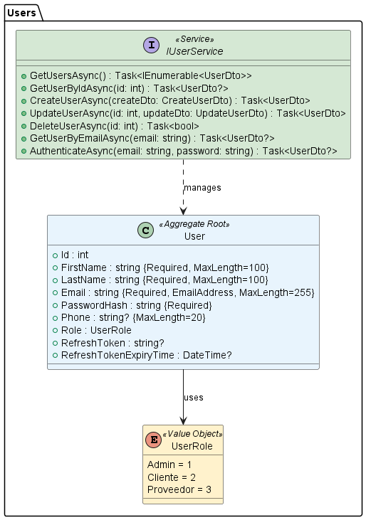

##### 2.6.4.6.2. Bounded Context Database Design Diagram

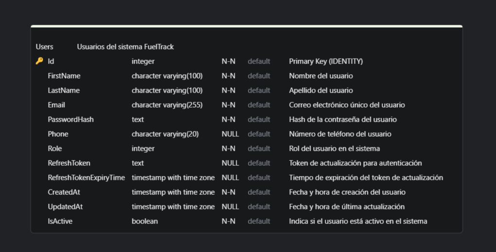

### 2.6.5. Bounded Context: Notifications

Este contexto se encarga de la gestión de las notificaciones para los usuarios del sistema FuelTrack. Permite consultar, crear, y actualizar el estado de las notificaciones, con control de acceso para roles específicos (Admin, Proveedor). Maneja la lógica de lectura, conteo y asociación con órdenes relacionadas.

#### 2.6.5.1. Domain Layer

En este **bounded context**, el agregado principal es la entidad **Notification**, que contiene la información y el estado de la notificación, con soporte para relacionarse con **órdenes** cuando corresponda.

<table border>
  <thead>
    <tr>
      <th>Clase</th>
      <th>Tipo</th>
      <th>Descripción</th>
    </tr>
  </thead>
  <tbody>
    <tr>
      <td>Notification</td>
      <td>Entity (Shared.Models)</td>
      <td>Representa una notificación: título, mensaje, tipo, estado de lectura, etc.</td>
    </tr>
    <tr>
      <td>NotificationType</td>
      <td>Value Object (Enum)</td>
      <td>Enum que define tipos de notificación (Ej: Info, Warning, OrderUpdate, etc.).</td>
    </tr>
  </tbody>
</table>

#### 2.6.5.2. Interface Layer

Contiene el **controlador HTTP** que expone los **endpoints** para gestionar las notificaciones.

<table border>
  <thead>
    <tr>
      <th>Clase</th>
      <th>Tipo</th>
      <th>Métodos Públicos</th>
      <th>Descripción</th>
    </tr>
  </thead>
  <tbody>
    <tr>
      <td>NotificationsController</td>
      <td>Controller</td>
      <td>
        - <code>GetNotifications()</code> 
        - <code>GetNotification(int)</code> 
        - <code>CreateNotification(CreateNotificationDto)</code> 
        - <code>MarkAsRead(int)</code> 
        - <code>MarkAllAsRead()</code> 
        - <code>GetUnreadCount()</code>
      </td>
      <td>
        Controlador HTTP para gestionar notificaciones del usuario autenticado, 
        con roles <strong>Admin</strong> y <strong>Proveedor</strong> para la creación.
      </td>
    </tr>
  </tbody>
</table>

#### 2.6.5.3. Application Layer

Contiene la lógica de **gestión de notificaciones** dentro del sistema.

<table border>
  <thead>
    <tr>
      <th>Clase</th>
      <th>Tipo</th>
      <th>Métodos Públicos</th>
      <th>Descripción</th>
    </tr>
  </thead>
  <tbody>
    <tr>
      <td>INotificationService</td>
      <td>Interface</td>
      <td>
        - <code>GetNotificationsAsync(int userId)</code> 
        - <code>GetNotificationByIdAsync(int id, int userId)</code> 
        - <code>CreateNotificationAsync(CreateNotificationDto)</code> 
        - <code>MarkAsReadAsync(int id, int userId)</code> 
        - <code>MarkAllAsReadAsync(int userId)</code> 
        - <code>GetUnreadCountAsync(int userId)</code>
      </td>
      <td>Define el contrato de servicios para el BC de notificaciones.</td>
    </tr>
    <tr>
      <td>NotificationService</td>
      <td>Application Service</td>
      <td>
        Implementa <code>INotificationService</code>, contiene la lógica de negocio para: 
        - Consulta y creación de notificaciones 
        - Marcado de notificaciones como leídas 
        - Conteo de notificaciones no leídas 
        - Mapeo entre entidad y DTO
      </td>
      <td>
        Implementa la lógica de negocio de las notificaciones, gestionando su consulta, creación y marcado de lectura.
      </td>
    </tr>
  </tbody>
</table>

#### 2.6.5.4 Infrastructure Layer

<table border>
  <thead>
    <tr>
      <th>Clase</th>
      <th>Tipo</th>
      <th>Descripción</th>
    </tr>
  </thead>
  <tbody>
    <tr>
      <td>FuelTrackDbContext</td>
      <td>EF Core DbContext</td>
      <td>
        Utilizado por <strong>NotificationService</strong> para acceder a los datos de la entidad 
        <strong>Notification</strong>. Todas las operaciones CRUD se realizan a través de este contexto.
      </td>
    </tr>
  </tbody>
</table>

**DTOs usados**

<table border>
  <thead>
    <tr>
      <th>Clase</th>
      <th>Tipo</th>
      <th>Atributos Clave</th>
      <th>Descripción</th>
    </tr>
  </thead>
  <tbody>
    <tr>
      <td>NotificationDto</td>
      <td>DTO de salida</td>
      <td>
        <code>Id</code>, <code>Title</code>, <code>Message</code>, <code>Type</code>, 
        <code>IsRead</code>, <code>RelatedOrderId</code>, <code>RelatedOrderNumber</code>, <code>CreatedAt</code>
      </td>
      <td>Representa una notificación para ser mostrada en el frontend.</td>
    </tr>
    <tr>
      <td>CreateNotificationDto</td>
      <td>DTO de entrada</td>
      <td>
        <code>UserId</code>, <code>Title</code>, <code>Message</code>, 
        <code>Type</code>, <code>RelatedOrderId</code>
      </td>
      <td>Datos necesarios para crear una nueva notificación.</td>
    </tr>
  </tbody>
</table>

#### 2.6.5.5. Bounded Context Software Architecture Component Level Diagrams

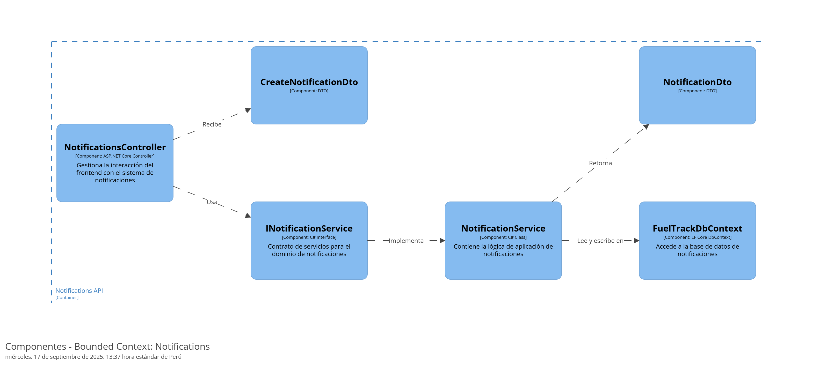

#### 2.6.5.6. Bounded Context Software Architecture Code Level Diagrams

##### 2.6.5.6.1. Bounded Context Domain Layer Class Diagrams

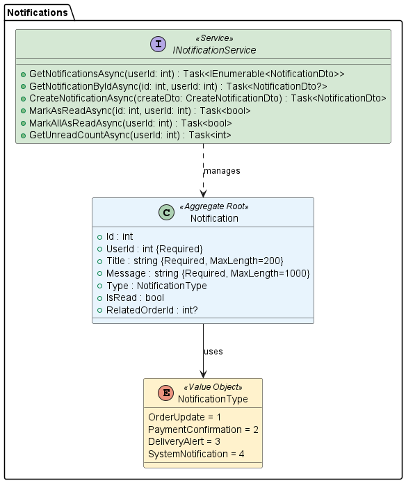

##### 2.6.5.6.2. Bounded Context Database Design Diagram

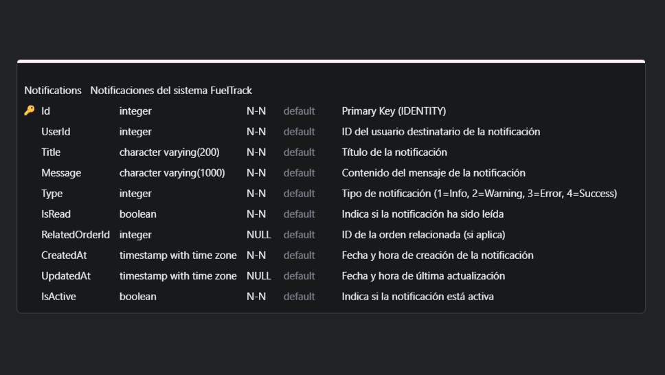

### 2.6.6. Bounded Context: Payments

Gestiona los métodos de pago y el procesamiento de pagos de los pedidos para usuarios con rol Cliente. Permite la consulta, creación y eliminación de métodos de pago, además de procesar pagos asociados a órdenes. Soporta control de acceso según roles (Cliente, Admin).

#### 2.6.6.1. Domain Layer

Este **bounded context** gestiona la información relacionada con **pagos** y **métodos de pago** dentro del sistema.

<table border>
  <thead>
    <tr>
      <th>Clase</th>
      <th>Tipo</th>
      <th>Descripción</th>
    </tr>
  </thead>
  <tbody>
    <tr>
      <td>Payment</td>
      <td>Entity (Shared.Models)</td>
      <td>
        Representa un pago: monto, estado, fecha, método de pago asociado, número de transacción, etc.
      </td>
    </tr>
    <tr>
      <td>PaymentMethod</td>
      <td>Entity (Shared.Models)</td>
      <td>
        Representa un método de pago del usuario: titular, tipo, últimos dígitos, fecha expiración, activo, etc.
      </td>
    </tr>
    <tr>
      <td>PaymentStatus</td>
      <td>Value Object (Enum)</td>
      <td>
        Enum con los estados posibles de un pago: <em>Completed</em>, <em>Failed</em>, <em>Pending</em>, etc.
      </td>
    </tr>
  </tbody>
</table>

#### 2.6.6.2. Interface Layer

Contiene el **controlador HTTP** que expone los **endpoints** para gestionar los pagos y métodos de pago.

<table border>
  <thead>
    <tr>
      <th>Clase</th>
      <th>Tipo</th>
      <th>Métodos Públicos</th>
      <th>Descripción</th>
    </tr>
  </thead>
  <tbody>
    <tr>
      <td>PaymentsController</td>
      <td>Controller</td>
      <td>
        - <code>GetPaymentMethods()</code> 
        - <code>CreatePaymentMethod(CreatePaymentMethodDto)</code> 
        - <code>DeletePaymentMethod(int)</code> 
        - <code>ProcessPayment(ProcessPaymentDto)</code> 
        - <code>GetPayments()</code> 
        - <code>GetPayment(int)</code>
      </td>
      <td>
        Controlador HTTP para gestionar métodos de pago y pagos. 
        Autorización basada en roles <strong>Cliente</strong> y <strong>Admin</strong>.
      </td>
    </tr>
  </tbody>
</table>

#### 2.6.6.3. Application Layer

Contiene la lógica de **gestión de pagos** y **métodos de pago**.

<table border>
  <thead>
    <tr>
      <th>Clase</th>
      <th>Tipo</th>
      <th>Métodos Públicos</th>
      <th>Descripción</th>
    </tr>
  </thead>
  <tbody>
    <tr>
      <td>IPaymentService</td>
      <td>Interface</td>
      <td>
        - <code>GetPaymentMethodsAsync(int userId)</code> 
        - <code>CreatePaymentMethodAsync(CreatePaymentMethodDto, int userId)</code> 
        - <code>DeletePaymentMethodAsync(int, int)</code> 
        - <code>ProcessPaymentAsync(ProcessPaymentDto, int)</code> 
        - <code>GetPaymentsAsync(int? userId = null)</code> 
        - <code>GetPaymentByIdAsync(int, int? userId = null)</code>
      </td>
      <td>
        Define el contrato de servicios para operaciones con métodos de pago y pagos.
      </td>
    </tr>
    <tr>
      <td>PaymentService</td>
      <td>Application Service</td>
      <td>
        Implementa <code>IPaymentService</code>, incluye lógica para: 
        - Validación de tarjetas 
        - Procesamiento simulado de pagos 
        - CRUD en <code>Payment</code> y <code>PaymentMethod</code>
      </td>
      <td>
        Implementa la lógica de negocio para la gestión de métodos de pago, validaciones, procesamiento de pagos y acceso a datos.
      </td>
    </tr>
  </tbody>
</table>

#### 2.6.6.4 Infrastructure Layer

<table border>
  <thead>
    <tr>
      <th>Clase</th>
      <th>Tipo</th>
      <th>Descripción</th>
    </tr>
  </thead>
  <tbody>
    <tr>
      <td>FuelTrackDbContext</td>
      <td>EF Core DbContext</td>
      <td>
        Contexto EF Core que maneja el acceso a las tablas 
        <strong>PaymentMethods</strong>, <strong>Payments</strong> y <strong>Orders</strong>.
      </td>
    </tr>
  </tbody>
</table>

**DTOs usados**

<table border>
  <thead>
    <tr>
      <th>Clase</th>
      <th>Tipo</th>
      <th>Atributos Clave</th>
      <th>Descripción</th>
    </tr>
  </thead>
  <tbody>
    <tr>
      <td>CreatePaymentMethodDto</td>
      <td>DTO de entrada</td>
      <td>
        <code>CardHolderName</code>, 
        <code>CardNumber</code>, 
        <code>ExpiryMonth</code>, 
        <code>ExpiryYear</code>, 
        <code>CVV</code>, 
        <code>IsDefault</code>
      </td>
      <td>Datos necesarios para registrar un nuevo método de pago.</td>
    </tr>
    <tr>
      <td>PaymentMethodDto</td>
      <td>DTO de salida</td>
      <td>
        <code>Id</code>, 
        <code>CardHolderName</code>, 
        <code>LastFourDigits</code>, 
        <code>CardType</code>, 
        <code>ExpiryDate</code>, 
        <code>IsDefault</code>, 
        <code>CreatedAt</code>
      </td>
      <td>Representa un método de pago para ser mostrado en el frontend.</td>
    </tr>
    <tr>
      <td>ProcessPaymentDto</td>
      <td>DTO de entrada</td>
      <td>
        <code>OrderId</code>, 
        <code>PaymentMethodId</code>
      </td>
      <td>Datos necesarios para procesar un pago.</td>
    </tr>
    <tr>
      <td>PaymentDto</td>
      <td>DTO de salida</td>
      <td>
        <code>Id</code>, 
        <code>OrderId</code>, 
        <code>OrderNumber</code>, 
        <code>Amount</code>, 
        <code>Status</code>, 
        <code>TransactionId</code>, 
        <code>ProcessedAt</code>, 
        <code>CreatedAt</code>, 
        <code>CardHolderName</code>, 
        <code>LastFourDigits</code>, 
        <code>CardType</code>
      </td>
      <td>Representa un pago procesado o en curso, con detalles como monto, estado, transacción, etc.</td>
    </tr>
  </tbody>
</table>

#### 2.6.6.5. Bounded Context Software Architecture Component Level Diagrams

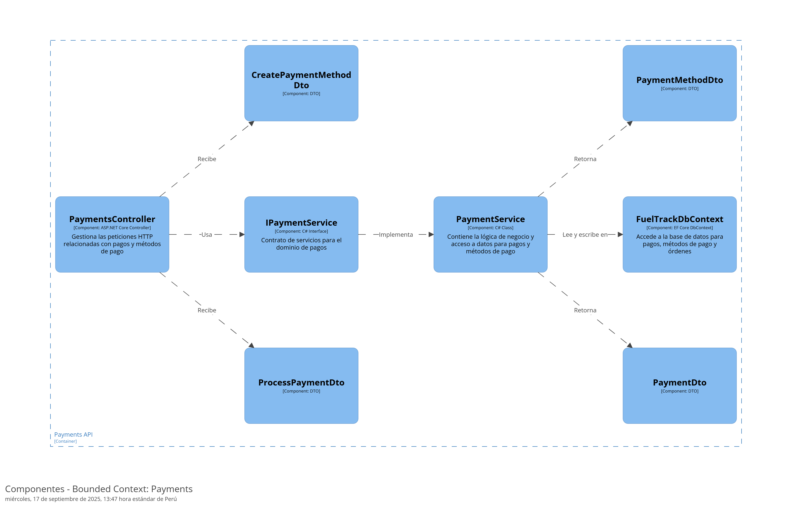

#### 2.6.6.6. Bounded Context Software Architecture Code Level Diagrams

##### 2.6.6.6.1. Bounded Context Domain Layer Class Diagrams

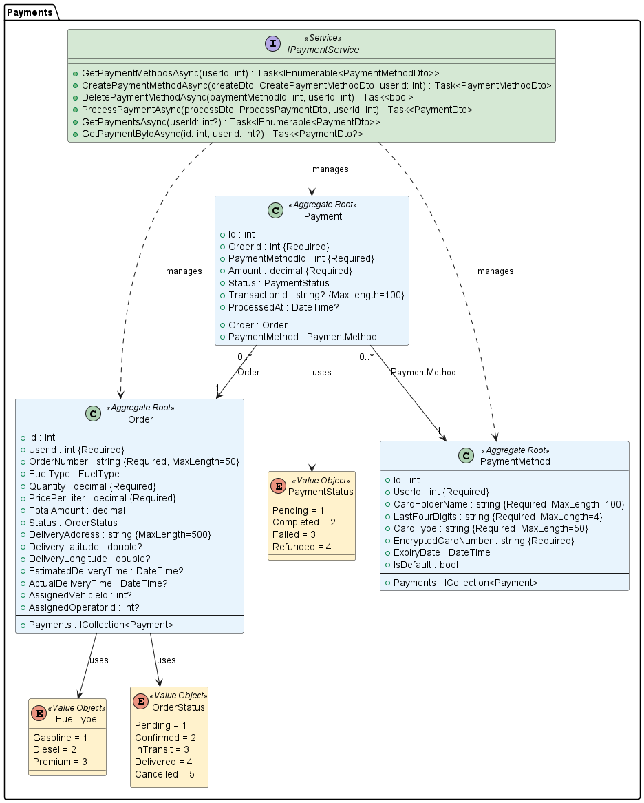

##### 2.6.6.6.2. Bounded Context Database Design Diagram

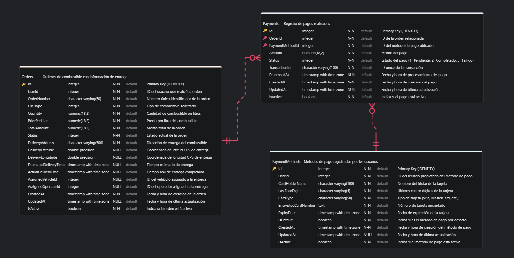

### 2.6.7. Bounded Context: Orders

Gestiona el ciclo completo de pedidos (órdenes) de combustible, incluyendo creación por clientes, asignación de vehículos y operadores por proveedores, actualización de estados y consulta según roles (Admin, Cliente, Proveedor).

#### 2.6.7.1. Domain Layer

Este **bounded context** gestiona la información relacionada con **pedidos**, **vehículos** asignados y **operadores** para las entregas.

<table border>
  <thead>
    <tr>
      <th>Clase</th>
      <th>Tipo</th>
      <th>Descripción</th>
    </tr>
  </thead>
  <tbody>
    <tr>
      <td>Order</td>
      <td>Entity (Shared.Models)</td>
      <td>
        Representa un pedido, con datos como tipo de combustible, cantidad, precio, estado, fechas, etc.
      </td>
    </tr>
    <tr>
      <td>OrderStatus</td>
      <td>Enum (Shared.Models)</td>
      <td>
        Estados posibles de un pedido: <code>Pending</code>, <code>Confirmed</code>, 
        <code>InTransit</code>, <code>Delivered</code>, <code>Cancelled</code>, etc.
      </td>
    </tr>
    <tr>
      <td>FuelType</td>
      <td>Enum (Shared.Models)</td>
      <td>
        Tipos de combustible: <code>Gasoline</code>, <code>Diesel</code>, <code>Premium</code>, etc.
      </td>
    </tr>
    <tr>
      <td>Vehicle</td>
      <td>Entity</td>
      <td>
        Vehículo asignable para entregas, con atributos como matrícula, capacidad y estado (Disponible, En uso, etc.).
      </td>
    </tr>
    <tr>
      <td>Operator</td>
      <td>Entity</td>
      <td>
        Operador asignado a entregas, con datos de identificación y estado (Disponible, En entrega, etc.).
      </td>
    </tr>
    <tr>
      <td>VehicleStatus</td>
      <td>Enum</td>
      <td>
        Estado del vehículo: <code>Available</code>, <code>InUse</code>, etc.
      </td>
    </tr>
    <tr>
      <td>OperatorStatus</td>
      <td>Enum</td>
      <td>
        Estado del operador: <code>Available</code>, <code>OnDelivery</code>, etc.
      </td>
    </tr>
  </tbody>
</table>

#### 2.6.7.2. Interface Layer

Contiene el **controlador REST** que expone los **endpoints** para gestionar los pedidos, asignación de entregas y cambios de estado.

<table border>
  <thead>
    <tr>
      <th>Clase</th>
      <th>Tipo</th>
      <th>Métodos Públicos</th>
      <th>Descripción</th>
    </tr>
  </thead>
  <tbody>
    <tr>
      <td>OrdersController</td>
      <td>Controller</td>
      <td>
        - <code>GetOrders()</code> 
        - <code>GetOrder(int)</code> 
        - <code>CreateOrder(CreateOrderDto)</code> 
        - <code>AssignDelivery(int, AssignDeliveryDto)</code> 
        - <code>UpdateOrderStatus(int, int)</code> 
        - <code>GetOrdersForProvider()</code>
      </td>
      <td>
        Controlador REST protegido con autorización por roles, expone la API para 
        operaciones CRUD y específicas de los pedidos (gestión, asignación de entregas, actualización de estado, etc.).
      </td>
    </tr>
  </tbody>
</table>

#### 2.6.7.3. Application Layer

Contiene la lógica de **gestión de pedidos** y reglas de negocio relacionadas con asignación de entregas y cambios de estado.

<table border>
  <thead>
    <tr>
      <th>Clase</th>
      <th>Tipo</th>
      <th>Métodos Públicos</th>
      <th>Descripción</th>
    </tr>
  </thead>
  <tbody>
    <tr>
      <td>IOrderService</td>
      <td>Interface</td>
      <td>
        - <code>GetOrdersAsync(int? userId = null)</code> 
        - <code>GetOrderByIdAsync(int id, int? userId = null)</code> 
        - <code>CreateOrderAsync(CreateOrderDto, int userId)</code> 
        - <code>AssignDeliveryAsync(int orderId, AssignDeliveryDto)</code> 
        - <code>UpdateOrderStatusAsync(int orderId, int newStatus)</code> 
        - <code>GetOrdersByProviderAsync()</code>
      </td>
      <td>
        Define el contrato de servicios para gestionar pedidos, incluyendo validaciones y 
        reglas de negocio para la creación, consulta, asignación de entregas y actualización de estados.
      </td>
    </tr>
    <tr>
      <td>OrderService</td>
      <td>Application Service</td>
      <td>
        Implementa todos los métodos definidos en <code>IOrderService</code> usando 
        <b>FuelTrackDbContext</b> para el acceso a datos.
      </td>
      <td>
        Contiene la lógica de negocio para la gestión de pedidos, validaciones de estado,
        y reglas de asignación de vehículos y operadores a las entregas.
      </td>
    </tr>
  </tbody>
</table>

#### 2.6.7.4 Infrastructure Layer

<table border>
  <thead>
    <tr>
      <th>Clase</th>
      <th>Tipo</th>
      <th>Descripción</th>
    </tr>
  </thead>
  <tbody>
    <tr>
      <td>FuelTrackDbContext</td>
      <td>EF Core DbContext</td>
      <td>Acceso a la base de datos, con tablas <b>Orders</b>, <b>Vehicles</b>, <b>Operators</b>, <b>Users</b>, etc.</td>
    </tr>
  </tbody>
</table>

**DTOs usados**

<table border>
  <thead>
    <tr>
      <th>Clase</th>
      <th>Tipo</th>
      <th>Atributos Clave</th>
      <th>Descripción</th>
    </tr>
  </thead>
  <tbody>
    <tr>
      <td>CreateOrderDto</td>
      <td>DTO de entrada</td>
      <td><code>FuelType</code>, <code>Quantity</code>, <code>DeliveryAddress</code>, <code>DeliveryLatitude</code>, <code>DeliveryLongitude</code></td>
      <td>Datos necesarios para crear un nuevo pedido.</td>
    </tr>
    <tr>
      <td>AssignDeliveryDto</td>
      <td>DTO de entrada</td>
      <td><code>VehicleId</code>, <code>OperatorId</code>, <code>EstimatedDeliveryTime</code></td>
      <td>Datos necesarios para asignar un vehículo y un operador a un pedido.</td>
    </tr>
    <tr>
      <td>OrderDto</td>
      <td>DTO de salida</td>
      <td><code>Id</code>, <code>OrderNumber</code>, <code>FuelType</code>, <code>Quantity</code>, <code>PricePerLiter</code>, <code>TotalAmount</code>, <code>Status</code>, <code>DeliveryAddress</code>, etc.</td>
      <td>Representación detallada de un pedido, con información completa sobre el pedido.</td>
    </tr>
  </tbody>
</table>

#### 2.6.7.5. Bounded Context Software Architecture Component Level Diagrams

#### 2.6.7.6. Bounded Context Software Architecture Code Level Diagrams

##### 2.6.7.6.1. Bounded Context Domain Layer Class Diagrams


##### 2.6.7.6.2. Bounded Context Database Design Diagram


# Capítulo III: Solution UI/UX Design

## 3.1. Product design

### 3.1.1. Style Guidelines

En esta sección se presentan los estándares que definen el formato y el diseño de la solución, asegurando la calidad en su implementación.

#### 3.1.1.1.General Style Guidelines

Con estas decisiones en el diseño visual buscamos reflejar innovación que incentive a la formalidad en los procesos de comercialización, es asi como demostramos modernidad y calidad, valores que van alineados a nuestro proyecto

> **Color**
> Seleccionamos esta gama de colores porque armoniza con el diseño del logo y refleja la temática de nuestra aplicación, asegurando la identidad de la marca.
> 

> **Tipografia**
> Seleccionamos esta tipografía por su excelente legibilidad en diversos entornos, lo que nos permite diferenciarnos frente a la competencia y aportar una identidad única a nuestra marca.
> 

> **Branding**
> El nombre de nuestro producto es FuelTrack, contamos con un logo que representa claramente nuestro rubro, dandole un toque moderno y simple, ademas usar colores que seran caractristicos en nuestra empresa y amigables a la vista de nuestros clientes
> 

### 3.1.2. Information Architecture

La arquitectura de información se diseñó para guiar al usuario de forma lógica a través de las funciones esenciales de FuelTrack, facilitando la navegación y reduciendo la curva de aprendizaje.

#### 3.1.2.1. Organization Systems

El Sistema de Organización de FuelTrack tiene como objetivo facilitar la interacción fluida entre los usuarios (compradores y proveedores) y la plataforma mediante una jerarquía visual clara. Esta jerarquía destaca las funciones clave —como la gestión de pedidos de combustible, el registro de depósitos y la carga de documentos— permitiendo que los usuarios accedan rápidamente a las acciones más importantes desde la pantalla principal.

- **Agrupación lógica de funciones:** Las funcionalidades están organizadas por bloques temáticos (“Record Deposits”, “Upload Documents”, “Track Orders”), lo que permite a los usuarios identificar rápidamente las opciones disponibles y su propósito.

- **Accesibilidad inmediata:** La interfaz principal resalta las opciones más utilizadas mediante una disposición vertical y centrada, optimizada principalmente para dispositivos móviles.

- **Menú de navegación:** Se mantiene fijo en la parte superior para facilitar el acceso constante a secciones clave como "How it Works", "Pricing" y "Sign Up".

- **Reducción de fricción:** Al minimizar la cantidad de clicks necesarios para ejecutar acciones comunes, el sistema organiza la información de forma que prioriza la eficiencia y la experiencia del usuario.

Este sistema organizativo asegura que tanto usuarios nuevos como recurrentes puedan navegar por FuelTrack con facilidad, incrementando la productividad y reduciendo los errores de operación.

#### 3.1.2.2. Labelling Systems

Las etiquetas que utilizaremos para la página serán diseñadas para ser claras, directas y fáciles de entender, enfocándose en la eficiencia y simplicidad para usuarios con distintos niveles de experiencia tecnológica.

**Principios generales**

- Se limita el uso de 2-3 palabras por ítem.
- Se mantiene la consistencia terminológica en todas las pantallas.
- Las etiquetas son descriptivas y responden a acciones directas, estados o categorías claras.

Algunas de las etiquetas principales de nuestras secciones serán las siguientes:

**Gestión de Pedidos**

- `Nuevo Pedido`
- `Estado de Pedido`
- `Historial de Pedidos`
- `Ver Detalles`
- `Confirmar Entrega`

**Pagos y Facturación**

- `Métodos de Pago`
- `Mis Facturas`
- `Resumen de Pagos`
- `Confirmar Pago`

**Reportes**

- `Reporte de Pedidos`
- `Reporte de Pagos`
- `Resumen de Actividad`
- `Generar Informe`
- `Navegación general`

**Inicio**

- `Mi Cuenta`
- `Soporte`
- `Cerrar Sesión`

**Asociaciones y agrupaciones**

- Las etiquetas se agrupan en módulos lógicos (por ejemplo: pedidos, pagos, reportes) con un menú lateral y dashboard central de fácil acceso.
- Las acciones están asociadas a sus contextos inmediatos: por ejemplo, `Nuevo Pedido` solo aparece cuando se selecciona la opción `Gestión de Pedidos`.
- Los mensajes del sistema son claros y directos: `Pedido Confirmado`, `Pago Realizado`, `Entrega Programada`.

Estas etiquetas están diseñadas para que los usuarios puedan navegar de manera sencilla y sin confusiones, optimizando la experiencia para empresas que desean una solución eficiente y fácil de usar.

#### 3.1.2.3. SEO Tags and Meta Tags

¡Perfecto! Aquí tienes el apartado **"SEO Tags and Meta Tags"** para **Landing Page**, **Web Application** y **Mobile App**, todo en formato Markdown, con títulos en inglés como pediste, y descripciones en español. También he cuidado el formato para que se vea ordenado y profesional:

🖥️ **Landing Page**

- **Title (SEO Tag):**
  `FuelTrack | Simplify Fuel Order Management`

- **Description (Meta Tag):**
  Optimiza tu proceso de pedidos de combustible con FuelTrack: una plataforma centralizada para compradores y proveedores donde puedes registrar depósitos, subir documentos y hacer seguimiento de pedidos.

- **Keywords (Meta Tag):**
  `Fuel, Track, Ordering, Fuel management, Supplier platform, Track fuel orders, Fuel deposits, Order management software`

- **Author (Meta Tag):**
  `FuelTrack Team`

💻 **Web Application**

- **Title (SEO Tag):**
  `FuelTrack | Manage Fuel Orders and Deposits`

- **Description (Meta Tag):**
  Accede a tu panel de control para registrar depósitos, gestionar documentos y monitorear el estado de los pedidos de combustible en tiempo real.

- **Keywords (Meta Tag):**
  `Fuel order tracking, Deposit management, Supplier dashboard, Fuel logistics, FuelTrack Web App`

- **Author (Meta Tag):**
  `FuelTrack Team`

📱 **Mobile App**

- **Title (SEO Tag):**
  `FuelTrack Mobile | Fuel Orders On the Go`

- **Description (Meta Tag):**
  Administra tus pedidos de combustible, depósitos y documentos desde cualquier lugar con la app móvil de FuelTrack. Mantente actualizado estés donde estés.

- **Keywords (Meta Tag):**
  `Fuel mobile app, FuelTrack app, Mobile fuel management, Fuel orders on mobile, Deposit tracking app, Fuel logistics mobile, Fuel supplier app`

- **Author (Meta Tag):**
  `FuelTrack Team`

#### 3.1.2.4. Searching Systems

Para garantizar una experiencia de usuario fluida, rápida y centrada en la interacción móvil, se ha diseñado un sistema de navegación y búsqueda adaptado principalmente a la **versión móvil** de la plataforma. Las decisiones de diseño están enfocadas en ofrecer una interfaz clara, accesible mediante gestos táctiles, y optimizada para pantallas pequeñas, sin descuidar la compatibilidad con la versión web o de escritorio.

**🔹 Menú de navegación**

En la aplicación móvil se implementará un menú tipo hamburguesa o barra de navegación inferior (bottom tab bar), dependiendo de la plataforma (iOS / Android). Este menú proporcionará acceso rápido a:

- Características clave de la app
- Registro e inicio de sesión
- Seguimiento de pedidos y depósitos

Esto asegura que tanto nuevos usuarios como usuarios recurrentes puedan navegar sin fricción, minimizando el número de toques necesarios para acceder a las funciones principales.

**🔹 Navegación visual guiada**

La aplicación organizará su contenido en bloques visuales verticales, adaptados al scroll táctil. Esta estructura permite al usuario recorrer de forma fluida las distintas secciones funcionales, guiado por jerarquías visuales claras y elementos interactivos táctiles, como tarjetas, botones grandes e iconografía reconocible.

**🔹 Diseño responsive enfocado en móviles**

El enfoque está puesto en la experiencia móvil. Las pantallas se ajustarán automáticamente a diferentes resoluciones y relaciones de aspecto, manteniendo:

- Legibilidad en pantallas pequeñas
- Interacción optimizada para uso con una sola mano
- Navegación simple y directa sin sobrecarga visual

#### 3.1.2.5. Navigation Systems

En la aplicación móvil, se ha diseñado un sistema de navegación que permite a los usuarios —especialmente a los proveedores— acceder de forma eficiente a la información clave relacionada con sus pedidos. La estructura de navegación está enfocada en ofrecer accesos rápidos, búsqueda intuitiva y filtros inteligentes, todo optimizado para una experiencia táctil fluida

**🔹 Búsqueda por texto**

- Los usuarios tendrán una lista de pedidos donde podrán buscar dentro de cada categoría, razón social, número de pedido, nombre del banco y otros datos.

- Habrá un buscador simple para encontrar pedidos registrados o pendientes, que mostrará resultados según el tipo de información que se detecte automáticamente.
- Además, habrá un botón llamado “Búsqueda avanzada” para realizar búsquedas más específicas, completando todos los campos requeridos.

**🔹 Filtros por categorías automáticas**
Junto a la búsqueda textual, se integrará un sistema de filtros dinámicos basado en las categorías existentes dentro del sistema.

- Los usuarios contarán con un sistema automático de filtros basado en las categorías existentes.
- Por ejemplo, el sistema filtrará todas las ubicaciones detectadas en los pedidos registrados o pendientes, y el usuario podrá seleccionar las que desee aplicar.

**📲 Experiencia adaptada a la navegación móvil**

Toda la navegación y búsqueda estará diseñada para funcionar bien en dispositivos móviles, con interacción táctil sencilla y fácil acceso a las funciones.

### 3.1.3. Landing Page UI Design

#### 3.1.3.1. Landing Page Wireframe

En esta sección se presentan los Wireframes del Landing Page de FuelTrack, tanto en versión Desktop como Mobile. Estos bocetos muestran la estructura visual inicial del sitio, aplicando los principios y elementos de diseño, la arquitectura de información y los lineamientos de diseño inclusivo que orientan la experiencia del usuario.

**Desktop Web Browser**


**Mobile Web Browser**

   
   
   
   
   
   
   
   
   
   
   
   
   

#### 3.1.3.2. Landing Page Mock-ups

Esta sección muestra los Mock-ups del Landing Page de FuelTrack, en sus versiones para Desktop y Mobile. Aquí se refleja la propuesta visual final del diseño, evidenciando la aplicación de los principios y elementos de diseño.

**Desktop Web Browser**


**Mobile Web Browser**

   
   
   
   
   
   
   
   
   
   
   
   
   
   
   

### 3.1.4. Mobile Applications UX/UI Design

#### 3.1.4.1. Mobile Applications Wireframes

En esta sección se presentan los Wireframes de las aplicaciones móviles de FuelTrack, diseñados para mostrar la estructura y disposición de los elementos de la interfaz. Reflejan la aplicación de los principios y elementos de diseño, la arquitectura de información y el diseño inclusivo, utilizando las herramientas indicadas para su elaboración.

---

#### **Bienvenida al aplicativo**

   
  <em>Pantalla de bienvenida que introduce al usuario a la aplicación FuelTrack.</em>

---

#### **Sección Cliente**

#### **Inicio de Sesión (Cliente)**

   
  <em>El usuario cliente accede al sistema ingresando su correo y contraseña.</em>

#### **Crear Cuenta (Cliente)**

   
  <em>Formulario para registrar un nuevo cliente en la plataforma.</em>

#### **Apartado Principal (Cliente)**

   
  <em>Panel principal donde el cliente puede acceder a sus órdenes y opciones del sistema.</em>

#### **Menú Principal (Cliente)**

   
  <em>Menú lateral con accesos a secciones como “Orders”, “Profile” y “Settings”.</em>

#### **Listado de Órdenes (Cliente)**

   
  <em>Vista donde se muestran las órdenes activas y completadas del cliente.</em>

#### **Visualización de una Orden**

   
  <em>Detalle de una orden específica.</em>

#### **Creación de una Orden**

  
  
   
  <em>Secuencia de pantallas donde el cliente registra una nueva orden de combustible.</em>

---

#### **Sección Proveedor**

#### **Inicio de Sesión (Proveedor)**

   
  <em>El proveedor inicia sesión con sus credenciales registradas.</em>

#### **Crear Cuenta (Proveedor)**

   
  <em>Formulario para registrar una nueva cuenta de proveedor con RUC y razón social.</em>

#### **Apartado Principal (Proveedor)**

   
  <em>Panel donde el proveedor puede visualizar sus órdenes.</em>

#### **Menú Principal (Proveedor)**

   
  <em>Menú lateral con opciones de navegación para gestión de órdenes y conciliaciones.</em>

#### **Gestión de Órdenes (Order Management)**

  
  
  <em>Vista donde el proveedor consulta y gestiona las órdenes asignadas por clientes.</em>

#### **Conciliaciones (Subir comprobantes)**

  
   
   
  <em>Flujo de carga de comprobantes bancarios mediante la función “Load Bank Statement”.</em>

#### 3.1.4.2. Mobile Applications Wireflow Diagrams

#### **User Goal 01: Crear una nueva orden de combustible**

**Descripción:**  
El usuario cliente desea generar una nueva orden de combustible ingresando los detalles del producto, forma de pago y confirmando la solicitud.  
Este flujo permite registrar un pedido dentro del sistema **FuelTrack**.

**Task Flow:**  


**Wireflow:**  


**Explicación del flujo:**  
El flujo inicia en la pantalla de órdenes (**w05**). El usuario crea una nueva orden (**w06–w08**) llenando toda la información requerida.  
Finalmente, confirma la creación en (**w09**), donde el sistema valida los datos y genera la orden.

---

#### **User Goal 02: Visualizar historial de órdenes**

**Descripción:**  
El usuario desea consultar el listado de órdenes registradas y revisar los detalles de cada una.  
Este flujo facilita el seguimiento del estado de los pedidos (**pendiente**, **aprobado** o **entregado**).

**Task Flow:**  


**Wireflow:**  


**Explicación del flujo:**  
El flujo comienza en el listado general (**w05**). El usuario puede desplazarse entre las órdenes y, al seleccionar una, el sistema muestra la información detallada en la pantalla (**w06**).

---

#### **User Goal 03: Registrar proveedor**

**Descripción:**  
El administrador desea registrar un nuevo proveedor en el sistema para habilitar su acceso a la plataforma.  
Este flujo permite crear cuentas de proveedores con los datos de empresa, RUC y credenciales.

**Task Flow:**  


**Wireflow:**  


**Explicación del flujo:**  
El proceso comienza con la selección del tipo de usuario (**w10**). Luego, el administrador completa los campos de registro (**w11**).  
Tras la validación exitosa, el sistema redirige al panel principal (**w12**) y muestra las opciones de gestión del proveedor (**w13–w14**).

---

#### **User Goal 04: Cargar comprobantes o documentos de pago**

**Descripción:**  
El usuario desea subir archivos de comprobantes bancarios o documentos de respaldo de sus transacciones.  
Este flujo facilita la carga de archivos en formato **PDF**, **XLS** o similar.

**Task Flow:**  


**Wireflow:**  


**Explicación del flujo:**  
El flujo inicia en la sección de pagos (**w15**), donde el usuario elige **“Load bank statement”**.  
Luego, se muestra la zona de carga (**w17**), donde puede seleccionar y subir los archivos.  
Al completar el proceso, los documentos quedan vinculados a la orden correspondiente.

#### 3.1.4.3. Mobile Applications Mock-ups

Esta sección muestra los Mock-ups de las aplicaciones móviles de FuelTrack, donde se representa la propuesta visual final.

#### **Bienvenida al aplicativo**

   
  <em>Pantalla de bienvenida que introduce al usuario a la aplicación FuelTrack.</em>

---

#### **Sección Cliente**

#### **Inicio de Sesión (Cliente)**

   
  <em>El usuario cliente accede al sistema ingresando sus credenciales.</em>

#### **Crear Cuenta (Cliente)**

   
  <em>Formulario de registro para crear una cuenta de cliente en la aplicación.</em>

#### **Apartado Principal (Cliente)**

   
  <em>Vista principal donde el cliente puede gestionar sus órdenes y acceder a las secciones del sistema.</em>

#### **Menú Principal (Cliente)**

   
  <em>Menú lateral con accesos a “Orders”, “Profile” y “Settings”.</em>

#### **Listado de Órdenes (Cliente)**

   
  <em>Vista donde se muestran todas las órdenes activas y completadas del cliente.</em>

#### **Visualización de una Orden**

   
  <em>El cliente puede ver los detalles de una orden específica, incluyendo el estado.</em>

#### **Creación de una Orden**

  
  
   
  <em>Secuencia donde el cliente ingresa los datos del pedido, confirma y envía la orden.</em>

---

#### **Sección Proveedor**

#### **Inicio de Sesión (Proveedor)**

   
  <em>El proveedor inicia sesión con su correo y contraseña registrados.</em>

#### **Crear Cuenta (Proveedor)**

   
  <em>Formulario donde el proveedor registra su empresa con datos como RUC y razón social.</em>

#### **Apartado Principal (Proveedor)**

   
  <em>Panel principal con acceso a órdenes, conciliaciones y configuración.</em>

#### **Menú Principal (Proveedor)**

   
  <em>Menú lateral con opciones de gestión como “Orders”, “Conciliations” y “Settings”.</em>

#### **Gestión de Órdenes (Order Management)**

   
  <em>Vista donde el proveedor consulta, acepta y gestiona las órdenes recibidas.</em>

#### **Conciliaciones (Subir Comprobantes)**

  
   
  <em>Flujo donde el proveedor carga documentos bancarios o comprobantes mediante la opción “Load Bank Statement”.</em>

#### 3.1.4.4. Mobile Applications User Flow Diagrams

Se presentan los User Flows correspondientes a los principales objetivos del usuario (User Goals) identificados para el sistema. Cada flujo integra las vistas representativas mediante Mock-ups, evidenciando el recorrido del usuario dentro de la aplicación.

**User Flow Diagram 1:**
- **User Goal:** Crear una nueva orden de combustible. Como usuario solicitante, deseo registrar una nueva orden de combustible ingresando los detalles del producto, forma de pago y confirmando la solicitud.
- **Task Flow:** 
- **Wireflow:** 
- **User Flow:** 

---

**User Flow Diagram 2:**
- **User Goal:** Ver listado de órdenes. Como usuario solicitante, deseo consultar las órdenes realizadas para revisar su estado y detalles.
- **Task Flow:** 
- **Wireflow:** 
- **User Flow:** 

---

**User Flow Diagram 3:**
- **User Goal:** Registro de proveedor. Como administrador, deseo registrar un nuevo proveedor ingresando sus datos empresariales y credenciales de acceso.
- **Task Flow:** 
- **Wireflow:** 
- **User Flow:** 

---

**User Flow Diagram 4:**
- **User Goal:** Cargar comprobantes o documentos de pago. Como usuario proveedor, deseo subir comprobantes bancarios o documentos de respaldo para asociarlos a mis órdenes.
- **Task Flow:** 
- **Wireflow:** 
- **User Flow:** 

#### 3.1.4.5. Mobile Applications Prototyping

En esta sección se presentan los prototipos interactivos para Desktop y Mobile, los cuales muestran los principales flujos de navegación definidos en los User Flows.

**Prototipo Mobile:**

  

🔗 [Ver video del prototipo Mobile](https://upcedupe-my.sharepoint.com/:v:/g/personal/u202223984_upc_edu_pe/EbkMNcIxgANFoQdpHLdylroBBPLTV772gJn62IVS69h6Iw?nav=eyJyZWZlcnJhbEluZm8iOnsicmVmZXJyYWxBcHAiOiJPbmVEcml2ZUZvckJ1c2luZXNzIiwicmVmZXJyYWxBcHBQbGF0Zm9ybSI6IldlYiIsInJlZmVycmFsTW9kZSI6InZpZXciLCJyZWZlcnJhbFZpZXciOiJNeUZpbGVzTGlua0NvcHkifX0&e=o4wVdD)

---

**Prototipo Web:**

  

🔗 [Ver video del prototipo Web](https://upcedupe-my.sharepoint.com/:v:/g/personal/u202223984_upc_edu_pe/EQy0y4y9E5pKkOL-pwOFqkEBLzXdX8GCbsUCoJKIBjpaaw?nav=eyJyZWZlcnJhbEluZm8iOnsicmVmZXJyYWxBcHAiOiJPbmVEcml2ZUZvckJ1c2luZXNzIiwicmVmZXJyYWxBcHBQbGF0Zm9ybSI6IldlYiIsInJlZmVycmFsTW9kZSI6InZpZXciLCJyZWZlcnJhbFZpZXciOiJNeUZpbGVzTGlua0NvcHkifX0&e=0xWg0h)

# Capítulo IV: Product Implementation & Validation

## 4.1 Software Configuration Management

En esta sección se establecerán todas las decisiones, reglas y procesos que el equipo seguirá para la creación y despliegue de FuelTrack Pro. El objetivo principal de estas convenciones es garantizar la integridad, calidad y consistencia del software a lo largo de todo su ciclo de vida, desde el desarrollo inicial hasta su mantenimiento futuro.

### 4.1.1. Software Development Environment Configuration

Para garantizar un ciclo de vida de desarrollo consistente y colaborativo para _FuelTrack Pro_, el equipo ha adoptado el siguiente conjunto de herramientas y plataformas estandarizadas. A continuación, se detalla cada producto, su propósito específico dentro del proyecto y el enlace de acceso o descarga correspondiente.

**Project Management**

Para la planificación, seguimiento y comunicación del equipo, se utilizan las siguientes herramientas, asegurando una organización centralizada y una coordinación fluida.

| Herramienta   | Propósito en el Proyecto                                                                             | Enlace                      |
| :------------ | :--------------------------------------------------------------------------------------------------- | :-------------------------- |
| _GitHub_      | Repositorio central de código fuente, gestión de versiones y colaboración en el desarrollo.          | `https://github.com/`       |
| _Trello_      | Planificación de sprints, gestión de tareas (historias de usuario, bugs) y seguimiento del progreso. | `https://trello.com/`       |
| _Discord_     | Canal principal para discusiones técnicas y sincronizaciones diarias.                                | `https://discord.com/`      |
| _Google Meet_ | Canal adicional para reuniones de equipo y presentaciones formales.                                  | `https://meet.google.com/`  |
| _WhatsApp_    | Comunicación rápida y coordinación ágil para asuntos urgentes o de baja formalidad.                  | `https://www.whatsapp.com/` |

**Product UX/UI Design**

El diseño de la experiencia e interfaz de usuario se centraliza en Figma, permitiendo un ciclo de diseño iterativo y colaborativo.

| Herramienta | Propósito en el Proyecto                                                                                                       | Enlace                   |
| :---------- | :----------------------------------------------------------------------------------------------------------------------------- | :----------------------- |
| _Figma_     | Diseño de la experiencia (UX) e interfaz (UI), incluyendo wireframes, mockups y el prototipo interactivo de la aplicación web. | `https://www.figma.com/` |

**Software Development**

El stack tecnológico seleccionado para la construcción de _FuelTrack Pro_ se compone de las siguientes herramientas y frameworks, cubriendo el desarrollo backend, frontend y móvil.

| Herramienta        | Propósito en el Proyecto                                                                       | Enlace                                                 |
| :----------------- | :--------------------------------------------------------------------------------------------- | :----------------------------------------------------- |
| _.NET (C#)_        | Framework backend para la construcción de la API RESTful y la lógica de negocio.               | `https://dotnet.microsoft.com/`                        |
| _HTML_             | Lenguaje de marcado para la estructura y contenido de la aplicación web (landing page).        | `https://developer.mozilla.org/es/docs/Web/HTML`       |
| _CSS_              | Lenguaje de hojas de estilo para el diseño y la presentación visual de la interfaz web.        | `https://developer.mozilla.org/es/docs/Web/CSS`        |
| _JavaScript_       | Lenguaje de programación para la interactividad y lógica del lado del cliente en la web.       | `https://developer.mozilla.org/es/docs/Web/JavaScript` |
| _Android (Kotlin)_ | Sistema operativo y lenguaje de programación para el desarrollo de la aplicación móvil nativa. | `https://developer.android.com/`                       |
| _Jetpack Compose_  | Toolkit de UI moderno para construir la interfaz de usuario de la aplicación Android nativa.   | `https://developer.android.com/jetpack/compose`        |

### **Software Deployment**

La infraestructura para el despliegue y operación de los servicios de _FuelTrack Pro_ se gestiona a través de las siguientes plataformas en la nube.

| Herramienta      | Propósito en el Proyecto                                                                                 | Enlace                                 |
| :--------------- | :------------------------------------------------------------------------------------------------------- | :------------------------------------- |
| _Render_         | Plataforma en la nube para el despliegue y hosting del backend (API REST) y la base de datos PostgreSQL. | `https://render.com/`                  |
| _Vercel_         | Plataforma para el despliegue y hosting de la aplicación web (landing page).                             | `https://vercel.com/`                  |
| _Android Studio_ | Entorno de desarrollo integrado (IDE) para la compilación y despliegue de la aplicación móvil.           | `https://developer.android.com/studio` |

**Software Documentation**

La creación y mantenimiento de la documentación del proyecto se realiza utilizando herramientas que facilitan la escritura y el control de versiones.

| Herramienta | Propósito en el Proyecto                                                                         | Enlace                           |
| :---------- | :----------------------------------------------------------------------------------------------- | :------------------------------- |
| _Markdown_  | Lenguaje de marcado ligero para escribir toda la documentación técnica y funcional del proyecto. | `https://www.markdownguide.org/` |
| _GitHub_    | Plataforma para versionar y colaborar en la documentación del proyecto junto al código fuente.   | `https://github.com/`            |

### 4.1.2. Source Code Management

Para la gestión del código fuente de _FuelTrack Pro_, se utiliza _GitHub_ como plataforma centralizada y _Git_ como sistema de control de versiones. La estructura de repositorios del proyecto es la siguiente:

| Producto           | Repositorio    | Enlace                                                                |
| :----------------- | :------------- | :-------------------------------------------------------------------- |
| Backend            | `backend`      | `https://github.com/1ACC0238-2520-1827-Group2-FuelTrack/backend`      |
| Landing Page       | `landing-page` | `https://github.com/1ACC0238-2520-1827-Group2-FuelTrack/landing-page` |
| Mobile Application | `mobile-app`   | `https://github.com/1ACC0238-2520-1827-Group2-FuelTrack/mobile-app`   |

<h4>Flujo de Trabajo: GitFlow</h4>

El equipo adopta el modelo de ramificación _GitFlow_ de Vincent Driessen para asegurar un proceso de desarrollo ordenado y predecible. Este flujo de trabajo define un conjunto estricto de ramas con roles específicos.

- **`main`**: Esta rama refleja el estado actual del código en _producción_. Solo se fusionan en ella las ramas `release` y `hotfix`. Cada commit en `main` debe ser una nueva versión etiquetada (tag) siguiendo Semantic Versioning.
- **`develop`**: Es la rama principal de integración para el desarrollo. Contiene los últimos cambios y funcionalidades completadas que se incluirán en el próximo lanzamiento. Sirve como base para crear las ramas `feature`.

<h4>Convenciones para Nombres de Ramas</h4>

Para mantener la consistencia, se han definido las siguientes convenciones para nombrar las ramas:

- **Feature Branches:** Se crean a partir de `develop` para trabajar en nuevas funcionalidades.

  - _Convención:_ `feature/[TICKET-ID]-[descripcion-corta]`

- **Release Branches:** Se crean a partir de `develop` cuando se decide iniciar un nuevo ciclo de lanzamiento. En esta rama se realizan los últimos ajustes, pruebas y correcciones de bugs menores antes de pasar a producción.

  - _Convención:_ `release/v[version]`

- **Hotfix Branches:** Se crean a partir de `main` para solucionar errores críticos (`bugs`) detectados en producción. Estas correcciones se fusionan tanto en `main` como en `develop` para asegurar que el bug no reaparezca en futuros lanzamientos.
  - _Convención:_ `hotfix/[TICKET-ID]-[descripcion-corta]`

<h4>Convención para Mensajes de Commit (Conventional Commits)</h4>

Todos los mensajes de commit deben seguir la especificación de _Conventional Commits_. Esta convención mejora la legibilidad del historial y permite automatizar la generación de changelogs.

**Formato:** `<tipo>[ámbito opcional]: <descripción>`

- **Tipos de commit principales:**

  - `feat`: Para una nueva funcionalidad (`feature`).
  - `fix`: Para la corrección de un error (`bug`).
  - `docs`: Cambios exclusivos en la documentación.
  - `style`: Cambios de formato que no afectan la lógica (espacios, punto y coma, etc.).
  - `refactor`: Cambios en el código que no corrigen un error ni añaden una funcionalidad.
  - `test`: Añadir o corregir pruebas.
  - `chore`: Actualizaciones de tareas de build, configuración, etc.

- **Ejemplos de commits:**
  - `feat(auth): permitir inicio de sesión con correo y contraseña`
  - `fix(api): corregir cálculo de impuestos en la creación de pedidos`
  - `docs(readme): actualizar instrucciones de instalación`

<h4>Versionado Semántico (Semantic Versioning 2.0.0)</h4>

Cada lanzamiento en la rama `main` se etiquetará con una versión siguiendo el formato `MAJOR.MINOR.PATCH`.

- **`MAJOR`**: Se incrementa cuando se introducen cambios incompatibles con la API (breaking changes).
- **`MINOR`**: Se incrementa cuando se añaden funcionalidades de forma retrocompatible.
- **`PATCH`**: Se incrementa cuando se realizan correcciones de errores de forma retrocompatible.

Para versiones de desarrollo o pre-lanzamiento, se utilizarán versiones adicionales de la siguiente manera:

- **`alpha`**: Versión inicial, sin estabilidad garantizada.
- **`beta`**: Versión casi estable, pero aún con características no completamente testeadas.
- **`rc` (Release Candidate)**: Versión candidata a ser lanzada, con pocas correcciones pendientes.

### 4.1.3. Source Code Style Guide & Conventions

Para asegurar la calidad, legibilidad y mantenibilidad del código de **FuelTrack Pro**, el equipo se compromete a seguir las siguientes guías de estilo y convenciones para cada tecnología del proyecto.

#### Backend: .NET (C#)

- **Nomenclatura:**

  - _Clases, Interfaces, Propiedades y Métodos:_ `PascalCase`.
  - _Variables locales y parámetros de métodos:_ `camelCase`.
  - _Campos privados:_ `_camelCase`.

- **Estructura del Proyecto:**
  - _Organización por capas:_ Se seguirá una arquitectura limpia, separando las responsabilidades en proyectos distintos (e.g., `Domain`, `Application`, `Infrastructure`, `Api`).
  - _Inyección de Dependencias (DI):_ Utilizar DI para desacoplar las capas, especialmente para inyectar servicios y repositorios en los controladores.
  - _Nombres de archivo:_ El nombre del archivo (`.cs`) debe coincidir exactamente con el nombre de la clase pública que contiene.

#### Landing Page: HTML, CSS y JavaScript

- **HTML:**

  - _Semántica:_ Utilizar etiquetas semánticas de HTML5 siempre que sea posible (`<header>`, `<nav>`, `<main>`, `<section>`, `<footer>`).
  - _Accesibilidad:_ Proveer atributos `alt` descriptivos para todas las imágenes (``).

- **CSS:**

  - _Nomenclatura:_ Utilizar la metodología **BEM (Block, Element, Modifier)** para nombrar las clases, evitando conflictos y mejorando la legibilidad.
  - _Organización:_ Agrupar las propiedades CSS por función (Posicionamiento, Modelo de caja, Tipografía, Visual, Otros).

- **JavaScript:**
  - _Sintaxis:_ Utilizar sintaxis moderna (ES6+), prefiriendo `const` y `let` sobre `var`, y usando funciones de flecha (`=>`).
  - _Nomenclatura:_ `camelCase` para variables y funciones. `PascalCase` para clases.

#### Mobile: Android (Kotlin) & Jetpack Compose

- **Kotlin (General):**

  - _Nomenclatura:_
    - Clases y Objetos: `PascalCase`.
    - Funciones y Variables: `camelCase`.
    - Constantes (`const val`): `UPPER_SNAKE_CASE`.
  - _Estructura:_ Seguir la arquitectura recomendada por Google (MVVM), separando la lógica de la UI con `ViewModel`, `UseCase` y `Repository`.

- **Jetpack Compose:**
  - _Componentes Composable:_ Nombrar las funciones con `PascalCase` (e.g., `SubmitButton()`).
  - _Rendimiento:_ Evitar cálculos o lógica de negocio pesada dentro de las funciones `@Composable` para prevenir recomposiciones innecesarias.

#### Convenciones Generales (Todo el Proyecto)

- **Comentarios:** El código debe ser auto-explicativo. Usar comentarios solo para explicar el "porqué" de una lógica compleja, no el "qué". Todos los comentarios deben estar en _inglés_.
- **Commits:** Seguir la especificación de _Conventional Commits_ (`feat:`, `fix:`, `docs:`, `chore:`, etc.) para mantener un historial limpio y legible.
- **Formato:** Utilizar un formateador de código automático (como el integrado en Visual Studio, VS Code o Android Studio) para mantener un estilo consistente en todo el proyecto.

### 4.1.4. Software Deployment Configuration

En esta sección se especifica la configuración y el proceso de despliegue para cada uno de los componentes de la solución _FuelTrack Pro_. Los siguientes pasos describen cómo, a partir de los repositorios de código fuente, se logra la publicación de la Landing Page, el Backend y la Aplicación Móvil.

#### Landing Page (HTML/CSS/JS)

**Consideraciones antes del despliegue:**

- Verificar que todos los enlaces internos y externos funcionen correctamente.
- Asegurarse de que el diseño sea completamente responsivo y se visualice correctamente en diferentes tamaños de pantalla.
- Comprobar que no haya errores de carga de recursos (imágenes, scripts, hojas de estilo) en la consola del navegador.

**Requerimientos para el despliegue:**

- Repositorio de GitHub con el código fuente de la Landing Page.
- Una cuenta activa en _Vercel_.

**Pasos para el despliegue en Vercel:**

1.  Ingresar al panel de control de Vercel.
2.  Hacer clic en "Add New..." y seleccionar "Project".
3.  Importar el repositorio de GitHub correspondiente a la Landing Page (`landing-page`).
4.  Vercel detectará automáticamente que es un proyecto estático. No se requiere configuración adicional para HTML/CSS/JS.
5.  Hacer clic en el botón "Deploy".
6.  Esperar a que Vercel complete el proceso de build y despliegue.
7.  Acceder a la URL pública generada por Vercel para verificar que la Landing Page esté operativa.

#### Backend (.NET API)

**Consideraciones antes del despliegue:**

- La base de datos en _Render_ debe estar creada y accesible.
- Se debe tener a la mano el string de conexión de la base de datos para configurarlo en el entorno de producción.
- El proyecto debe contener un `Dockerfile` para que Render pueda construir y ejecutar la aplicación en un contenedor.

**Requerimientos para el despliegue:**

- Repositorio de GitHub con el código fuente del Backend (.NET).
- Una cuenta activa en _Render_.

**Pasos para el despliegue en Render:**

1.  Ingresar al panel de control de Render.
2.  Hacer clic en "New" y seleccionar "Web Service".
3.  Conectar y seleccionar el repositorio de GitHub correspondiente al Backend (`backend`).
4.  Configurar el nombre del servicio (e.g., `fueltrack-pro-api`).
5.  Render detectará el `Dockerfile` y lo seleccionará como entorno de ejecución.
6.  Ir a la sección "Environment" y añadir una nueva variable de entorno para el string de conexión de la base de datos (e.g., `ConnectionStrings__DefaultConnection` con el valor proporcionado por Render).
7.  Hacer clic en "Create Web Service" para iniciar el despliegue.
8.  Render construirá la imagen Docker y desplegará el servicio. Una vez completado, se podrá acceder a la API a través de la URL pública generada.

#### Aplicación Móvil (Android)

**Consideraciones antes del despliegue (en dispositivo de prueba):**

- El Backend (.NET API) debe estar desplegado en Render y su URL pública debe ser accesible.
- La URL de la API debe estar correctamente configurada en el código fuente de la aplicación móvil antes de compilar.

**Requerimientos para el despliegue:**

- Un dispositivo físico con sistema operativo Android.
- El archivo APK (Android Package Kit) compilado y firmado de la aplicación.
- El cable USB para conectar el dispositivo a la computadora.

**Pasos para la instalación en un dispositivo de prueba:**

1.  En el dispositivo Android, activar las "Opciones de desarrollador".
2.  Dentro de las opciones de desarrollador, habilitar la "Depuración por USB".
3.  Conectar el dispositivo a la computadora mediante el cable USB.
4.  Abrir el proyecto en _Android Studio_.
5.  Seleccionar el dispositivo conectado en la lista de dispositivos de destino.
6.  Hacer clic en el botón "Run 'app'" (icono de play) en la barra de herramientas.
7.  Android Studio compilará el código, generará el APK y lo instalará automáticamente en el dispositivo.
8.  Una vez instalado, abrir la aplicación en el dispositivo y verificar que se conecte correctamente con el backend y que todas las funcionalidades operen como se espera.

## 4.2. Landing Page & Mobile Application Implementation

### 4.2.1. Sprint 1

#### 4.2.1.1. Sprint Planning 1

<table border>
    <tr align="center">
        <td><strong>Sprint #</strong></td>
        <td><strong>Sprint 1</strong></td>
    </tr>
    <tr>
        <td colspan="2" align="center"><strong>Sprint Planning Background</strong></td>
    </tr>
    <tr align="center">
        <td>Date</td>
        <td>23/09/2025</td>
    </tr>
    <tr align="center">
        <td>Time</td>
        <td>10:00 AM</td>
    </tr>
    <tr align="center">
        <td>Location</td>
        <td>Meet</td>
    </tr>
    <tr align="center">
        <td>Prepared by</td>
        <td>Rogger Miranda</td>
    </tr>
    <tr align="center">
        <td>Attendess (to planning meeting)</td>
        <td>
          Acuña Tomas, Diego Rolin - U202221436 
          Miranda Ayasta, Rogger Faryd - U202319239 
          Arias Segil, Marllely Anahi - U202223984 
          Sanchez Arenas, Manuel Angel - U201817507 
          Meza Camayo, Lynn Jeeferzon - U20201C320
        </td>
    </tr>
    <tr align="center">
        <td>Sprint 0 Review Summary</td>
        <td>No hubo sprint previo</td>
    </tr>
    <tr align="center">
        <td>Sprint 0 Retrospective Summary</td>
        <td>No hubo sprint previo</td>
    </tr>
    <tr>
        <td colspan="2" align="center"><strong>Sprint Goal & User Stories</strong></td>
    </tr>
    <tr>
        <td align="center">Sprint 1 Goal</td>
        <td> Implementar las correcciones en la Landing Page para un nuevo despliegue.
        Desarrollo de las primeras vistas core de la mobile application:
        • Login (Client & Supplier)
        • Client Order List View
        • Client Detailed Order View
        • Create Order View
        </td>
    </tr>
    <tr align="center">
        <td>Sprint 1 Velocity</td>
        <td>12</td>
    </tr>
    <tr align="center">
        <td>Sum of Story Point</td>
        <td>22</td>
    </tr>
</table>

#### 4.2.1.2. Sprint Backlog 1

<table border>
    <tr align="center">
        <td colspan="2"><strong>Sprint #</strong></td>
        <td colspan="6"><strong>Sprint 1</strong></td>
    </tr>
    <tr align="center">
        <td colspan="2"><strong>User Story</strong></td>
        <td colspan="6"><strong>Work-Item / Task</strong></td>
    </tr>
    <tr align="center">
        <td><strong>Id</strong></td>
        <td><strong>Title</strong></td>
        <td><strong>Id</strong></td>
        <td><strong>Description</strong></td>
        <td><strong>Estimation (Hours)</strong></td>
        <td><strong>Assigned to</strong></td>
        <td><strong>Status (To do / In process / To review / Done)</strong></td>
    </tr>
    <tr align="center">
        <td>US-01</td>
        <td>Crear nuevo pedido</td>
        <td>W-01</td>
        <td>Como usuario de una empresa solicitante, quiero poder registrar un pedido directamente desde la plataforma agilizar el proceso y evitar llamadas.</td>
        <td>5 horas</td>
        <td>Manuel Sanchez</td>
        <td>Done</td>
    </tr>
    <tr align="center">
        <td>US-02</td>
        <td>Consultar historial de pedidos</td>
        <td>W-02</td>
        <td>Como solicitante, quiero poder consultar mi historial de pedidos anteriores, y poder ver cada uno con información detallada. Además, debo ser capaz de filtrar y ordenar el historial según características específicas de los pedidos.</td>
        <td>3 horas</td>
        <td>Manuel Sanchez</td>
        <td>Done</td>
    </tr>
    <tr align="center">
        <td>US-05</td>
        <td>Actualización de un pedido</td>
        <td>W-03</td>
        <td>Como proveedor de combustible, quiero poder actualizar el estado e información de los pedidos en tiempo real, para mantener a mis clientes informados y organizar mejor mis entregas.</td>
        <td>5 horas</td>
        <td>Lynn Meza</td>
        <td>Done</td>
    </tr>
    <tr align="center">
        <td>US-06</td>
        <td>Notificaciones a clientes sobre cambios</td>
        <td>W-04</td>
        <td>Como proveedor, quiero que mis clientes reciban notificaciones automáticas cuando actualizo un pedido, para que estén al tanto del progreso sin tener que llamarlos.</td>
        <td>4 horas</td>
        <td>Diego Acuña</td>
        <td>Done</td>
    </tr>
    <tr align="center">
        <td>US-13</td>
        <td>Visualización del landing page</td>
        <td>W-06</td>
        <td>Como usuario de la plataforma, quiero que el sistema muestre un landing page informativo para que los interesados conozcan los beneficios antes de registrarse.</td>
        <td>7 horas</td>
        <td>Marllely Arias</td>
        <td>Done</td>
    </tr>
    <tr align="center">
        <td>TS-01</td>
        <td>Implementar endpoint REST para pedidos</td>
        <td>W-07</td>
        <td>Como desarrollador, quiero implementar un endpoint RESTful para registrar pedidos, para que la aplicación frontend pueda enviar solicitudes válidas al backend.</td>
        <td>4 horas</td>
        <td>Manuel Sanchez</td>
        <td>Done</td>
    </tr>
    <tr align="center">
        <td>TS-02</td>
        <td>Servicio de autenticación y token</td>
        <td>W-08</td>
        <td>Como desarrollador, quiero implementar un servicio de autenticación con generación de tokens, para proteger las rutas privadas de la plataforma.</td>
        <td>5 horas</td>
        <td>Rogger Miranda</td>
        <td>Done</td>
    </tr>
    <tr align="center">
        <td>US-14</td>
        <td>Ver sección Home</td>
        <td>W-09</td>
        <td>Como visitante (proveedor), quiero ver una sección de inicio que resuma el valor de FuelTrack para comprender rápidamente el objetivo del sistema.</td>
        <td>3 horas</td>
        <td>Marllely Arias</td>
        <td>Done</td>
    </tr>
    <tr align="center">
        <td>US-15</td>
        <td>Ver sección About Us</td>
        <td>W-10</td>
        <td>Como desarrollador, quiero implementar un servicio de autenticación con generación de tokens, para proteger las rutas privadas de la plataforma.</td>
        <td>3 horas</td>
        <td>Marllely Arias</td>
        <td>Done</td>
    </tr>
    <tr align="center">
        <td>US-16</td>
        <td>Ver sección How it works?</td>
        <td>W-11</td>
        <td>Como visitante de ambos segmentos, quiero entender cómo funciona FuelTrack paso a paso para evaluar si se ajusta a mis necesidades.</td>
        <td>3 horas</td>
        <td>Marllely Arias</td>
        <td>Done</td>
    </tr>
    <tr align="center">
        <td>TS-05</td>
        <td>Endpoint: Login</td>
        <td>W-12</td>
        <td>Como developer, quiero un endpoint para autenticar usuarios.</td>
        <td>5 horas</td>
        <td>Rogger Miranda</td>
        <td>Done</td>
    </tr>
    <tr align="center">
        <td>TS-06</td>
        <td>Endpoint: Recuperar contraseña</td>
        <td>W-13</td>
        <td>Como developer, quiero un endpoint para que permita enviar correo de recuperación.</td>
        <td>- horas</td>
        <td>Diego Acuña</td>
        <td>In Process</td>
    </tr>
    <tr align="center">
        <td>TS-07</td>
        <td>Endpoint: Logout</td>
        <td>W-14</td>
        <td>Como developer, quiero un endpoint para cerrar sesión.</td>
        <td>8 horas</td>
        <td>Rogger Miranda</td>
        <td>Done</td>
    </tr>
    <tr align="center">
        <td>US-24</td>
        <td>Asignar vehículo a pedido</td>
        <td>W-15</td>
        <td>Como proveedor, quiero asignar un vehículo a un pedido aprobado para organizar la logística.</td>
        <td>6 horas</td>
        <td>Lynn Meza</td>
        <td>Done</td>
    </tr>
</table>

#### 4.2.1.3. Development Evidence for Sprint Review

Durante el Sprint 1, nuestro equipo culminó la implementación de la Landing Page de Fueltrack junto a la API, cumpliendo con las User Stories determinadas. Se trabajó en la maquetación de las secciones principales, implementación de estilos CSS, diseño responsive para diferentes dispositivos y subida de los cambios al repositorio grupal. Además, trabajamos en el desarrollo de los endpoints necesarios para la funcionalidad básica de la aplicación móvil, incluyendo autenticación y, listado y actualización de pedidos.

<table border>
  <thead>
    <tr>
      <th>Repositorio</th>
      <th>Rama</th>
      <th>ID de Commit</th>
      <th>Mensaje de Commit</th>
      <th>Descripción del Commit</th>
      <th>Fecha de Commit</th>
    </tr>
  </thead>
<tbody>
  <tr>
    <td>1ACC0238-2520-1827-Group2-FuelTrack/landing-page</td>
    <td>main</td>
    <td>61b7f30</td>
    <td>feat: base HTML and scripts for internationalization and style scrolling</td>
    <td>-</td>
    <td>17/09/2025</td>
  </tr>
  <tr>
    <td>1ACC0238-2520-1827-Group2-FuelTrack/landing-page</td>
    <td>main</td>
    <td>f736a38</td>
    <td>feat: Integradas secciones Benefits, Features y Testimonials</td>
    <td>-</td>
    <td>17/09/2025</td>
  </tr>
  <tr>
    <td>1ACC0238-2520-1827-Group2-FuelTrack/landing-page</td>
    <td>main</td>
    <td>1279281</td>
    <td>feat: section pricing, contact and footer</td>
    <td>-</td>
    <td>17/09/2025</td>
  </tr>
  <tr>
    <td>1ACC0238-2520-1827-Group2-FuelTrack/landing-page</td>
    <td>main</td>
    <td>5cd6ee3</td>
    <td>Stats section, about/video section, How It Works Section</td>
    <td>-</td>
    <td>17/09/2025</td>
  </tr>
  <tr>
    <td>1ACC0238-2520-1827-Group2-FuelTrack/landing-page</td>
    <td>main</td>
    <td>49e591e</td>
    <td>styles: style file added</td>
    <td>-</td>
    <td>17/09/2025</td>
  </tr>
  <tr>
    <td>1ACC0238-2520-1827-Group2-FuelTrack/landing-page</td>
    <td>main</td>
    <td>c64084c</td>
    <td>feat: Hero Section added</td>
    <td>-</td>
    <td>18/09/2025</td>
  </tr>
  <tr>
    <td>1ACC0238-2520-1827-Group2-FuelTrack/backend</td>
    <td>main</td>
    <td>b345722</td>
    <td>feat: full web services implementation</td>
    <td>-</td>
    <td>18/09/2025</td>
  </tr>
</tbody>
</table>

#### 4.2.1.4. Testing Suite Evidence for Sprint Review

En este Sprint 1 no se implementaron pruebas unitarias ni de integración, ya que el enfoque principal fue el desarrollo inicial de la Landing Page y los endpoints básicos de la API. Sin embargo, se realizaron pruebas para verificar la usabilidad de la Landing Page en diferentes dispositivos y navegadores, así como pruebas funcionales de los endpoints implementados para asegurar que respondieran adecuadamente a las solicitudes.

#### 4.2.1.5. Execution Evidence for Sprint Review

En el sprint 1 se diseñó el primer modelo de la landing page. Esta cuenta con diferentes secciones para acceso de los usuarios. Algunas evidencias son:

- **Home:** Presenta de manera rápida el propósito y valor de FuelTrack para captar la atención del visitante.
  

- **About Us:** Explica quiénes somos y nuestra misión para generar confianza.
  
  

- **Benefits:** Explica los beneficios de implementar Fueltrack en el área logística de la empresa.
  

- **How it works?:** Describe de forma sencilla y visual el funcionamiento de FuelTrack paso a paso.
  

- **Testimonials:** Muestra algunas de las empresas o usuarios que confían en FuelTrack como referencia de credibilidad.
  

- **Pricing:** Propone planes y precios que puedan acomodarse a las necesidades del usuario.
  

- **Contact Us:** Ofrece un formulario y datos de contacto directo para resolver dudas o solicitar soporte.
  

Igualmente, se implementaron los primeros endpoints de la API RESTful para la gestión de pedidos y autenticación de usuarios. Algunas evidencias son:

- **Endpoint para crear un nuevo pedido:**
  

- **Endpoint para listar pedidos de un usuario:**
  

- **Endpoint para iniciar sesión:**
  

- **Endpoint para cerrar sesión:**
  

- **Endpoint asignar vehículo a un pedido:**
  

- **Endpoint asignar conductor a un pedido:**
  

- **Endpoint para notificar al usuario:**
  

#### 4.2.1.6. Services Documentation Evidence for Sprint Review

Durante el Sprint 1 se completó la documentación de los Web Services correspondientes a las funcionalidades de gestión de pedidos y autenticación de usuarios. En esta sección se describen los endpoints implementados, las operaciones soportadas, y el alcance funcional previsto conforme a la especificación OpenAPI, acompañados de evidencias visuales que muestran el resultado de las pruebas realizadas con datos de ejemplo:

<table border>
  <thead>
    <tr>
      <th>Endpoint Simulado (Fake API)</th>
      <th>Operaciones CRUD Soportadas</th>
      <th>Futuro Alcance con OpenAPI</th>
    </tr>
  </thead>
  <tbody>
    <tr>
      <td>/api/Users/</td>
      <td>GET, PUT, PATCH</td>
      <td>Consulta y actualización de información de usuarios.</td>
    </tr>
    <tr>
      <td>/api/Vehicles/</td>
      <td>GET, POST, PUT, DELETE</td>
      <td>Gestión completa de vehículos: creación, consulta, edición, eliminación de vehículos.</td>
    </tr>
    <tr>
      <td>/api/Notifications/</td>
      <td>GET, POST, PATCH</td>
      <td>Gestión de notificaciones: Listar y crear notificaciones, marcar como leídas y contar las notificaciones no leídas.</td>
    </tr>
    <tr>
      <td>/api/Orders/</td>
      <td>GET, POST, PATCH</td>
      <td>Gestión parcial: listado, creación y actualización de pedidos.</td>
    </tr>
    <tr>
      <td>/api/Auth/</td>
      <td>POST</td>
      <td>Acciones de autenticación: inicio de sesión, cierre de sesión y gestión de tokens.</td>
    </tr>
    <tr>
      <td>/api/Operators/</td>
      <td>GET, POST, PUT, DELETE</td>
      <td>Gestión de operadores: creación, consulta, actualización y eliminación de operadores de transporte.</td>
    </tr>
  </tbody>
</table>

Adicionalmente, se desplego la estructura de los Web Services mediante la herramienta Swagger UI, lo que permitió validar la definición y comportamiento de los endpoints simulados:

  

#### 4.2.1.7. Software Deployment Evidence for Sprint Review

Este proyecto utilizó diversas herramientas para el desarrollo del backend de la aplicación web. A continuación, se detallan las principales herramientas empleadas:

- **Git**: Sistema de control de versiones utilizado para gestionar el código.

- **GitFlow**: Flujo de trabajo colaborativo implementado en el desarrollo del proyecto.

- **GitHub**: Plataforma colaborativa donde se almacenó y gestionó los repositorios remotos del backend.

- **Render**: Plataforma de despliegue en la nube usada para alojar el backend de la aplicación.

Enlaces de despliegue:

- **Backend**: [FuelTrack Backend](https://fueltrack-api.onrender.com/swagger/index.html)

Evidencia de despliegue del backend en Render:


#### 4.2.1.8. Team Collaboration Insigths during Sprint

  <strong>Resumen:</strong> 
  El equipo colaboró mediante GitHub, WhatsApp y Google Meet durante el Sprint. Las actividades principales se centraron en el desarrollo y despliegue de los web services.

<h4>Evidencia de Colaboración:</h4>
<ul>
  <li>Identificación y descripción de commits en GitHub mostrando contribuciones del equipo.</li>
  <li>Implementación de los endpoints documentados para garantizar el cumplimiento y la satisfacción de las User Stories.</li>
</ul>

<h4>Principales Herramientas de Comunicación:</h4>
<ul>
  <li>GitHub (control de versiones y manejo de issues)</li>
  <li>WhatsApp (comunicación diaria y aclaraciones rápidas)</li>
  <li>Google Meet (reuniones de planificación de sprint)</li>
</ul>

### 4.2.2. Sprint 2

#### 4.2.2.1. Sprint Planning 2

<table border>
    <tr align="center">
        <td><strong>Sprint #</strong></td>
        <td><strong>Sprint 2</strong></td>
    </tr>
    <tr>
        <td colspan="2" align="center"><strong>Sprint Planning Background</strong></td>
    </tr>
    <tr align="center">
        <td>Date</td>
        <td>30/10/2025</td>
    </tr>
    <tr align="center">
        <td>Time</td>
        <td>10:00 AM</td>
    </tr>
    <tr align="center">
        <td>Location</td>
        <td>Meet</td>
    </tr>
    <tr align="center">
        <td>Prepared by</td>
        <td>Rogger Miranda</td>
    </tr>
    <tr align="center">
        <td>Attendess (to planning meeting)</td>
        <td>
          Acuña Tomas, Diego Rolin - U202221436 
          Miranda Ayasta, Rogger Faryd - U202319239 
          Arias Segil, Marllely Anahi - U202223984 
          Sanchez Arenas, Manuel Angel - U201817507 
          Meza Camayo, Lynn Jeeferzon - U20201C320
        </td>
    </tr>
    <tr align="center">
        <td>Sprint 1 Review Summary</td>
        <td>El Sprint 1 finalizó con éxito: Landing Page, vistas core de la app y endpoints de backend completados. Todo se entregó dentro del plazo y con integración entre frontend y backend funcionando correctamente.</td>
    </tr>
    <tr align="center">
        <td>Sprint 1 Retrospective Summary</td>
        <td>El sprint fue positivo, pero se identificaron áreas de mejora en la distribución de tareas y la estimación de tiempos. Se destacó la importancia de mejorar la coordinación y realizar pruebas más tempranas para evitar retrabajos. Se ajustarán estos aspectos en el próximo ciclo.</td>
    </tr>
    <tr>
        <td colspan="2" align="center"><strong>Sprint Goal & User Stories</strong></td>
    </tr>
    <tr>
        <td align="center">Sprint 2 Goal</td> 
            <td>Implementar las correcciones en la Landing Page para un nuevo despliegue.  
        Desarrollo de las primeras vistas core de la mobile application:
        <ul>
            <li>Login (Client & Supplier)</li>
            <li>Client Order List View</li>
            <li>Client Detailed Order View</li>
            <li>Create Order View</li>
        </ul>
        </td>
    </tr>
    <tr align="center">
        <td>Sprint 2 Velocity</td>
        <td>12</td>
    </tr>
    <tr align="center">
        <td>Sum of Story Point</td>
        <td>22</td>
    </tr>
</table>

#### 4.2.3.2. Sprint Backlog 3

#### 4.2.2.3. Development Evidence for Sprint Review

#### 4.2.2.4. Testing Suite Evidence for Sprint Review

En el Sprint 2, aunque el enfoque principal fue el desarrollo de las vistas core de la aplicación móvil en Kotlin, no se implementaron pruebas unitarias ni de integración completas debido a que el avance estaba centrado en la implementación de la funcionalidad básica de la app. Sin embargo, se llevaron a cabo pruebas de usabilidad para las vistas de la aplicación móvil, asegurando que las pantallas de Login, Listado de Pedidos, Detalle de Pedido y Crear Pedido fueran funcionales en diferentes dispositivos y versiones de Android. Además, se realizaron pruebas funcionales de los endpoints RESTful implementados, validando la correcta autenticación de usuarios y el manejo de pedidos a través de las API. Estas pruebas permitieron asegurar que los elementos clave del sistema estuvieran operativos antes de continuar con la integración de más funcionalidades en los siguientes sprints.

#### 4.2.3.5. Execution Evidence for Sprint Review

#### 4.2.3.6. Services Documentation Evidence for Sprint Review

#### 4.2.3.7. Software Deployment Evidence for Sprint Review

#### 4.2.3.8. Team Collaboration Insights during Sprint

  <strong>Resumen:</strong> 
  Durante el Sprint 2, el equipo mantuvo una estrecha colaboración a través de GitHub, WhatsApp y Google Meet. Las actividades principales se centraron en el desarrollo de la aplicación móvil en Kotlin, completando aproximadamente el 80% del avance esperado en las vistas core de la app.

<h4>Evidencia de Colaboración:</h4>
<ul>
  <li>Desarrollo y revisión de las vistas principales de la app móvil en Kotlin, incluyendo Login, Client Order List, Client Detailed Order y Create Order.</li>
  <li>Integración de endpoints RESTful y pruebas de autenticación de usuarios para la plataforma.</li>
  <li>Commit de código documentado en GitHub con descripciones claras del trabajo realizado por cada miembro del equipo.</li>
  <li>Revisión continua de las User Stories y ajustes según los comentarios del equipo en las reuniones de Google Meet.</li>
</ul>

<h4>Principales Herramientas de Comunicación:</h4>
<ul>
  <li>GitHub (control de versiones, seguimiento de issues y revisión de código)</li>
  <li>WhatsApp (comunicación diaria y resolución de dudas rápidas entre los miembros)</li>
  <li>Google Meet (reuniones de planificación, seguimiento de avances y solución de problemas técnicos en equipo)</li>
</ul>

### 4.2.2. Sprint 3

#### 4.2.2.1. Sprint Planning 3

<table border>
    <tr align="center">
        <td><strong>Sprint #</strong></td>
        <td><strong>Sprint 3</strong></td>
    </tr>
    <tr>
        <td colspan="2" align="center"><strong>Sprint Planning Background</strong></td>
    </tr>
    <tr align="center">
        <td>Date</td>
        <td>22/11/2025</td>
    </tr>
    <tr align="center">
        <td>Time</td>
        <td>02:00 PM</td>
    </tr>
    <tr align="center">
        <td>Location</td>
        <td>Meet</td>
    </tr>
    <tr align="center">
        <td>Prepared by</td>
        <td>Rogger Miranda</td>
    </tr>
    <tr align="center">
        <td>Attendess (to planning meeting)</td>
        <td>
          Acuña Tomas, Diego Rolin - U202221436 
          Miranda Ayasta, Rogger Faryd - U202319239 
          Arias Segil, Marllely Anahi - U202223984 
          Sanchez Arenas, Manuel Angel - U201817507 
          Meza Camayo, Lynn Jeeferzon - U20201C320
        </td>
    </tr>
    <tr align="center">
        <td>Sprint 2 Review Summary</td>
        <td>Se concluyó parcialmente el Sprint 2: Entregables en este Sprint como lo fueron el JPC y actualizaciones en la Landing Page no fueron concluidos debido a la falta de coordinación y agilidad del equipo.</td>
    </tr>
    <tr align="center">
        <td>Sprint 2 Retrospective Summary</td>
        <td>Una de las áreas de mejora más importantes que logramos identificar fue el mapear correctamente las partes del reporte de proyecto, así como los entregables y en lo que consisten. A pesar de este gran obstáculo, el sprint resultó, en términos generales, bastante positivo, y gracias a la retroalimentación dada, el siguiente Sprint no será perjudicado de la misma forma.</td>
    </tr>
    <tr>
        <td colspan="2" align="center"><strong>Sprint Goal & User Stories</strong></td>
    </tr>
    <tr>
        <td align="center">Sprint 3 Goal</td> 
        <td>Desarrollo de la Flutter app de Fueltrack (vistas Core).
        Implementar las correcciones en la Landing Page para un nuevo despliegue. Desarrollo de las primeras vistas core de la mobile application:
          <ul>
              <li>Login (Client & Supplier)</li>
              <li>Client Order List View</li>
              <li>Client Detailed Order View</li>
              <li>Create Order View</li>
          </ul>
        </td>
    </tr>
    <tr align="center">
        <td>Sprint 2 Velocity</td>
        <td>12</td>
    </tr>
    <tr align="center">
        <td>Sum of Story Point</td>
        <td>22</td>
    </tr>
</table>

#### 4.2.3.2. Sprint Backlog 3

<table border>
    <tr align="center">
        <td colspan="2"><strong>Sprint #</strong></td>
        <td colspan="6"><strong>Sprint 3</strong></td>
    </tr>
    <tr align="center">
        <td colspan="2"><strong>User Story</strong></td>
        <td colspan="6"><strong>Work-Item / Task</strong></td>
    </tr>
    <tr align="center">
        <td><strong>Id</strong></td>
        <td><strong>Title</strong></td>
        <td><strong>Id</strong></td>
        <td><strong>Description</strong></td>
        <td><strong>Estimation (Hours)</strong></td>
        <td><strong>Assigned to</strong></td>
        <td><strong>Status (To do / In process / To review / Done)</strong></td>
    </tr>
    <tr align="center">
        <td>US-01</td>
        <td>Crear nuevo pedido</td>
        <td>W-01</td>
        <td>Como usuario de una empresa solicitante, quiero poder registrar un pedido directamente desde la plataforma agilizar el proceso y evitar llamadas.</td>
        <td>6</td>
        <td>Diego Acuña</td>
        <td>Done</td>
    </tr>
    <tr align="center">
        <td>US-02</td>
        <td>Consultar historial de pedidos</td>
        <td>W-02</td>
        <td>Como solicitante, quiero poder consultar mi historial de pedidos anteriores, y poder ver cada uno con información detallada. Además, debo ser capaz de filtrar y ordenar el historial según características específicas de los pedidos.</td>
        <td>4</td>
        <td>Diego Acuña</td>
        <td>Done</td>
    </tr>
    <tr align="center">
        <td>US-05</td>
        <td>Notificar a clientes sobre cambios de pedido</td>
        <td>W-03</td>
        <td>Como proveedor de combustible, quiero poder actualizar el estado e información de los pedidos en tiempo real, para mantener a mis clientes informados y organizar mejor mis entregas.</td>
        <td>5 horas</td>
        <td>Lynn Meza</td>
        <td>Done</td>
    </tr>
    <tr align="center">
        <td>US-07</td>
        <td>Iniciar sesión en la Plataforma</td>
        <td>W-04</td>
        <td>Como usuario registrado, quiero iniciar sesión con mi correo y contraseña, para acceder a mi cuenta de forma segura.</td>
        <td>5 horas</td>
        <td>Diego Acuña</td>
        <td>Done</td>
    </tr>
    <tr align="center">
        <td>US-08</td>
        <td>Registro de cuenta nueva</td>
        <td>W-05</td>
        <td>Como visitante, Quiero crear una cuenta con correo, contraseña y rol (cliente o proveedor), Para acceder y comenzar a utilizar la plataforma.</td>
        <td>7 horas</td>
        <td>Diego Acuña</td>
        <td>Done</td>
    </tr>
</table>

#### 4.2.3.3. Development Evidence for Sprint Review

En el transcurso de este Sprint, el equipo realizó importantes correcciones en la configuración de la base de datos desplegada para el backend de la aplicación, además del desarrollo de la aplicación móvil de Fueltrack en Flutter. Además, se logró conectar nuestra API RESTful con la aplicación móvil, permitiendo la autenticación de usuarios y la gestión de pedidos directamente desde la app. A continuación, se detallan las evidencias de desarrollo correspondientes:

<table border>
  <thead>
    <tr>
      <th>Repositorio</th>
      <th>Rama</th>
      <th>ID de Commit</th>
      <th>Mensaje de Commit</th>
      <th>Descripción del Commit</th>
      <th>Fecha de Commit</th>
    </tr>
  </thead>
<tbody>
  <tr>
    <td>1ACC0238-2520-1827-Group2-FuelTrack/fueltrack-clients-flutter-mobile-app</td>
    <td>main</td>
    <td>3e9f1a5</td>
    <td>Primer commit y donde agrego las dependencias necesarias</td>
    <td>-</td>
    <td>02/12/2025</td>
  </tr>
  <tr>
    <td>1ACC0238-2520-1827-Group2-FuelTrack/fueltrack-clients-flutter-mobile-app</td>
    <td>main</td>
    <td>aa134bc</td>
    <td>Añadir imágenes en assets/images</td>
    <td>-</td>
    <td>02/12/2025</td>
  </tr>
  <tr>
    <td>1ACC0238-2520-1827-Group2-FuelTrack/fueltrack-clients-flutter-mobile-app</td>
    <td>main</td>
    <td>037fe0d</td>
    <td>Añadir modelos: Method, Notification, Order</td>
    <td>-</td>
    <td>02/12/2025</td>
  </tr>
  <tr>
    <td>1ACC0238-2520-1827-Group2-FuelTrack/fueltrack-clients-flutter-mobile-app</td>
    <td>main</td>
    <td>e10ea89</td>
    <td>Añadir modelos: Payment, Profile, User</td>
    <td>-</td>
    <td>02/12/2025</td>
  </tr>
  <tr>
    <td>1ACC0238-2520-1827-Group2-FuelTrack/fueltrack-clients-flutter-mobile-app</td>
    <td>main</td>
    <td>0998d80</td>
    <td>Añadir db_helper para usar la BD sqlite</td>
    <td>-</td>
    <td>02/12/2025</td>
  </tr>
  <tr>
    <td>1ACC0238-2520-1827-Group2-FuelTrack/fueltrack-clients-flutter-mobile-app</td>
    <td>main</td>
    <td>65f3c65</td>
    <td>Añadir lib/utils/http_helper.dart — esto usa los endpoints para que se relacione con nuestro backend</td>
    <td>-</td>
    <td>02/12/2025</td>
  </tr>
  <tr>
    <td>1ACC0238-2520-1827-Group2-FuelTrack/fueltrack-clients-flutter-mobile-app</td>
    <td>main</td>
    <td>0b729f1</td>
    <td>Añadir UI auth — esto es para iniciar sesión y registrarse</td>
    <td>-</td>
    <td>02/12/2025</td>
  </tr>
  <tr>
    <td>1ACC0238-2520-1827-Group2-FuelTrack/fueltrack-clients-flutter-mobile-app</td>
    <td>main</td>
    <td>0b729f1</td>
    <td>Añadir UI auth — esto es para iniciar sesión y registrarse</td>
    <td>-</td>
    <td>02/12/2025</td>
  </tr>
  <tr>
    <td>1ACC0238-2520-1827-Group2-FuelTrack/fueltrack-clients-flutter-mobile-app</td>
    <td>main</td>
    <td>886c808</td>
    <td>Añadir UI/navigation — Home</td>
    <td>-</td>
    <td>02/12/2025</td>
  </tr>
  <tr>
    <td>1ACC0238-2520-1827-Group2-FuelTrack/fueltrack-clients-flutter-mobile-app</td>
    <td>main</td>
    <td>4a86966</td>
    <td>Añadir UI/view — Orders y OrderCreate</td>
    <td>-</td>
    <td>02/12/2025</td>
  </tr>
  <tr>
    <td>1ACC0238-2520-1827-Group2-FuelTrack/fueltrack-clients-flutter-mobile-app</td>
    <td>main</td>
    <td>29ac40f</td>
    <td>Añadir views: CardAddView, OrderPaymentView y PaymentsView</td>
    <td>-</td>
    <td>02/12/2025</td>
  </tr>
  <tr>
    <td>1ACC0238-2520-1827-Group2-FuelTrack/fueltrack-clients-flutter-mobile-app</td>
    <td>main</td>
    <td>2026269</td>
    <td>Actualizar .gitignore</td>
    <td>-</td>
    <td>02/12/2025</td>
  </tr>
</tbody>
</table>

#### 4.2.3.4. Testing Suite Evidence for Sprint Review

Durante el Sprint 3 no se implementaron pruebas unitarias ni de integración, ya que el enfoque principal estuvo centrado en el desarrollo inicial de la aplicación móvil en Flutter y en su conexión con la API ya operativa. Sin embargo, se realizaron algunas pruebas exploratorias (no documentadas) con el fin de verificar la correcta visualización y funcionamiento de los datos dentro de la aplicación móvil.

#### 4.2.3.5. Execution Evidence for Sprint Review

Durante este tercer sprint, se realizó la aplicación móvil diseñada únicamente para clientes con el framework Flutter. La construimos para el segmento objetivo, incorporando la retroalimentación de la app previa en JPC. A continuación, se presentan las evidencias de ejecución en el orden indicado.

   
  <em>Pantalla de inicio de sesión (Login)</em>

<strong>Descripción:</strong> Permite ingresar con correo y contraseña o navegar al registro.

   
  <em>Pantalla de registro (Register)</em>

<strong>Descripción:</strong> Registra cuentas de clientes. Antes de crear la cuenta, redirige a Términos y condiciones.

   
  <em>Términos y condiciones (Term)</em>

<strong>Descripción:</strong> Muestra los términos y condiciones. Para continuar, se deben aceptar.

   
  <em>Centro de notificaciones (Notifications)</em>

<strong>Descripción:</strong> Lista mensajes automáticos cuando un pedido propio cambia de estado o es actualizado.

   
  <em>Listado de pedidos (Orders)</em>

<strong>Descripción:</strong> Muestra las órdenes del cliente con información actualizada y un botón para crear un nuevo pedido.

   
  <em>Creación de pedido (Create Order)</em>

<strong>Descripción:</strong> Formulario para registrar una nueva orden de combustible.

   
  <em>Pagos (Payments)</em>

<strong>Descripción:</strong> Gestiona métodos de pago y permite elegir con cuál pagar. Incluye accesos a “Agregar tarjeta” y “Pago de pedido”.

   
  <em>Agregar nueva tarjeta (Add New Card)</em>

<strong>Descripción:</strong> Registra un nuevo método de pago y permite marcarlo como predeterminado.

   
  <em>Pago de pedido (Order Payment)</em>

<strong>Descripción:</strong> Procesa el pago de una orden ingresando su código. Muestra un historial de pagos realizados.

   
  <em>Perfil de usuario (Profile)</em>

<strong>Descripción:</strong> Visualiza y edita información personal del perfil. Incluye opción para cerrar sesión.

#### 4.2.3.6. Services Documentation Evidence for Sprint Review

Para este Sprint, no se hizo desarrollo o mantenimiento adicional de los Web Services, ya que el enfoque principal estuvo en el desarrollo de la aplicación móvil en Flutter y su integración con la API RESTful ya existente. Por lo tanto, no se generaron nuevas evidencias de documentación de servicios en esta etapa del proyecto.
Sin embargo, se realizaron correcciones en el despliegue de la base de datos para el backend, asegurando que estuviera correctamente configurada y optimizada para soportar las operaciones de la aplicación móvil. Estas correcciones incluyeron inserción de data, y reestablecimiento de conexiones entre la API y la base de datos para garantizar un rendimiento adecuado durante las pruebas y el uso de la aplicación móvil.

- Top Queries de la Base de Datos Desplegada:


- Métricas de la Base de Datos Desplegada:


#### 4.2.3.7. Software Deployment Evidence for Sprint Review

<h4>Firebase App Distribution (Resumen)</h4>

   
  <em>Comprobamos que la app Flutter funciona y creamos el proyecto en Firebase.</em>

   
  <em>Proyecto listo. Elegimos “Agregar app” y seleccionamos Android.</em>

   
  <em>Registramos la app Android con su paquete. Firebase guía los pasos básicos.</em>

   
  <em>Conectamos la app con Firebase desde la carpeta Android (archivo de configuración).</em>

   
  <em>App registrada. Guardamos el ID para distribuir más adelante.</em>

   
  <em>Subimos el APK, elegimos testers o grupos y agregamos notas.</em>

<h5>Pasos simples para App Distribution</h5>

- Crear el proyecto en Firebase y registrar la app Android.
- Conectar la app con Firebase (archivo de configuración en Android).
- Generar el APK de release desde Flutter.
- En Firebase App Distribution, cargar el APK.
- Elegir testers/grupos y enviar la versión.
- Los testers reciben un enlace para instalar y comentar.

#### 4.2.3.8. Team Collaboration Insights during Sprint

  <strong>Resumen:</strong> 
  Durante el Sprint 3, el equipo logró completar las vistas core de la aplicación móvil en Flutter, alcanzando aproximadamente un 100% del avance esperado. La colaboración se mantuvo activa a través de GitHub, WhatsApp y Google Meet, facilitando la comunicación y coordinación entre los miembros del equipo.

<h4>Evidencia de Colaboración:</h4>
<ul>
  <li>Desarrollo de las vistas core de la app móvil (Flutter), incluyendo Login, Register, Orders List, Create Order, etc.</li>
  <li>Implementación de API RESTful en la aplicación móvil.</li>
  <li>Commit de código documentado en GitHub con descripciones claras del trabajo realizado por cada miembro del equipo.</li>
  <li>Corrección y manipulación en despliegue de base de datos</li>
</ul>

<h4>Principales Herramientas de Comunicación:</h4>
<ul>
  <li>GitHub (control de versiones, seguimiento de issues y revisión de código)</li>
  <li>WhatsApp (comunicación diaria y resolución de dudas rápidas entre los miembros)</li>
  <li>Google Meet (reuniones de planificación, seguimiento de avances y solución de problemas técnicos en equipo)</li>
</ul>

## 4.3. Entrevistas de Validación

### 4.3.1. Diseño de Entrevistas

Preguntas relacionadas con la Landing Page:

1. ¿La información presentada en la página principal le resulta clara y fácil de entender para su negocio?
2. ¿Cómo calificarías la facilidad de navegación de la plataforma?
3. ¿Consideras que se debería añadir alguna información adicional?
4. ¿Qué tan confiable le pareció la página al primer vistazo?
5. ¿El formulario de contacto o registro le inspiró confianza para dejar sus datos?
6. ¿Qué lo motivaría a registrarse o probar la plataforma después de visitar la página?

### 4.3.2. Registro de Entrevistas

**A) Empresa Solicitante:**

**Entrevista 1**

- **Nombres:** Dennis
- **Apellidos:** Castañeda Vilcapoma
- **Edad:** 23
- **Distrito:** San Juan de Lurigancho
- **Captura de la entrevista:**

  

- **Duración:** 9:33
- **URL de la Entrevista:** [Ver video](https://upcedupe-my.sharepoint.com/:v:/g/personal/u20201c320_upc_edu_pe/ESEt8NVZpiBFrdi2rDsF-vIB0Y6cHCpU9fuDeLdgXp--Kw?nav=eyJyZWZlcnJhbEluZm8iOnsicmVmZXJyYWxBcHAiOiJTdHJlYW1XZWJBcHAiLCJyZWZlcnJhbFZpZXciOiJTaGFyZURpYWxvZy1MaW5rIiwicmVmZXJyYWxBcHBQbGF0Zm9ybSI6IldlYiIsInJlZmVycmFsTW9kZSI6InZpZXcifX0%3D&e=5iADbQ)

---

**Entrevista 2**

- **Nombres:** Cris
- **Apellidos:** Meza Camayo
- **Edad:** 20
- **Distrito:** Chupaca-Junín
- **Captura de la entrevista:**

  

- **Duración:** 7:57
- **URL de la Entrevista:** [Ver video](https://upcedupe-my.sharepoint.com/:v:/g/personal/u20201c320_upc_edu_pe/ESwzEeIMh0FEmNXho8kKSNoBXHyIshzIDZcbqELwDhoSmQ?nav=eyJyZWZlcnJhbEluZm8iOnsicmVmZXJyYWxBcHAiOiJTdHJlYW1XZWJBcHAiLCJyZWZlcnJhbFZpZXciOiJTaGFyZURpYWxvZy1MaW5rIiwicmVmZXJyYWxBcHBQbGF0Zm9ybSI6IldlYiIsInJlZmVycmFsTW9kZSI6InZpZXcifX0%3D&e=wsfV0j)

---

**Entrevista 3**

- **Nombres:** Piero
- **Apellidos:** Ricaldi Solis
- **Edad:** 23
- **Distrito:** Puente Piedra
- **Captura de la entrevista:**

  

- **Duración:** 3:58
- **URL de la Entrevista:** [Ver video](https://upcedupe-my.sharepoint.com/:v:/g/personal/u20201c320_upc_edu_pe/EU1GcCmh0udAs0919oZr62QBu4hQor3AQKfTIjWmflYBfw?nav=eyJyZWZlcnJhbEluZm8iOnsicmVmZXJyYWxBcHAiOiJTdHJlYW1XZWJBcHAiLCJyZWZlcnJhbFZpZXciOiJTaGFyZURpYWxvZy1MaW5rIiwicmVmZXJyYWxBcHBQbGF0Zm9ybSI6IldlYiIsInJlZmVycmFsTW9kZSI6InZpZXcifX0%3D&e=gUdCYh)

### 4.3.3. Evaluaciones según Heurísticas

La evaluación heurística identifica problemas de usabilidad comparando la interfaz con principios reconocidos.

**Sitio o App a Evaluar:** FuelTrap — Landing Page

**Tareas a Evaluar:**

1. La propuesta de valor en el “hero”.
2. Navegar por las secciones de la landing usando el menú y enlaces internos.
3. Explorar el bloque de Precios/Planes y distinguir el plan recomendado.
4. Revisar el footer.
5. Verificar la experiencia móvil (~360–390 px) y escritorio (≥1280 px).
6. Comprobar accesibilidad básica: navegación por teclado, foco visible, textos alternativos en imágenes relevantes y contraste suficiente.

**No Incluido en Esta Evaluación:**

- Registro/Login completos, recuperación de contraseña.
- Operaciones dentro del producto.
- Procesos de pago/facturación, integración con pasarelas.

**Escala de Severidad:**

Los errores serán puntuados tomando en cuenta la siguiente escala de severidad:

| Nivel | Descripción                                                                                                                                                                                     |
| ----- | ----------------------------------------------------------------------------------------------------------------------------------------------------------------------------------------------- |
| 1     | Problema superficial: Puede ser fácilmente superado por el usuario y ocurre con muy poca frecuencia. No necesita ser arreglado a no ser que exista disponibilidad de tiempo.                    |
| 2     | Problema menor: Puede ocurrir un poco más frecuentemente o es un poco más difícil de superar para el usuario. Se le debería asignar una prioridad baja resolverlo de cara al siguiente release. |
| 3     | Problema mayor: Ocurre frecuentemente o los usuarios no son capaces de resolverlo. Es importante que sean corregidos y se les debe asignar una prioridad alta.                                  |
| 4     | Problema muy grave: Un error de gran impacto que impide al usuario continuar con el uso de la herramienta. Es imperativo que sea corregido antes del lanzamiento.                               |

**Tabla Resumen:**

| #   | Problema                                                                                                                             | Severidad | Heurística/Principio Violado                                                                     |
| --- | ------------------------------------------------------------------------------------------------------------------------------------ | :-------: | ------------------------------------------------------------------------------------------------ |
| 1   | Los botones del "hero" (“Conócenos más” / “Ver demo”) no redirigen y solo refrescan la página.                                       |     3     | Arquitectura de la Información: ¿Es usable?                                                      |
| 2   | Faltan anclas/destinos internos en los botones de la sección "Planes".                                                               |     3     | Arquitectura de la Información: ¿Es encontrable?                                                 |
| 3   | En móvil, la landing **no es suficientemente responsiva** (desbordes/solapamientos, objetivos táctiles pequeños, scroll horizontal). |     3     | Diseño Inclusivo: Experiencias comparables; Accesibilidad: WCAG 1.4.10 Reflow, 2.5.5 Target Size |

**Descripción de Problemas:**

**PROBLEMA #1: Los botones del "hero" (“Conócenos más” / “Ver demo”) no redirigen y solo refrescan la página**

- **Severidad:** 3
- **Heurística violada:** Arquitectura de la Información - ¿Es usable?

**Problema:**  
Al hacer clic en los botones del hero, la página se actualiza o no realiza navegación alguna. Esto impide acceder rápidamente a la información clave (sección “Sobre nosotros” o una demo funcional), rompiendo el flujo de exploración inicial.

**Recomendación:**  
Asignar destinos válidos y coherentes con el texto del botón (por ejemplo, #nosotros, #demo o ruta /demo), habilitar scroll suave y actualizar la URL (ancla o ruta) para dar feedback de navegación. Verificar el comportamiento con analítica (eventos de clic) y estados :focus/:active visibles. (Incluir además una captura de pantalla ilustrando el problema).

---

**PROBLEMA #2: Faltan anclas/destinos internos en los botones de la sección “Planes”**

- **Severidad:** 3
- **Heurística violada:** Arquitectura de la Información - ¿Es encontrable?

**Problema:**  
Los botones de la sección “Planes” (“Empezar ahora” , “Comprar prueba”) no llevan al flujo esperado (lead/checkout) y, en algunos casos, retornan al inicio. Esto dificulta encontrar y completar la acción principal de conversión.

**Recomendación:**  
Definir rutas o anclas claras que conecten cada botón con su destino.

---

**PROBLEMA #3: En móvil, la landing no es suficientemente responsiva (desbordes/solapamientos, objetivos táctiles pequeños, scroll horizontal)**

- **Severidad:** 3
- **Heurística violada:** Diseño Inclusivo - Experiencias comparables; Accesibilidad - WCAG 1.4.10 Reflow, 2.5.5 Target Size

**Problema:**  
En vistas ~360–390 px se presentan textos e imágenes que se desbordan, elementos superpuestos, objetivos táctiles < 44×44 px y presencia de scroll horizontal, afectando la lectura, navegación y clics en botones.

**Recomendación:**  
Aplicar diseño mobile-first: tipografías y espaciado en rem, imágenes fluidas (max-width: 100%), rejillas adaptativas (1 columna en móvil), breakpoints adecuados, evitar anchos/altos fijos y garantizar tamaño mínimo de 44×44 px en objetivos táctiles.

# Conclusiones

## Conclusiones y Recomendaciones

El proyecto FuelTrack logró importantes avances en la definición del problema, análisis del usuario y diseño conceptual de la solución. A través de entrevistas, herramientas de Lean UX y ejercicios de Needfinding, se validaron necesidades reales del mercado y se delineó una propuesta alineada con los usuarios. Se definieron requisitos clave mediante User Stories e Impact Mapping, y se modeló la arquitectura del sistema utilizando Domain-Driven Design, EventStorming y diagramas C4. Aunque el producto aún no está desarrollado, esta etapa sentó una base sólida para futuras fases de diseño y construcción, con decisiones respaldadas por validación temprana y un enfoque centrado en el usuario.

Para los próximos avances, se recomienda crear prototipos interactivos que permitan validar las funcionalidades clave y la experiencia de usuario de manera temprana. También es esencial refinar la arquitectura del sistema para garantizar su escalabilidad y flexibilidad a medida que se agreguen nuevas funcionalidades. Las pruebas de usabilidad continuas con usuarios reales proporcionarán retroalimentación valiosa para mejorar la interfaz, mientras que el monitoreo de competidores permitirá ajustar la propuesta de valor en función de las tendencias del mercado. Finalmente, se debe adoptar un enfoque de desarrollo incremental, priorizando las funcionalidades más críticas y expandiendo gradualmente el sistema.

## Video App Validation

## Video About the product

## Video About the team

# Glosario

# Bibliografía

[¿Qué es la gestión de pedidos?](https://www.ibm.com/es-es/think/topics/order-management)

# Anexos

**Link del repositorio del informe:**  
[https://github.com/1ACC0238-2520-1827-Group2-FuelTrack/report](https://github.com/1ACC0238-2520-1827-Group2-FuelTrack/report)

**Link de los repositorios de la organización:**  
[https://github.com/orgs/1ACC0238-2520-1827-Group2-FuelTrack/repositories](https://github.com/orgs/1ACC0238-2520-1827-Group2-FuelTrack/repositories)

**Link del Event Storming**
[https://miro.com/app/board/uXjVJG4nnMM=/?share_link_id=175103855021](https://miro.com/app/board/uXjVJG4nnMM=/?share_link_id=175103855021)

**Link del backend**
[https://fueltrack-api.onrender.com/swagger/index.html](https://fueltrack-api.onrender.com/swagger/index.html)

**Link de la landing**
[https://fueltrack-landing-page-dcpypy9w5.vercel.app/](https://fueltrack-landing-page-dcpypy9w5.vercel.app/)
