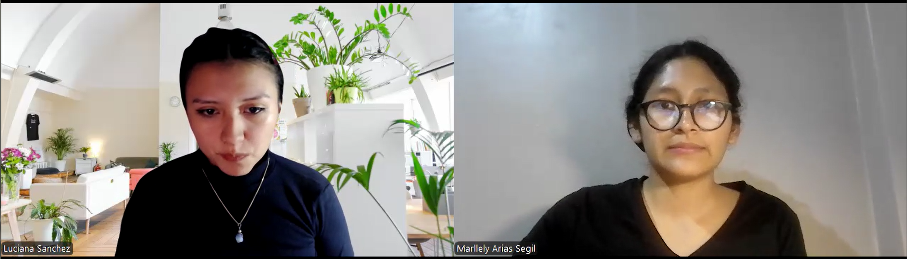

## 2.2. Entrevistas.
### 2.2.1. Diseño de entrevistas.

Para comprender mejor a nuestros segmentos objetivo, se han definido dos entrevistas diferenciadas según el segmento objetivo: 
- Proveedores de combustible
- Empresas con contratos de suministro (clientes corporativos)

---
#### A. Proveedores de Combustible

**Preguntas:**

1. ¿Cómo gestionan actualmente los pedidos de empresas clientes?
2. ¿Usan algún sistema digital para registrar pedidos o es manual?
3. ¿Qué pasos se siguen desde que un cliente hace un pedido hasta que se entregue?
4. ¿Cómo controlan que lo despachado coincida con lo solicitado?
5. ¿Qué tipo de reportes requieren generar (volúmenes, facturación, entregas, etc.)?
6. ¿Tienen un sistema para validar el stock antes de preparar el despacho de un pedido?
7. ¿Cómo hacen el seguimiento de los pedidos? ¿Informan al cliente en tiempo real?
8. ¿Qué problemas suelen ocurrir en el proceso de atención de pedidos empresariales?
9. ¿Cómo se realiza la conciliación de pagos con los clientes?
10. ¿Estarían dispuestos a integrar su sistema actual con una plataforma SaaS que unifique y centralice estos procesos?

**Preguntas complementarias:**

- ¿Qué edad tiene?
- ¿Cuál es su nivel de experiencia en logística o ventas?
- ¿Qué tipo de dispositivo usa en el trabajo? (PC, tablet, celular)
- ¿Qué aplicaciones o herramientas digitales usa en su día a día?
- ¿Cómo describiría su nivel de habilidad con la tecnología?

---

#### B. Empresas Solicitantes

**Preguntas:**

1. ¿Cómo solicitan actualmente combustible a su proveedor?
2. ¿Utilizan un sistema propio o envían pedidos por correo, WhatsApp, etc.?
3. ¿Cómo verifican que lo entregado coincida con lo solicitado?
4. ¿Tienen problemas con entregas incompletas o fuera de tiempo?
5. ¿Con qué frecuencia necesitan reportes de consumo, entregas o pagos?
6. ¿Qué tan importante es para ustedes tener trazabilidad de cada entrega?
7. ¿Quiénes son los responsables de validar pedidos y autorizar pagos?
8. ¿Cómo gestionan las reprogramaciones o cancelaciones de pedidos?
9. ¿Qué herramientas utilizan para monitorear el consumo mensual?
10. ¿Qué mejoras desearían ver en el proceso actual?

**Preguntas complementarias:**

- ¿Qué edad tiene?
- ¿En qué distrito vive y trabaja?
- ¿Qué nivel de estudios tiene?
- ¿Qué dispositivos utiliza más frecuentemente en el trabajo?
- ¿Qué aplicaciones o plataformas usa para su gestión operativa?
- ¿Cuáles son sus principales frustraciones en el proceso actual?

---

### 2.2.2. Registro de entrevistas  

#### **A. Proveedores de Combustible**  

**Entrevista 1**  
- **Nombres:** Kevin  
- **Apellidos:** Chacon  
- **Edad:** 30  
- **Distrito:** Lima  
- **Captura de la entrevista**  

  

  

  - **Duración:** 4:44  
  - **URL de Entrevista:** [Ver video](upc-pre-202501-cc238-1827-FuelTrack-needfinding-sprint-Segmento-1.1.mp4)  

**Entrevista 2**  
- **Nombres:** Zahir  
- **Apellidos:** Sanchez  
- **Edad:** 25  
- **Distrito:** Lima  
- **Captura de la entrevista**  

  

  

  - **Duración:** 5:35  
  - **URL de Entrevista:** [Ver video](upc-pre-202501-cc238-1827-FuelTrack-needfinding-sprint-Segmento-1.2.mp4)  

**Entrevista 3**  
- **Nombres:** Jocelyn  
- **Apellidos:** Almerco  
- **Edad:** 22  
- **Distrito:** Lima  
- **Captura de la entrevista**  

  

  

  - **Duración:** 4:37  
  - **URL de Entrevista:** [Ver video](upc-pre-202501-cc238-1827-FuelTrack-needfinding-sprint-Segmento-1.3.mp4)  

---

#### **B. Empresas Solicitantes**  

**Entrevista 1**  
- **Nombres:** Carla  
- **Apellidos:** Espejo  
- **Edad:** 28  
- **Distrito:** Lima  
- **Captura de la entrevista**  

  

  

  - **Duración:** 3:10  
  - **URL de Entrevista:** [Ver video](upc-pre-202501-cc238-1827-FuelTrack-needfinding-sprint-Segmento-2.1.mp4)  

**Entrevista 2**  
- **Nombres:** Luciana  
- **Apellidos:** Sanchez  
- **Edad:** 23  
- **Distrito:** Lima  
- **Captura de la entrevista**  

  

  

  - **Duración:** 5:24  
  - **URL de Entrevista:** [Ver video](upc-pre-202501-cc238-1827-FuelTrack-needfinding-sprint-Segmento-2.2.mp4)  

**Entrevista 3**  

---

### 2.2.3. Análisis de entrevistas  