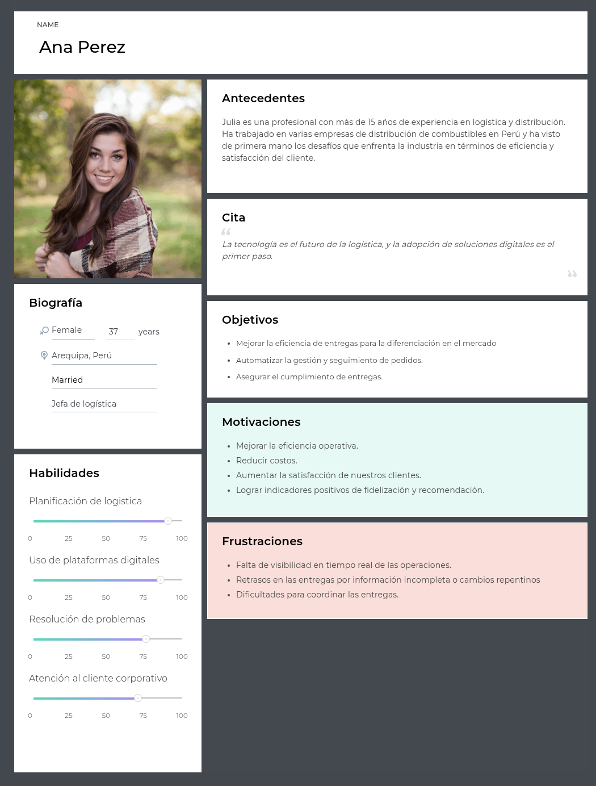
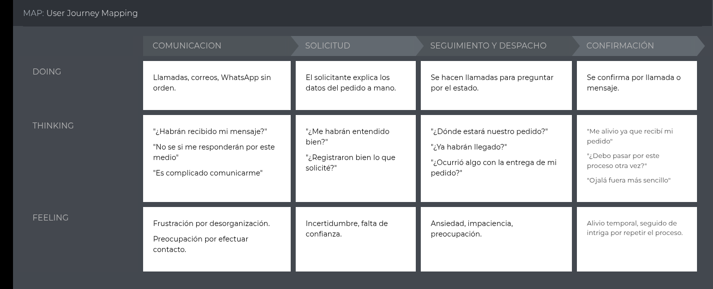
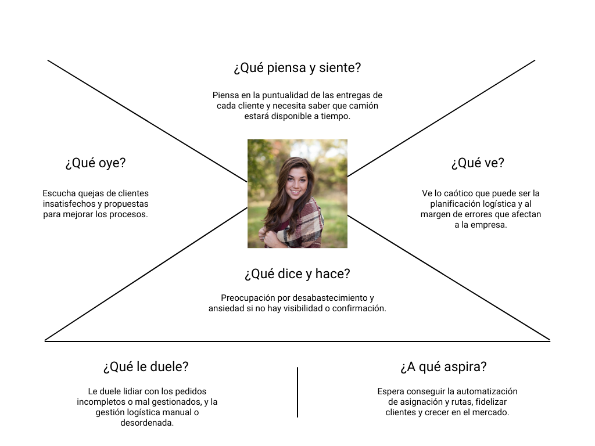

## 2.2. Needfinding.
### 2.3.1. User Persona.
#### A. Proveedores de Combustible

  

#### B. Empresas Solicitantes

  

 

### 2.3.2. User Task Matrix.

| **Tarea**                                      | **David Miller – Frecuencia** | **David Miller – Importancia** | **Ana Pérez – Frecuencia** | **Ana Pérez – Importancia** |
|------------------------------------------------|-------------------------------|---------------------------------|-----------------------------|------------------------------|
| Revisar nivel de stock de combustible          | Alta | Alta | Baja | Baja |
| Realizar pedido de combustible                 | Media | Alta | Alta | Alta |
| Validar confirmación de pedido                 | Alta | Alta | Alta | Alta |
| Hacer seguimiento a la entrega                 | Alta | Alta | Alta | Alta |
| Supervisar descarga y recepción                | Media | Alta | Media | Media |
| Evaluar proceso post-servicio                  | Baja | Media | Alta | Alta |
| Gestionar atención al cliente                  | Media | Alta | Alta | Alta |
| Revisar encuestas o feedback                   | Baja | Media | Media | Alta |

### 2.3.3. User Journey Mapping.
#### A. Proveedores de Combustible
En el caso del solicitante, el recorrido empieza con la generación de un pedido por correo o llamada, seguido por la validación manual del depósito, la espera de aprobación por parte del proveedor, la coordinación del despacho, y finalmente el registro manual de la entrega.

  

#### B. Empresas Solicitantes
En el caso del proveedor, el flujo parte desde la recepción del pedido, luego incluye la verificación del estado de cuenta, la aprobación manual, la asignación de planta y vehículo, y en muchos casos, la reprogramación por problemas de disponibilidad.

  

 

### 2.3.4. Empathy Mapping.
#### A. Proveedores de Combustible

  

 

#### B. Empresas Solicitantes

  

 

### 2.3.5. As-is Scenario Mapping.

